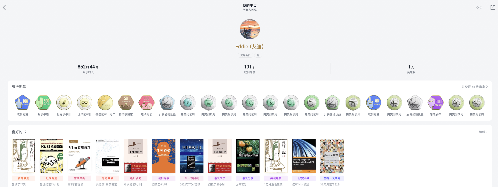

     

# 个人简介

我是Eddie Wang！

- 精通JavaScript/Node.js，现在的兴趣是学习rust
- 精通VOIP相关技术栈：SIP/opensips/kamailio等等
- 精通VIM
- email: eddie0501@qq.com
- Github: [github.com/wangduanduan](https://github.com/wangduanduan)
- 语雀: [yuque.com/wangdd](https://yuque.com/wangdd), 将不会更新
- 个人博客: [wdd.js.org](https://wdd.js.org), 最新内容将会发布在wdd.js.org
- 最喜欢的美剧《黄石》
- 喜欢读书、美剧、做饭
- 微信阅读资深会员/365天阅读挑战赛



  

  





<iframe frameborder="no" border="0" marginwidth="0" marginheight="0" width=330 height=86 src="//music.163.com/outchain/player?type=2&id=1902127843&auto=1&height=66"></iframe>



# 博客说明

博客取名为洞香春，灵感来自孙皓晖所著[《大秦帝国》](https://book.douban.com/subject/3079029/)。

洞香春大致在战国时代中期所在地：魏国安邑。

战国时期，社会制度发生着巨大变化，工商业日益兴旺，出现了以白圭为首的一批巨贾商人，而位于魏国安邑的洞香春酒肆就是白氏家族创办的产业中最为著名的一个。

洞香春以名士荟萃、谈论国事、交流思想而著称于当时列国
