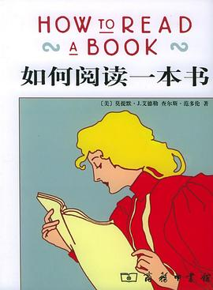

几年前，也许是在我参加工作的第一年。

那时候，亚马逊还没有退出中国。最大的阅读买书的应用是亚马逊书城，最方便的读书会员会员是kindle unlimit。

买kindle的unlimit的会员，就可以借阅亚马逊书城里几乎所有的书。

那一年，我为了增加自己的知识与眼界，也为了消磨一些无聊的时间，我买了kindle pw4。 

我给自己制定了一个小的读书计划。

**每天至少读一本书的1%**，每天读至少五本书。

我当时还用excel记录了每天，每本书的阅读进度。这种习惯持续了半年左右，直到我做手术时才终止。

当我回首那段读书时间后，在不知不觉中，我竟然读完了一百多本书。

**半年时间我读的书，要比我大学四年读的书还要多。**

分析原因，则总结出以下三点

## 1. 量化

**量化**：每次读书，至少要读百分之一。当然这只是一个理论值，最低的限度是至少翻一页。因为有些非常厚的书，即使是百分之一，一天之内也是很难读完的。例如《权利的游戏全集》英文版，我几乎每天都看，看了一周之后，再看看进度，还是不足百分之一。

## 2. 观测

**观测**：就是需要记录读书的进度，因为只有能观测到阅读的进度，才会比较容易发现时间的累积效果，才会有目标。简单的方法你可以用个excel, 每天记录进度。

例如如下表格：

| 书名     | 08-04(周一) | 05   | 06   | 07   | 08   | 09   | 10   |
| -------- | ----------- | ---- | ---- | ---- | ---- | ---- | ---- |
| 三体     | 5%          | 6%   |      |      |      |      |      |
| 百年孤独 | 20%         | 22%  |      |      |      |      |      |

## 3. 放弃

**放弃**：人在选书，书也在选人。有时候，一本书读了一小部分，发现读之无味，不读又觉得不该中途放弃。这时候，你应该放弃继续读这本书，把它放到一边，选择其他的书来看。

## 4. 坚持

**坚持**：一件事情，即使再困难，只要能坚持两周以上，就会形成习惯。一旦形成习惯，困难度就会显著降低。 以前我学车的时候，每天都要五点起床，去驾校学车。刚开始第一天，五点起床，被窝里仿佛是个黑洞漩涡，而我必要要有一个逃逸速度才能不被黑洞拉进去。 然而坚持一周之后，学车结束了，开始正常上班，我发现我也能很自然的在五点起床。 所以，不要以为百分之一很小，也不要以为阅读很难，自己先试试，看看两周之后的结果。

## 5. 针对性

对于不同类型的书，读书方法也不同，这里推荐大家看看《如何阅读一本书》

