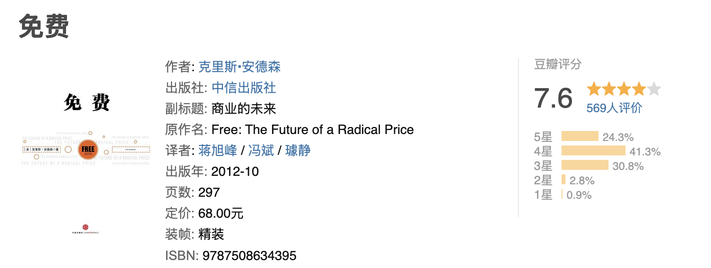

> 

在看这本书之前，我知道有以下几种免费的方式。

1. **广告**：你在B站、油管上看视频不用花钱，但是视频的中间、或者播放器的横幅广告，都是需要广告主付费。
2. **增值服务**：你在玩王者荣耀时，基本是免费的。但是王者荣耀的年收入却十几亿美元，假如王者里80%的用户是不付钱的，另外20%是付费用户。也就是说是由20%的付费用户承担了成本，那么他们理应拥有更好看的服装和道具，甚至更好看的胜率。所以，作为白嫖用户，你应该要有自知之明。
3. **版本差异**：比如软件有基础版本，功能虽然够用，但是也有各种限制。想要更好的服务，需要升级到pro版本。
4. **配额差异**：例如某个软件，30用户以内免费，超过30人则收费。
5. **时间限制**：
   1. 在固定的时间范围内免费，例如免费可以用一年，超过一年则需要付费
   2. 开始免费，用来培养用户习惯，培养韭菜，占领市场，等未来某个时间点再收费
6. **试吃试穿**

---

- 比如，用付费产品来补贴免费产品，用日后付费来补贴当前免费，由付费人群来给不付费人群提供补贴。
- 用免费的产品和服务去吸引用户，然后再用增值服务或其他产品收费，已经成为互联网公司的普遍成长规律。
- 用户。通常而言，一家网站会遵循“ 5%定律”，也就是说 5%的付费用户是网站的所有收入来源。
- 伍德沃德明白“免费”这个字眼能重塑顾客心态、创造新市场、打破旧习并让所有产品看上去具有更加吸引人的独特魅力。
- 林林总总的免费归根结底都表现为同一实质—让钱在不同的产品之间、人之间、现在和未来之间、不与钱打交道的市场和回到金钱市场之间转移。
- 经济学家把它称做“交叉补贴”（ cross-subsidies）。
- 但是当某样商品免费时，你就忘记了它的坏处了。
- 丈夫会有一种矛盾心态，觉得和她一起过不下去，但是离开她自己又过不下去。
- 科幻小说之所以引人入胜，就在于它揭示了人类对这种大错位会作何反应。
- 文化。换句话说，匮乏的终结使我们变得懒惰、颓废、愚蠢和卑鄙。
- 我们始终被自己不曾拥有的而非已经拥有的事物激励着。
- 悲痛5阶段 我们最好是通过心理学家伊丽莎白·库伯勒·罗斯提出的“悲痛五阶段”理论来解释
  - 否认
  - 愤怒
  - 商讨
  - 绝望
  - 接纳

