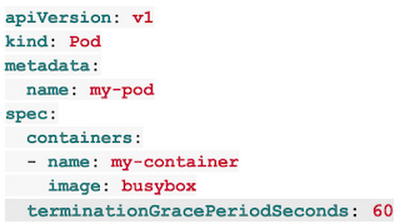

原文：[https://cloud.google.com/blog/products/gcp/kubernetes-best-practices-terminating-with-grace](https://cloud.google.com/blog/products/gcp/kubernetes-best-practices-terminating-with-grace)

Editor’s note: Today is the fifth installment in a seven-part video and blog series from Google Developer Advocate Sandeep Dinesh on how to get the most out of your Kubernetes environment.

When it comes to distributed systems, handling failure is key. Kubernetes helps with this by utilizing controllers that can watch the state of your system and restart services that have stopped performing. On the other hand, Kubernetes can often forcibly terminate your application as part of the normal operation of the system.

In this episode of “Kubernetes Best Practices,” let’s take a look at how you can help Kubernetes do its job more efficiently and reduce the downtime your applications experience.


In the pre-container world, most applications ran on VMs or physical machines. If an application crashed, it took quite a while to boot up a replacement. If you only had one or two machines to run the application, this kind of time-to-recovery was unacceptable.

Instead, it became common to use process-level monitoring to restart applications when they crashed. If the application crashed, the monitoring process could capture the exit code and instantly restart the application.

With the advent of systems like Kubernetes, process monitoring systems are no longer necessary, as Kubernetes handles restarting crashed applications itself. Kubernetes uses an event loop to make sure that resources such as containers and nodes are healthy. This means you no longer need to manually run these monitoring processes. If a resource fails a health check, Kubernetes automatically spins up a replacement.

The Kubernetes termination lifecycle
Kubernetes does a lot more than monitor your application for crashes. It can create more copies of your application to run on multiple machines, update your application, and even run multiple versions of your application at the same time!
This means there are many reasons why Kubernetes might terminate a perfectly healthy container. If you update your deployment with a rolling update, Kubernetes slowly terminates old pods while spinning up new ones. If you drain a node, Kubernetes terminates all pods on that node. If a node runs out of resources, Kubernetes terminates pods to free those resources (check out this previous post to learn more about resources).

It’s important that your application handle termination gracefully so that there is minimal impact on the end user and the time-to-recovery is as fast as possible!

In practice, this means your application needs to handle the SIGTERM message and begin shutting down when it receives it. This means saving all data that needs to be saved, closing down network connections, finishing any work that is left, and other similar tasks.

Once Kubernetes has decided to terminate your pod, a series of events takes place. Let’s look at each step of the Kubernetes termination lifecycle.

1 - Pod is set to the “Terminating” State and removed from the endpoints list of all Services
At this point, the pod stops getting new traffic. Containers running in the pod will not be affected.
2 - preStop Hook is executed
The preStop Hook is a special command or http request that is sent to the containers in the pod.
If your application doesn’t gracefully shut down when receiving a SIGTERM you can use this hook to trigger a graceful shutdown. Most programs gracefully shut down when receiving a SIGTERM, but if you are using third-party code or are managing a system you don’t have control over, the preStop hook is a great way to trigger a graceful shutdown without modifying the application.

3 - SIGTERM signal is sent to the pod
At this point, Kubernetes will send a SIGTERM signal to the containers in the pod. This signal lets the containers know that they are going to be shut down soon.
Your code should listen for this event and start shutting down cleanly at this point. This may include stopping any long-lived connections (like a database connection or WebSocket stream), saving the current state, or anything like that.

Even if you are using the preStop hook, it is important that you test what happens to your application if you send it a SIGTERM signal, so you are not surprised in production!

4 - Kubernetes waits for a grace period
At this point, Kubernetes waits for a specified time called the termination grace period. By default, this is 30 seconds. It’s important to note that this happens in parallel to the preStop hook and the SIGTERM signal. Kubernetes does not wait for the preStop hook to finish.
If your app finishes shutting down and exits before the terminationGracePeriod is done, Kubernetes moves to the next step immediately.

If your pod usually takes longer than 30 seconds to shut down, make sure you increase the grace period. You can do that by setting the **terminationGracePeriodSeconds** option in the Pod YAML. For example, to change it to 60 seconds:



5 - SIGKILL signal is sent to pod, and the pod is removed
If the containers are still running after the grace period, they are sent the SIGKILL signal and forcibly removed. At this point, all Kubernetes objects are cleaned up as well.

Conclusion
Kubernetes can terminate pods for a variety of reasons, and making sure your application handles these terminations gracefully is core to creating a stable system and providing a great user experience.


```bash
kubectl explain deployment.spec.template.spec

KIND:     Deployment
VERSION:  apps/v1

FIELD:    terminationGracePeriodSeconds <integer>

DESCRIPTION:
     Optional duration in seconds the pod needs to terminate gracefully. May be
     decreased in delete request. Value must be non-negative integer. The value
     zero indicates delete immediately. If this value is nil, the default grace
     period will be used instead. The grace period is the duration in seconds
     after the processes running in the pod are sent a termination signal and
     the time when the processes are forcibly halted with a kill signal. Set
     this value longer than the expected cleanup time for your process. Defaults
     to 30 seconds.
```

# 1. 参考

- [https://stackoverflow.com/questions/35453792/pods-stuck-in-terminating-status](https://stackoverflow.com/questions/35453792/pods-stuck-in-terminating-status)
