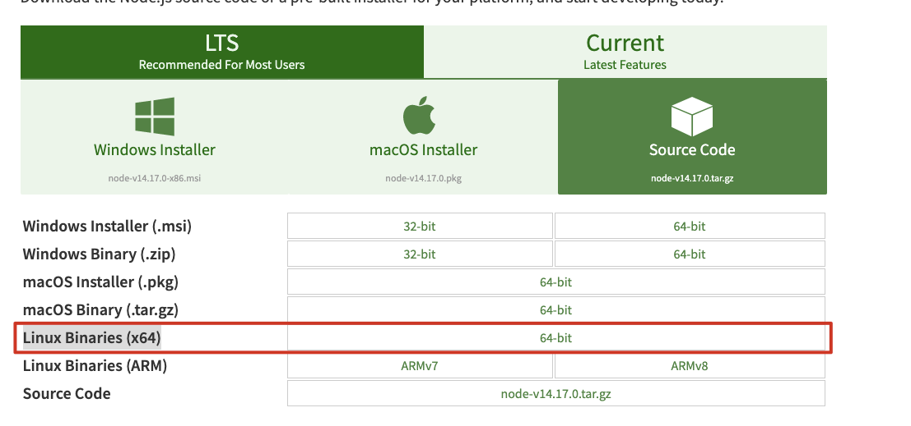

# 1. 选择安装包
访问 [https://nodejs.org/en/download/](https://nodejs.org/en/download/)
选择Linux Binaries(x64)


# 2. 解压
下载后的文件是一个tar.xz的文件。

```bash
xz -d node-xxxx.tar.zx  // 解压xz
tar -xvf node-xxxx.tar  // 拿出文件夹
```
解压后的目录如下，其中

```bash
➜  node-v14.17.0-linux-x64 ll
total 600K
drwxr-xr-x 2 wangdd staff 4.0K May 13 09:34 bin
-rw-r--r-- 1 wangdd staff 469K May 12 02:14 CHANGELOG.md
drwxr-xr-x 3 wangdd staff 4.0K May 13 09:34 include
drwxr-xr-x 3 wangdd staff 4.0K May 13 09:34 lib
-rw-r--r-- 1 wangdd staff  79K May 12 02:14 LICENSE
-rw-r--r-- 1 wangdd staff  30K May 12 02:14 README.md
drwxr-xr-x 5 wangdd staff 4.0K May 12 02:14 share

// bin目录下就是nodejs的可执行程序
➜  node-v14.17.0-linux-x64 ll bin
total 71M
-rwxr-xr-x 1 wangdd staff 71M May 12 02:14 node
lrwxrwxrwx 1 wangdd staff  38 May 12 02:14 npm -> ../lib/node_modules/npm/bin/npm-cli.js
lrwxrwxrwx 1 wangdd staff  38 May 12 02:14 npx -> ../lib/node_modules/npm/bin/npx-cli.js

➜  node-v14.17.0-linux-x64 ./bin/node --version
v14.17.0
```
通过将bin目录加入到$PATH环境变量中这种方式，就可以直接调用node。

