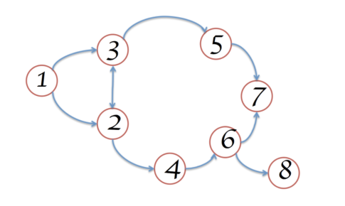
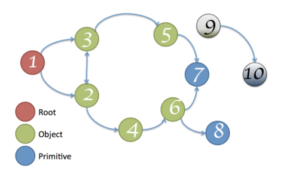
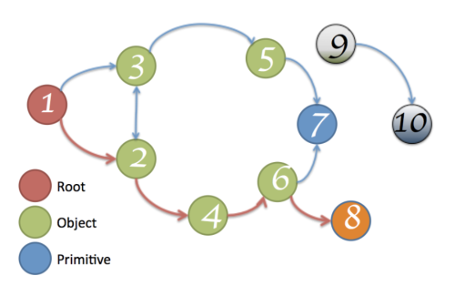
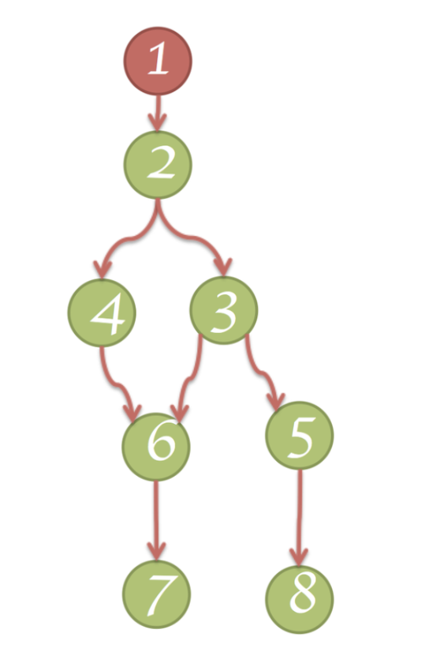
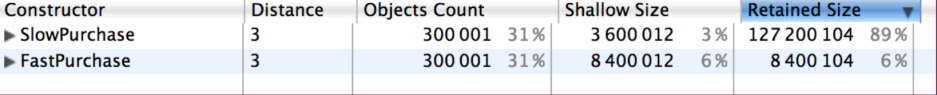
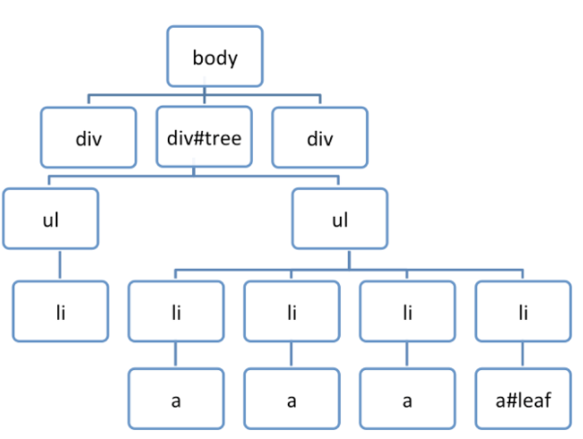

参考: [http://slides.com/gruizdevilla/memory](http://slides.com/gruizdevilla/memory#/7/11)
# 
# 内存是一张图

- 原始类型，只能作为叶子。原始类型不能引用其他类型
   - 数字
   - 字符串
   - 布尔值
- 除了原始类型之外，其他类型都是对象，其实就是键值对
- 数组是一种特殊对象，它的键是连续的数字



# 内存从根开始

- 在浏览器中，根对象是window
- 在nodejs中，根对象是global
- 任何从根无法到达的对象，都会被GC回收，例如下图的节点9和10
- 根节点的GC是无法控制的



# 路径

- 从根节点开始到特定对象的路径，如下图的1-2-4-6-8



# 支配项

- 每个对象有且仅有一个支配项，支配项对对象可能不是直接引用
- 举例子
   - 节点1支配节点2
   - 节点2支持节点3、4、6
   - 节点3支配节点5
   - 节点6支配节点7
   - 节点5支配节点8
   - 上面的例子有个不好理解的是节点2为什么支配了节点6？如果节点A存在于**从根节点到节点B的每一个路径**中，那么A就是B的支配项。2存在于1-2-4-6，也存在于1-2-3-6，所以节点2支配节点6



# V8 新生代与老生代

- v8内存分为新生代和老生代内存，两块内存使用不同的内存GC策略
- 相比而言，新生代GC很快，老生代则较慢
- 新生代的内存在某些条件下会被转到老生代内存区
- GC发生时，用可能应用会暂停

# 解除引用的一些错误

```shell
var a = {name: 'wdd'}
delete a.name // 这回让对象a变成慢对象

var a = {name: 'wdd'}
a.name = null // 这个则更好
```

# 关于slow Object

- V8 optimizing compiler makes assumptions on your code to make optimizations.
- It transparently creates hidden classes that represent your objects.
- Using this hidden classes, V8 works much faster. If you "delete" properties, these assumptions are no longer valid, and the code is de-optimized, slowing your code.

```shell
// Fast Object 
function FastPurchase(units, price) {
    this.units = units;
    this.price = price;
    this.total = 0;
    this.x = 1;
}
var fast = new FastPurchase(3, 25);

// Slow Object 
function SlowPurchase(units, price) {
    this.units = units;
    this.price = price;
    this.total = 0;
    this.x = 1;
}
var slow = new SlowPurchase(3, 25);
//x property is useless 
//so I delete it
delete slow.x; 
```


# Timers内存泄露

```shell
// 
var buggyObject = {
 callAgain: function () {
  var ref = this;
  var val = setTimeout(function () {
   console.log('Called again: '
   + new Date().toTimeString());
   ref.callAgain();
  }, 1000);
 }
};

buggyObject.callAgain();
buggyObject = null;
```

# 闭包内存泄露

```shell
var a = function () {
  var largeStr =
         new Array(1000000).join('x');
  return function () {
     return largeStr;
  };
}();

var a = function () {
    var smallStr = 'x',
           largeStr =
                new Array(1000000).join('x');
   return function (n) {
      return smallStr;
   }; 
}();

var a = function () {
   var smallStr = 'x',
          largeStr =
              new Array(1000000).join('x');
    return function (n) {
        eval(''); //maintains reference to largeStr
        return smallStr;
     };
}();
```

# DOM 内存泄露
#leaf maintains a reference to it's parent (parentNode), and recursively up to #tree, so only when leafRef is nullified is the WHOLE tree under #tree candidate to be GC



```shell
var select = document.querySelector;
var treeRef = select("#tree");
var leafRef = select("#leaf");
var body = select("body");
body.removeChild(treeRef);
//#tree can't be GC yet due to treeRef
treeRef = null;
//#tree can't be GC yet, due to 
//indirect reference from leafRef
leafRef = null;
//NOW can be #tree GC
```

# 守则

- Use appropiate scope
   - Better than de-referencing, use local scopes.
- Unbind event listeners
   - Unbind events that are no longer needed, specially if the related DOM objects are going to be removed.
- Manage local cache
   - Be careful with storing large chunks of data that you are not going to use.

 

# 分析内存泄漏的工具

- 浏览器： `performance.memory` 
- devtool memory profile

# 关于闭包的提示

- 给闭包命名，这样在内存分析时，就可以按照函数名找到对应的函数


