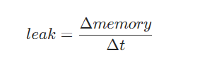
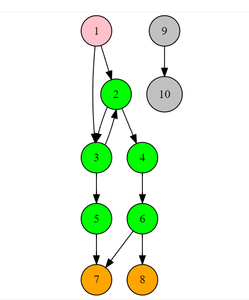
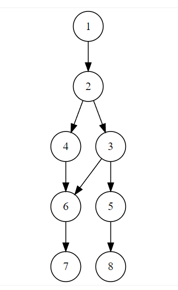
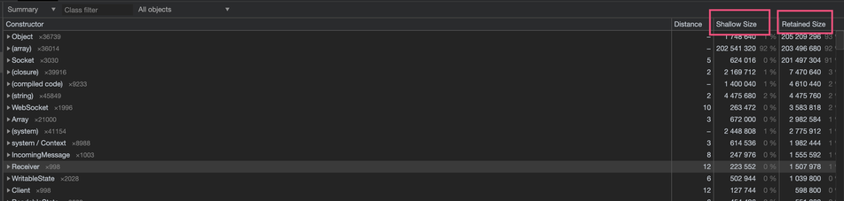
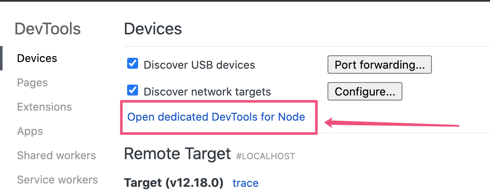
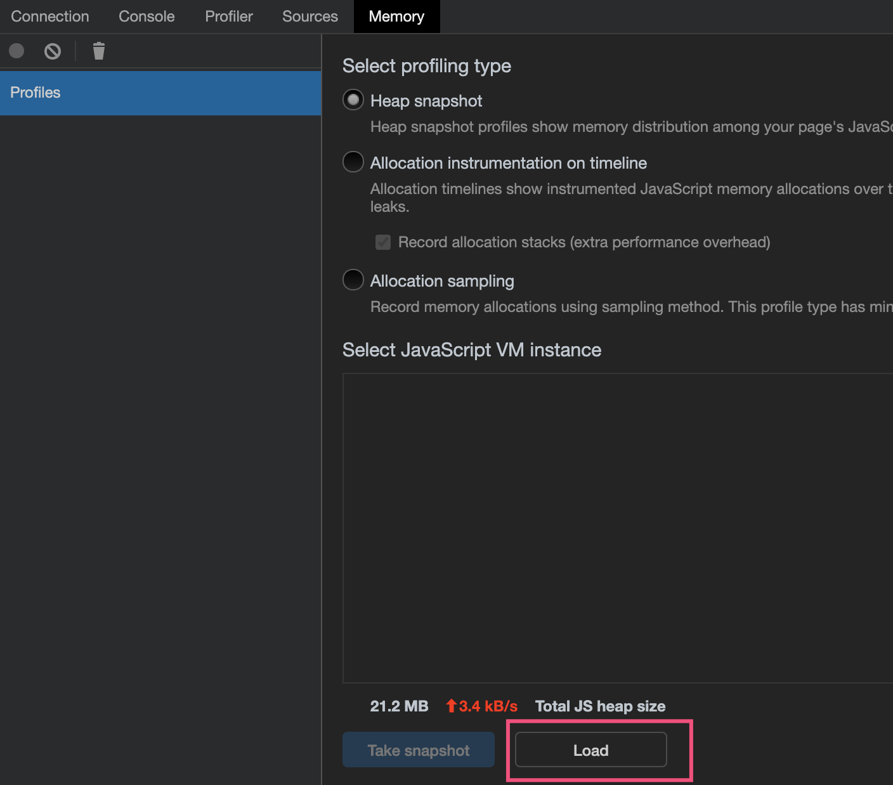
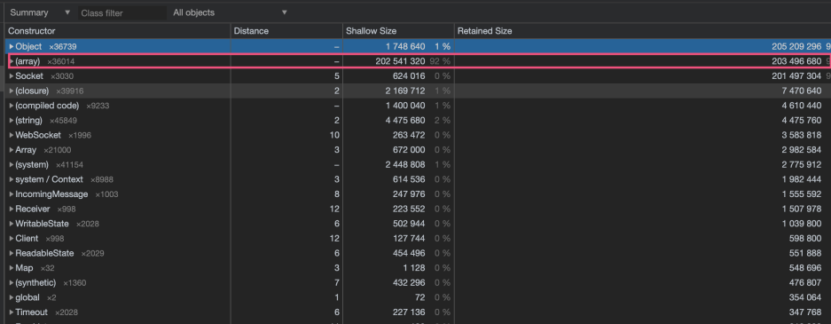
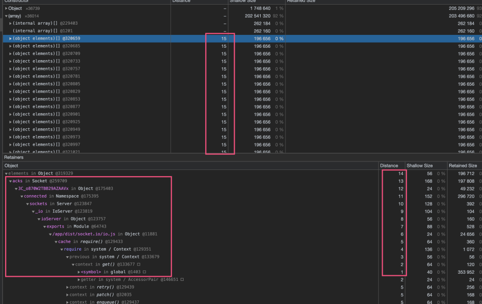
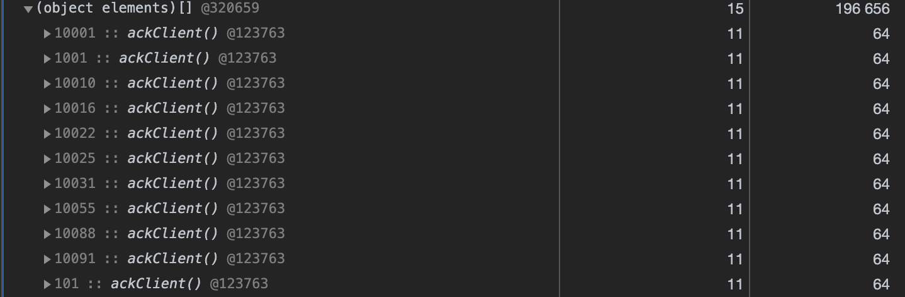

# 什么是内存泄漏？
单位时间内的内存变化量可能有三个值

- 正数：内存可能存在泄漏。生产环境，如果服务在启动后，该值一直是正值，从未出现负值或者趋近于0的值，那么极大的可能是存在内存泄漏的。
- 趋近于0的值: 内存稳定维持
- 负数：内存在释放



实际上，在观察内存变化量时，需要有两个前提条件

1. 一定的负载压力：因为在开发或者功能测试环境，很少的用户，服务的压力很小，是很难观测到内存泄漏问题的。所以务必在一定的负载压力下观测。
2. 至少要观测一天：内存上涨并不一定意味着存在内存泄漏问题。在一个工作日中，某些时间点，是用户使用的高峰期，服务的负载很高，自然内存使用会增长。关键在于在高峰期过后的低谷期时，内存是否回下降到正常值。如果内存在低谷期时依然维持着高峰期时的内存使用，那么非常大可能是存在内存泄漏了。

下图是两个服务的。从第一天的0点开始观测服务的内存，一直到第二天的12点。正常的服务会随着负载的压力增加或者减少内存使用。而存在内存泄漏的服务，内存一直在上升，并且负载压力越大，上升的越快。


# 有没有可能避免内存泄漏？

除非你不写代码，否者你是无法避免内存泄漏的问题的。

第一，即使你是非常精通某个语言，也是有很多关于如何避免内存泄漏的经验。但是你的代码里仍然可能会包含其他库或者其他同事写的代码，那些代码里是无法保证是否存在内存泄漏问题的。
第二，内存泄漏的代码有时候非常难以察觉。例如console.log打印的太快，占用太多的buffer。网络流量激增，占用太多的Recv_Q，node无法及时处理。写文件太慢，没有处理“后压”相关的逻辑等等。


# 为什么要关注内存泄漏？

为什么要关注内存泄漏？我们客户的服务器可是有500G内存的

你可能有个很豪的金主。但是你不要忘记一个故事。

> 传说国际象棋是由一位印度数学家发明的。国王十分感谢这位数学家，于是就请他自己说出想要得到什么奖赏。这位数学家想了一分钟后就提出请求——把1粒米放在棋盘的第1格里，2粒米放在第2格，4粒米放在第3格，8粒米放在第4格，依次类推，每个方格中的米粒数量都是之前方格中的米粒数量的2倍。
> 
> 国王欣然应允，诧异于数学家竟然只想要这么一点的赏赐——但随后却大吃了一惊。当他开始叫人把米放在棋盘上时，最初几个方格中的米粒少得像几乎不存在一样。但是，往第16个方格上放米粒时，就需要拿出1公斤的大米。而到了第20格时，他的那些仆人则需要推来满满一手推车的米。国王根本无法提供足够的大米放在棋盘上的第64格上去。因为此时，棋盘上米粒的数量会达到惊人的18 446 744 073 709 551 615粒。如果我们在伦敦市中心再现这一游戏，那么第64格中的米堆将延伸至M25环城公路，其高度将超过所有建筑的高度。事实上，这一堆米粒比过去1000年来全球大米的生产总量还要多得多。


对于内存泄漏来说，可能500G都是不够用的。

实际上操作系统对进程使用内存资源是有限制的，我们关注内存泄漏，实际上是关注内存泄漏会引起的最终问题：out of memory。如果进程使用的资源数引起了操作系统的注意，很可能进程被操作系统杀死。

然后你的客户可能正在使用你的服务完成一个重要的事情，接着你们的客户投诉热线回被打爆，然后是你的老板，你的领导找你谈话~~~

# 基本类型 vs 引用类型

- 基本类型：undefined, null, boolean, number, string。基本类型是按值访问
- 引用类型的值实际上是指向内存中的对象

上面的说法来自《JavaScript高级程序设计》。但是对于基本类型字符串的定义，实际上我是有些不认同的。有些人也认为字符串不属于基本类型。

就是关于字符串，我曾思考过，在JavaScript里，字符串的最大长度是多少，字符串最多能装下多少个字符？

我个人认为，一个变量有固定的大小的内存占用，才是基本类型。例如数字，null, 布尔值，这些值很容易能理解他们会占用固定的内存大小。但是字符串就不一样了。字符串的长度是不固定，在不同的浏览器中，有些字符串最大可能占用256M的内存，甚至更多。

可以参考这个问题：[https://stackoverflow.com/questions/34957890/javascript-string-size-limit-256-mb-for-me-is-it-the-same-for-all-browsers](https://stackoverflow.com/questions/34957890/javascript-string-size-limit-256-mb-for-me-is-it-the-same-for-all-browsers)


# 内存是一张图

- 1代表根节点，在NodeJS里是global对象，在浏览器中是window对象
- 2-6代表对象
- 7-8代表原始类型。分别有三种，字符串，数字，布尔值
- 9-10代表从根节点无法到达的对象

注意，作为原始类型的值，**在内存图中只能是叶子节点。**
**
从跟节点R0无法到达的节点9,10，将会在GC时被清除。



保留路径的含义是从跟对象到某一节点的最短路径。例如1->2->4->6。

# 对象保留树

- 节点： 构造函数的名称
- 边缘：对象的key
- 距离: 节点到跟节点的最短距离

# 支配项(Dominators)

- 每个对象有且仅有一个支配项
- 如果B存在从根节点到A节点之间的所有路径中，那么B是A的支配项，即B支配A。

下图中

- 1支配2
- 2支配3,4,6 (想想2为什么没有支配5？)
- 3支配5
- 6支配7
- 5支配8

**理解支配项的意义在于理解如何将资源释放**。如下图所示，如果目标是释放节点6的占用资源，仅仅释放节点3或者节点4是没有用的，必需释放其支配项节点2，才能将节点6释放。



# 对象大小

- 对象自身占用大小：shadow size
- 通过保持对其他对象的引用隐式占用，这种方式可以阻止这些对象被垃圾回收器（简称 GC）自动处置
- 对象的大小的单位是字节



# 分析工具
## heapsnapshot
```bash
import {writeHeapSnapshot} from 'v8'

router.get('/heapdump', function (req: express.Request, res: express. Response, next: express.NextFunction) {
    logger.debug('help_heapdump::', req.ip, req.hostname)

    if (req.hostname !== 'localhost') {
        logger.error('error:report_bad_host:', req.hostname)
        return res.status(401).end()
    }

    res.status(200).end()

    let fileName = writeHeapSnapshot('node.heapsnapshot')
    logger.info('help_heapdumap_file::', fileName)
})
```

通过将v8 writeHeapSnapshot放到express的路由中，我们可以简单通过curl的方式产生snapshot文件。需要注意的是，writeHeapSnapshot可能需要一段时间来产生snapshot文件。在生产环境要注意，需要注意产生该函数的调用频率。

拿到snapshot文件后，下一步是使用chrome dev-tools去打开这个文件。

在chrome的inspect页面：[chrome://inspect/#devices]()

点击Open dedicated DevTools for Node。可以打开一个单独的页面dev-tools页面。当然你也可以任意一个页面打开devTools.



点击load, 选择snapshot文件，就可以加载了。


## 真实的内存泄漏实战分析: socket.io内存泄漏

我写过一个使用socket.io来完成实时消息推送的服务，在做压力测试的时候，两个实例，模拟2000个客户端WebSocket连接，然后以每秒1000个速度发送消息，在持续压测15个小时之后，Node.js的内存从50M上涨到1.5G。所以，这其中必然产生了内存泄漏。

在array这一列，可以看出它占用的Shallow Size和Retained Size占用的内存都是超过90%的。


我们展开array这一列，可以发现有很多的distance是15的对象。然后我们展开其中一个对象后。

可以发现从距离是14到1之间的保留路径。



展开一个对象之后，发现有很多ackClient，这个ackClient实际上对应了代码里我写的一个函数，用来确认消息是否被客户端收到的。这个确认机制是socket.io提供的。



当我确认内存泄漏是socket.io的确认机制的问题后，我就将确认的函数从代码中移除，改为消息不确认。在一段时间的压测过后，服务的内存趋于稳定，看来问题已经定位了。

## socket.io内存泄漏的原因
在阅读了socket.io的源码之后，可以看到每个Socket对象都有一个acks对象用来表示确认。
```bash

function Socket(nsp, client, query){
  this.nsp = nsp;
  this.server = nsp.server;
  this.adapter = this.nsp.adapter;
  this.id = nsp.name !== '/' ? nsp.name + '#' + client.id : client.id;
  this.client = client;
  this.conn = client.conn;
  this.rooms = {};
  this.acks = {};
  this.connected = true;
  this.disconnected = false;
  this.handshake = this.buildHandshake(query);
  this.fns = [];
  this.flags = {};
  this._rooms = [];
}
```
在调用socket.emit()方法时，socket.io会将消息的id附着在acks对象上，可以想象，随着消息发送的量增大，这个acks的属性将会越来越多。
```bash
  if (typeof args[args.length - 1] === 'function') {
    if (this._rooms.length || this.flags.broadcast) {
      throw new Error('Callbacks are not supported when broadcasting');
    }

    debug('emitting packet with ack id %d', this.nsp.ids);
    this.acks[this.nsp.ids] = args.pop();
    packet.id = this.nsp.ids++;
  }
```
当收到ack之后，acks上对应的包的属性才会被删掉。
```bash
Socket.prototype.onack = function(packet){
  var ack = this.acks[packet.id];
  if ('function' == typeof ack) {
    debug('calling ack %s with %j', packet.id, packet.data);
    ack.apply(this, packet.data);
    delete this.acks[packet.id];
  } else {
    debug('bad ack %s', packet.id);
  }
};
```
如果客户端不对消息进行ack确认，那么服务端就会积累非常多的待确认的消息，最终导致内存泄漏。

虽然这个问题的最终原因是客户端没有及时确认，但是查看一下socket.io的项目，发现已经有将近500个issue没有解决。我觉得有时间的话，我会用原生的websocket替换掉socket.io。不然这个socket.io很可能回成为项目的一个瓶颈点。

# 参考资料

- [http://slides.com/gruizdevilla/memory](http://slides.com/gruizdevilla/memory)
- [http://bmeck.github.io/snapshot-utils/doc/manual/terms.html](http://bmeck.github.io/snapshot-utils/doc/manual/terms.html)
- [https://nodejs.org/dist/latest-v12.x/docs/api/v8.html#v8_v8_writeheapsnapshot_filename](https://nodejs.org/dist/latest-v12.x/docs/api/v8.html#v8_v8_writeheapsnapshot_filename)
- [https://github.com/socketio/socket.io/issues/3494](https://github.com/socketio/socket.io/issues/3494)

