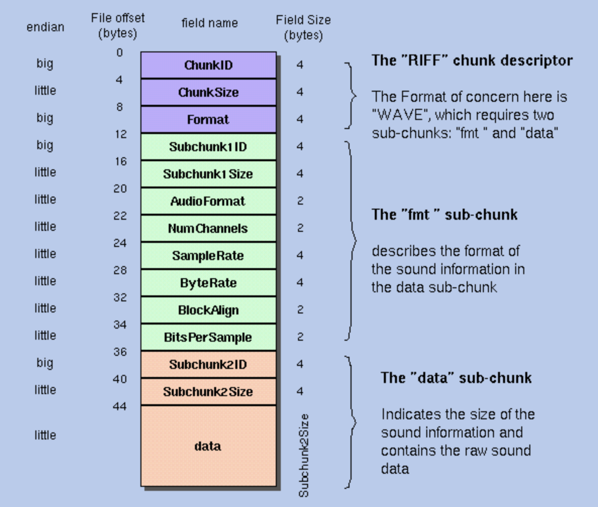

相比于普通的文件，二进制的文件略显神秘。本次就为大家揭开二进制文件的面纱。

# WAV文件的格式

下图是一个普通的wav文件的格式。其中除了最后的data部分，其他的每个格子都占用了固定大小的字节数。

知道字节数之后，就需要按照正确的字节序读区。字节序读反了，可能读出一堆乱码。 关于字节序，可以参考阮一峰老师写的[理解字节序](https://www.ruanyifeng.com/blog/2016/11/byte-order.html)这篇文章。



# step1: 读取文件

```javascript
const fs = require('fs')
const path = require('path')

const file = fs.readFileSync(path.join(__dirname, './a.wav'))
console.log(file)
```
原始的打印，二进制以16进制的方式显示。看不出其中有何含义。
```javascript
node main.js 

<Buffer 52 49 46 46 a4 23 48 00 57 41 56 45 66 6d 74 20 10 00 00 00 01 00 02 00 40 1f 00 00 00 7d 00 00 04 00 10 00 64 61 74 61 80 23 48 00 00 00 00 00 00 00 ... 4727674 more bytes>
```

# step2: 工具函数

```javascript
// 将buf转为字符串
function buffer2String (buf) {
    let int = []

    for (let i=0; i<buf.length; i++) {
       int.push(buf.readUInt8(i))
    }

    return String.fromCharCode(...int)
}

// 对读区的头字段的值进行校验
// 实际上头字段之间是存在一定的关系的
function  validWav (wav, fileSize) {
//20        2   AudioFormat      PCM = 1 (i.e. Linear quantization)
//                                Values other than 1 indicate some 
//                                form of compression.
// 22        2   NumChannels      Mono = 1, Stereo = 2, etc.
// 24        4   SampleRate       8000, 44100, etc.
// 28        4   ByteRate         == SampleRate * NumChannels * BitsPerSample/8
// 32        2   BlockAlign       == NumChannels * BitsPerSample/8
//                                The number of bytes for one sample including
//                                all channels. I wonder what happens when
//                                this number isn't an integer?
// 34        2   BitsPerSample    8 bits = 8, 16 bits = 16, etc.

    if (wav.AudioFormat !== 1) {
        return 1
    }

    if (![1,2].includes(wav.NumChannels)){
        return 2
    }

    if (![8000,44100].includes(wav.SampleRate)){
        return 3
    }

    if (![8,16].includes(wav.BitsPerSample)){
        return 4
    }


    if (wav.ByteRate  !== wav.SampleRate * wav.NumChannels * wav.BitsPerSample / 8){
        return 5
    }

    if (wav.BlockAlign  !== wav.NumChannels * wav.BitsPerSample / 8 ){
        return 6
    }

    if (wav.ChunkSize + 8 !== fileSize) {
        return 7
    }

    return 0
}


class ByteWalk {
    constructor(buf){
      	// 记录当前读过的字节数
        this.current = 0
      	// 记录整个buf
        this.buf = buf
    }
		
  	// 用来指定要读取的字节数，以及它的格式
    step(s, f){
        if (this.current === this.buf.length) {
            return
        }

        let bf

        if (arguments.length === 0) {
            s = this.buf.length - this.current
        }

        if (this.current + s >= this.buf.length) {
            bf = this.buf.slice(this.current, this.buf.length)
            this.current = this.buf.length
        } else {
            bf = this.buf.slice(this.current, this.current + s)
            this.current += s
        }


				// 一个特殊的标记，用来标记按照字符串的方式读取buf
        if (f === 'readStringBE') {
            return buffer2String(bf)
        }

        if (!f) {
            return bf
        }

        return bf[f]();
    }
}

function readData (buf, step, read) {
    let data = []

    for (let i=0; i<buf.length; i += step) {
        data.push(buf[read](i))
    }

    return data
}

module.exports = {
    buffer2String,
    // validFile,
    ByteWalk,
    validWav,
    readData
}
```

# step3: main函数
```javascript
const fs = require('fs')
const path = require('path')
const {
    ByteWalk,
    validWav,
    readData
} = require('./util')

const file = fs.readFileSync(path.join(__dirname, './a.wav'))

const B = new ByteWalk(file)

// 按照固定的字节数读取
let friendData = {
    ChunkID: B.step(4,'readStringBE'),
    ChunkSize: B.step(4, 'readUInt32LE'),
    Format: B.step(4, 'readStringBE'),
    Subchunk1ID: B.step(4, 'readStringBE'),
    Subchunk1Size: B.step(4, 'readUInt32LE'),
    AudioFormat: B.step(2, 'readUInt16LE'),
    NumChannels: B.step(2, 'readUInt16LE'),
    SampleRate: B.step(4, 'readUInt32LE'),
    ByteRate: B.step(4, 'readUInt32LE'),
    BlockAlign: B.step(2, 'readUInt16LE'),
    BitsPerSample: B.step(2, 'readUInt16LE'),
    Subchunk2ID: B.step(4, 'readStringBE'),
    Subchunk2Size: B.step(4, 'readUInt32LE'),
    Data: B.step()
}

// var data = readData(friendData.Data, friendData.BlockAlign, 'readInt16LE')

console.log(validWav(friendData, file.length))

console.log(friendData, friendData.Data.length)

// console.log(data)
```

从输出的内容可以看到，个个头字段基本上都读取出来了。
```javascript
0
{
  ChunkID: 'RIFF',
  ChunkSize: 4727716,
  Format: 'WAVE',
  Subchunk1ID: 'fmt ',
  Subchunk1Size: 16,
  AudioFormat: 1,
  NumChannels: 2,
  SampleRate: 8000,
  ByteRate: 32000,
  BlockAlign: 4,
  BitsPerSample: 16,
  Subchunk2ID: 'data',
  Subchunk2Size: 4727680,
  Data: <Buffer 00 00 00 00 00 00 00 00 00 00 00 00 00 00 00 00 00 00 00 00 00 00 00 00 00 00 00 00 00 00 00 00 00 00 00 00 00 00 00 00 00 00 00 00 00 00 00 00 00 00 ... 4727630 more bytes>
} 4727680
```

想要深入理解wav文件格式的，可以看下最后的参考资料。

之后大家可以从做一些有趣的事情，例如双声道的声音做声道分离，或者说双声道合并成单声道等等。

# 参考资料

- [http://soundfile.sapp.org/doc/WaveFormat/](http://soundfile.sapp.org/doc/WaveFormat/)
