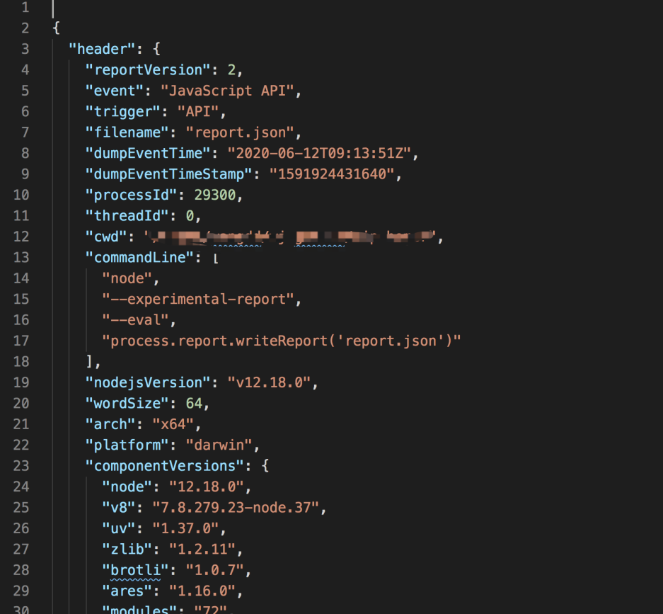

在v11.7.0中加入实验性功能，诊断报告。诊断报告的输出是一个json文件，包括以下信息。

- 进程信息
- 操作系统信息
- 堆栈信息
- 内存资源使用
- libuv状态
- 环境变量
- 共享库
- 诊断报告的原始信息

# 如何产生诊断报告

- 必需使用 --experimental-report 来启用
- process.report.writeReport() 来输出诊断报告
```
node --experimental-report --diagnostic-report-filename=YYYYMMDD.HHMMSS.PID.SEQUENCE#.txt --eval "process.report.writeReport('report.json')"

Writing Node.js report to file: report.json
Node.js report completed
```
用编辑器打开诊断报告，可以看到类似下面的内容。



# 如何从诊断报告中分析问题？
诊断报告很长，不太好理解。IBM开发了report-toolkit工具，可以用来分析。
要求：node > 11.8.0

```
npm install report-toolkit --global
或者
yarn global add report-toolkit
```
查看帮助信息
```
rtk --help
```

# 自动出发报告

```
node --experimental-report \
--diagnostic-report-on-fatalerror \
--diagnostic-report-uncaught-exception \
index.js
```

| $ node –help | grep report |
| :--- | :--- |
| `--experimental-report` | enable report generation
启用report功能 |
| `--diagnostic-report-on-fatalerror` | generate diagnostic report on fatal (internal) errors
产生报告当发生致命错误 |
| `--diagnostic-report-on-signal` | generate diagnostic report upon receiving signals
产生报告当收到信号 |
| `--diagnostic-report-signal=...` | causes diagnostic report to be produced on provided signal. Unsupported in Windows. (default: SIGUSR2) |
| `--diagnostic-report-uncaught-exception` | generate diagnostic report on uncaught exceptions
产生报告当出现未捕获的异常 |
| `--diagnostic-report-directory=...` | define custom report pathname. (default: current working directory of Node.js process) |
| `--diagnostic-report-filename=...` | define custom report file name. (default: YYYYMMDD.HHMMSS.PID.SEQUENCE#.txt) |

# 参考

- [https://nodejs.org/dist/latest-v12.x/docs/api/report.html](https://nodejs.org/dist/latest-v12.x/docs/api/report.html)
- [https://ibm.github.io/report-toolkit/quick-start](https://ibm.github.io/report-toolkit/quick-start)
- [https://developer.ibm.com/technologies/node-js/articles/introducing-report-toolkit-for-nodejs-diagnostic-reports](https://developer.ibm.com/technologies/node-js/articles/introducing-report-toolkit-for-nodejs-diagnostic-reports)
