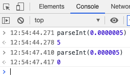
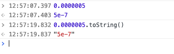
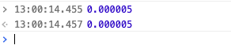
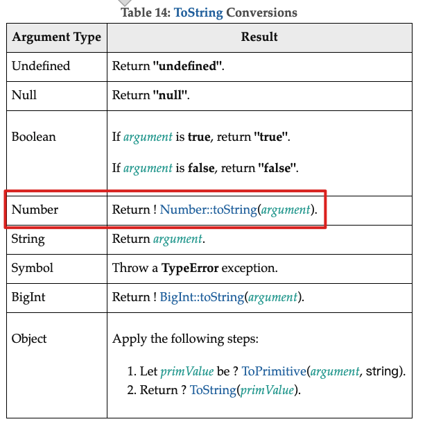
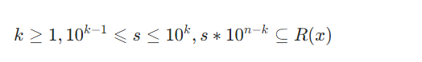

最近看了一篇文章，里面提出一个问题？

parseInt(0.0000005)为什么等于5？



最终也给出了解释，parseInt的第一个参数，如果不是字符串的话, 将会调用ToString方法，将其转为字符串。

> **string**
> The value to parse. If this argument is not a string, then it is converted to one using the[ToString](https://tc39.es/ecma262/#sec-tostring)abstract operation. Leading[whitespace](https://developer.mozilla.org/en-US/docs/Glossary/Whitespace)in this argument is ignored. MDN


我们在console面板上直接输入`0.0000005`回车之后发现是5e-7。我们使用toSting()方法转换之后发现是字符串`5e7`



字符串`5e-7`转成整数5是没什么疑问的，问题在于为什么`0.0000005`转成5e-7。而如果少一个零，就可以看到console会原样输出。



# 数值类型如何转字符串？

对于数值类型，是使用Number.toString()方法转换的。



# Number.toString(x)的算法分析
这个算法并没有像我们想象的那么简单。

先说一些简单场景

## 简单场景
```bash
Number.toString(x)
```

1. 如果x是NaN, 返回"NaN"
2. 如果x是+0或者-0， 返回"0"
3. 如果x是负数返回, 返回Number.toString(-x)
4. 如果x是正无穷，返回"Infinity"

## 复杂场景

可以看出，0.0000005并不在简单场景中。下面就进入到复杂场景了。

会用到一个公式



1. k,s,n都是整数
2. k大于等于1
3. 10的k-1次方小于等于s, 且s小于等于10的k次方
4. 10的n-k次方属于实数


0.0000005可以表示为5*10的-7次方。代入上面的公式，可以算出: k=1, s=5, n=-6。


# 参考

- [https://dmitripavlutin.com/parseint-mystery-javascript/](https://dmitripavlutin.com/parseint-mystery-javascript/)
- [https://developer.mozilla.org/en-US/docs/Web/JavaScript/Reference/Global_Objects/parseInt](https://developer.mozilla.org/en-US/docs/Web/JavaScript/Reference/Global_Objects/parseInt)
- [https://tc39.es/ecma262/#sec-numeric-types-number-tostring](https://tc39.es/ecma262/#sec-numeric-types-number-tostring)
