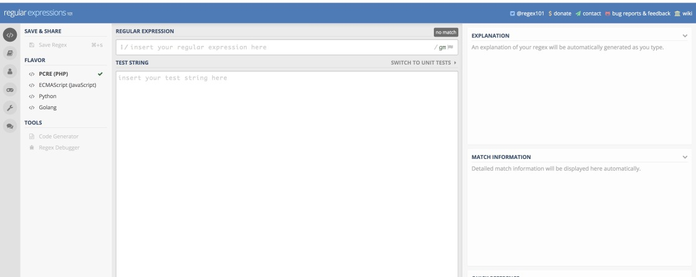
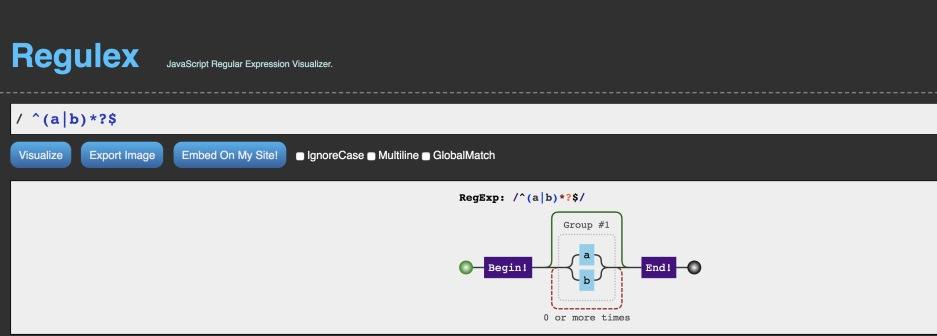
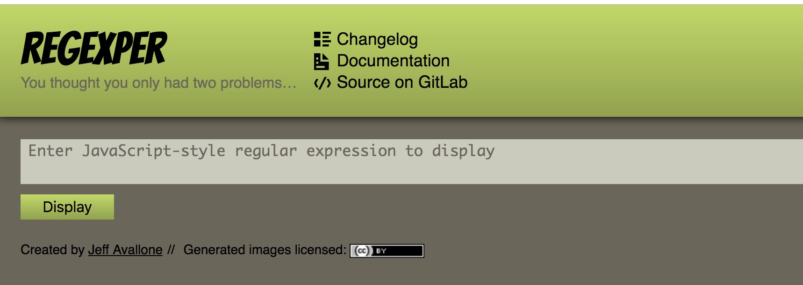
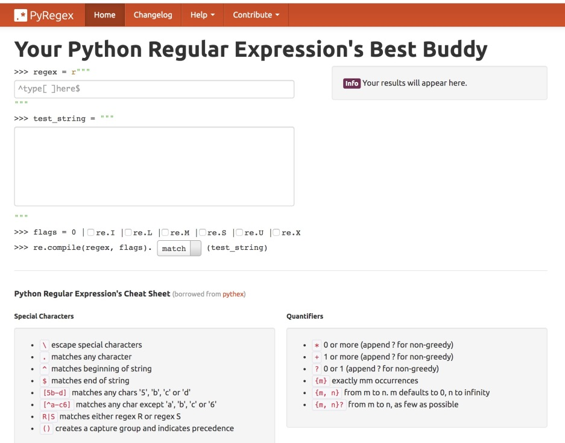
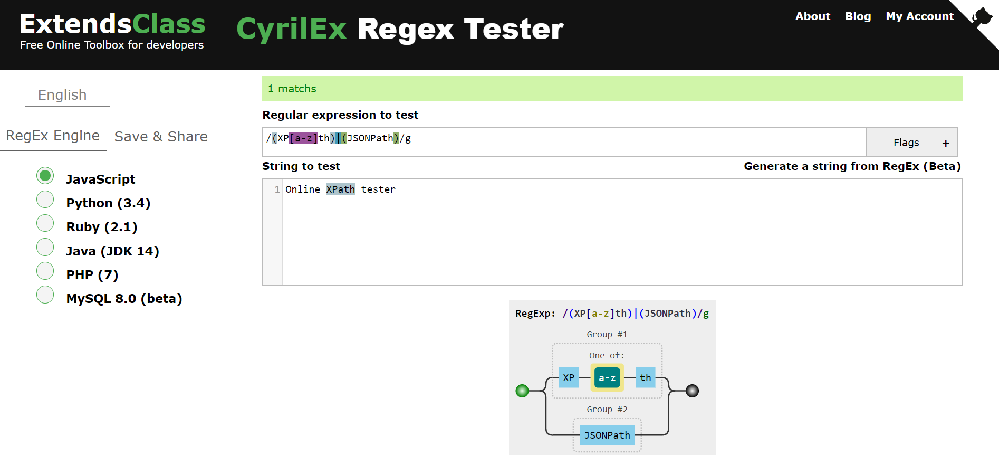

# regex101: 功能最强
[https://regex101.com/](https://regex101.com/)

regex101的功能最强，支持php, js, python, 和go的正则表达式

# Regulex：正则可视化
[https://jex.im/regulex/#!flags=&re=%5E(a%7Cb)*%3F%24](https://jex.im/regulex/#!flags=&re=%5E(a%7Cb)*%3F%24)

regulex仅支持js的正则，

# regexper：正则可视化

[https://regexper.com/](https://regexper.com/)

# pyregex：专注python正则

[http://www.pyregex.com/](http://www.pyregex.com/)

# cyrilex：正则可视化

[https://extendsclass.com/regex-tester.html](https://extendsclass.com/regex-tester.html)

cyrilex 支持 JS，Python，Ruby，Java，PHP 和 MySQL 的正则表达式.

