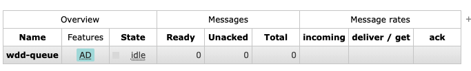

```js
client.onConnect = function (frame) {
     console.log('onConnect', frame)
  
     client.subscribe('/topic/event.agent.*.abc_cc', function (msg) {
       console.log(msg)
     }, {
       id: 'wdd',
       'x-queue-name': 'wdd-queue'
     })
}
```

在mq管理端：



Optional Arguments
Optional queue arguments, also known as "x-arguments" because of their field name in the AMQP 0-9-1 protocol, is a map (dictionary) of arbitrary key/value pairs that can be provided by clients when a queue is declared.  -https://www.rabbitmq.com/queues.html