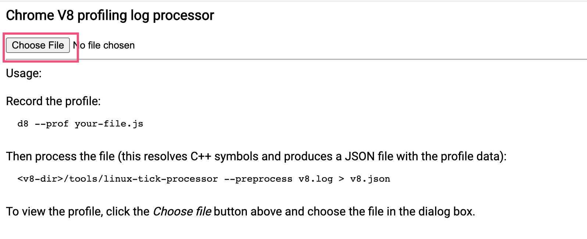
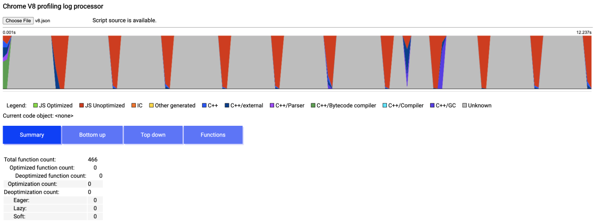
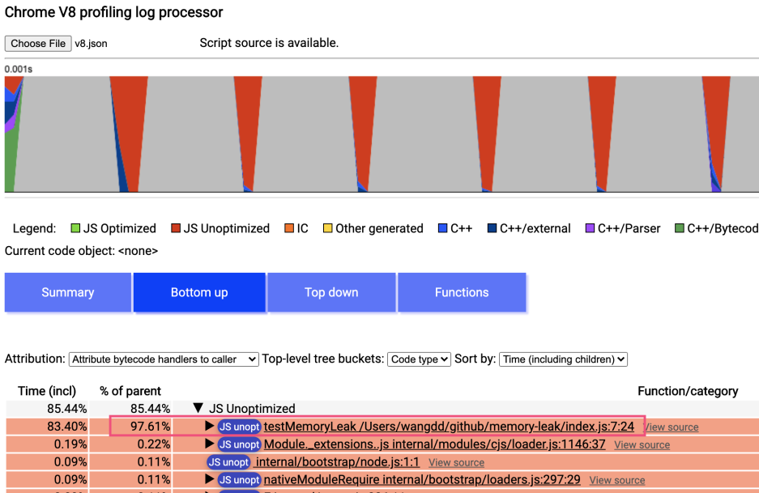

下面的命令可以生成一个v8的日志如 isolate-0x102d4e000-86008-v8.log

- --log-source-code 不是必传的字段，加了该字段可以在定位到源码
```bash
node --prof --log-source-code index.js
```

下一步是将log文件转成json
```bash
node --prof-process --preprocess isolate-0x102d4e000-86008-v8.log > v8.json
```

然后打开 [https://wangduanduan.gitee.io/v8-profiling/](https://wangduanduan.gitee.io/v8-profiling/)  这个页面，选择v8.json



下图横坐标是时间，纵坐标是cpu百分比。



选择Bottom Up之后，展开JS unoptimized, 可以发现占用cpu比较高的代码的位置。


