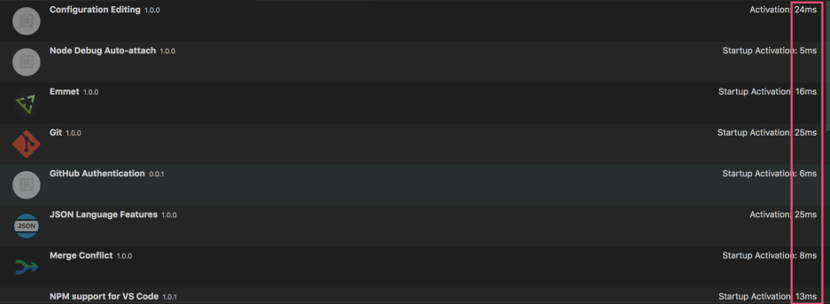

电脑的风扇声突然响了起来，我知道有某个进程在占用大量CPU资源。

在任务管理器中，可以看到vscode占用的的CPU资源达到150。说明问题出在vscode上。

在vscode中，按F1, 输入： show running extensions  可以查看所有插件的运行状况。

其中需要关注最重要的指标就是活动时间：如果某个插件的活动时间明显是其他插件的好多倍，那问题就可能出在这个插件上。要么禁用该插件，要么卸载该插件。

