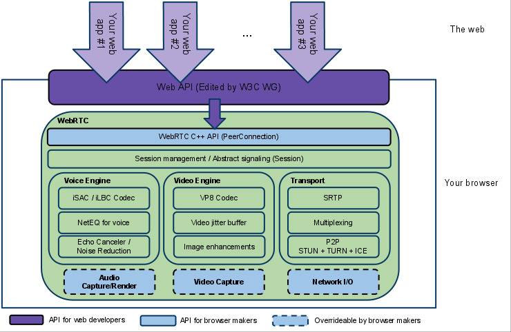
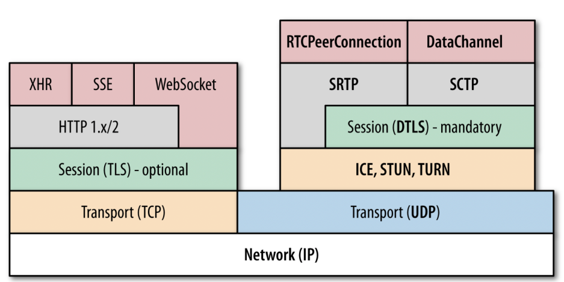

# 标准文档
- WebRTC [https://w3c.github.io/webrtc-pc/](https://w3c.github.io/webrtc-pc/)
- MediaStream [https://www.w3.org/TR/mediacapture-streams/](https://www.w3.org/TR/mediacapture-streams/)

# 实现接口

- MediaStream: 获取媒体流，例如从用户的摄像机或者麦克风
- RTCPeerConnection: 音频或者视频呼叫，以及加密和带宽管理
- RTCDataChannel: 端到端的数据交互

# WebRTC架构

架构图颜色标识说明：

- 紫色部分是Web开发者API层
- 蓝色实线部分是面向浏览器厂商的API层
- 蓝色虚线部分浏览器厂商可以自定义实现

WebRTC有三个模块：

- Voice Engine（音频引擎）
   - Voice Engine包含iSAC/iLBC Codec（音频编解码器，前者是针对宽带和超宽带，后者是针对窄带）
   - NetEQ for voice（处理网络抖动和语音包丢失）
   - Echo Canceler（回声消除器）/ Noise Reduction（噪声抑制）
- Video Engine（视频引擎）
   - VP8 Codec（视频图像编解码器）
   - Video jitter buffer（视频抖动缓冲器，处理视频抖动和视频信息包丢失）
   - Image enhancements（图像质量增强）
- Transport
   - SRTP（安全的实时传输协议，用以音视频流传输）
   - Multiplexing（多路复用）
   - P2P，STUN+TURN+ICE（用于NAT网络和防火墙穿越的）
   - 除此之外，安全传输可能还会用到DTLS（数据报安全传输），用于加密传输和密钥协商
   - 整个WebRTC通信是基于UDP的

# WebRTC底层协议

WebRTC 核心的协议都是在右侧基于 UDP 基础上搭建起来的。

其中，ICE、STUN、TURN 用于内网穿透, 解决了获取与绑定外网映射地址，以及 keep alive 机制

- DTLS 用于对传输内容进行加密，可以看做是 UDP 版的 TLS。由于 WebRTC 对安全比较重视，这一层是必须的。所有WebRTC组件都必须加密，并且其JavaScript API只能用于安全源（HTTPS或本地主机）。信令机制并不是由WebRTC标准定义的，所以您必须确保使用安全协议。
- SRTP 与 SRTCP 是对媒体数据的封装与传输控制协议
- SCTP 是流控制传输协议，提供类似 TCP 的特性，SCTP 可以基于 UDP 上构建，在 WebRTC 里是在 DTLS 协议之上
- RTCPeerConnection 用来建立和维护端到端连接，并提供高效的音视频流传输
- RTCDataChannel 用来支持端到端的任意二进制数据传输

WebRTC 协议栈解释

- ICE：互动式连接建立（RFC 5245）
- STUN：用于NAT的会话遍历实用程序（RFC 5389）
- TURN：在NAT周围使用继电器进行遍历（RFC 5766）
- SDP：会话描述协议（RFC 4566）
- DTLS：数据报传输层安全性（RFC 6347）
- SCTP：流控制传输协议（RFC 4960）
- SRTP：安全实时传输协议（RFC 3711）

