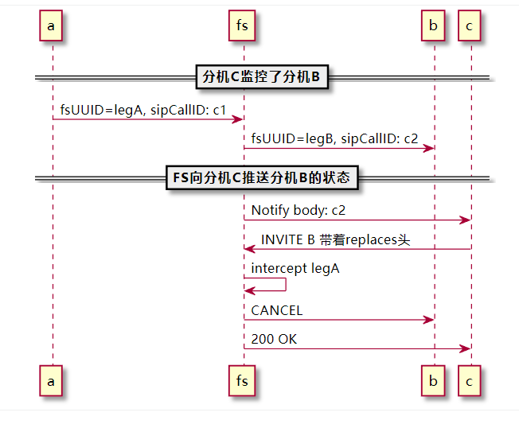

FS的 call pickup功能，就是用intercept功能。

> 一个呼叫一般有两个leg,  intercept一般是把自己bridge其中一个leg，另外一个leg会挂断。
> intercept默认是bridge legA, 挂断legB。通过参数也可以指定来bridge legB，挂断legA。

从一个简单的场景说起。A拨打B分机。

从FS的角度来说，有以下两条腿。

通过分析日志可以发现：具有replaces这种头的invite，fs没有走路由，而是直接用了intercept拦截。

New Channel sofia/external/8003@wdd.cc [6ca5ed94-a5e5-492d-aaf7-782cecbaf7d1] 2021-03-15 10:42:47.380797 [NOTICE] switch_channel.c:1118 New Channel sofia/external/8001@wdd.cc [34dc4095-3bac-4f7d-8be4-1ed5ed2f06b4]

2021-03-15 10:42:51.520800 [NOTICE] switch_channel.c:1118 New Channel sofia/external/8004@wdd.cc [03e78837-1413-4b77-ba4c-e753fed55ebe] 2021-03-15 10:42:51.520800 [DEBUG] switch_core_state_machine.c:585 (sofia/external/8004@wdd.cc) Running State Change CS_NEW (Cur 3 Tot 163) 2021-03-15 10:42:51.520800 [DEBUG] sofia.c:10279 sofia/external/8004@wdd.cc receiving invite from 192.168.2.109:18627 version: 1.10.3-release  32bit 2021-03-15 10:42:51.520800 [DEBUG] sofia.c:11640 call 6ca5ed94-a5e5-492d-aaf7-782cecbaf7d1 intercepted 2021-03-15 10:42:51.520800 [DEBUG] sofia.c:7325 Channel sofia/external/8004@wdd.cc entering state [received][100]

EXECUTE [depth=0] sofia/external/8004@wdd.cc intercept(6ca5ed94-a5e5-492d-aaf7-782cecbaf7d1)

常见的使用场景：

- 某个电话正在振铃，但是没人接。如果我的话机通过BLF监控了这个分机，就可以通过按键来用我自己的话机代接正在振铃的话机。

# 参考

- [https://www.yuque.com/wangdd/fyikfz/lawr6v](https://www.yuque.com/wangdd/fyikfz/lawr6v)
- [https://www.yuque.com/wangdd/fyikfz/lawr6v](https://www.yuque.com/wangdd/fyikfz/lawr6v)

