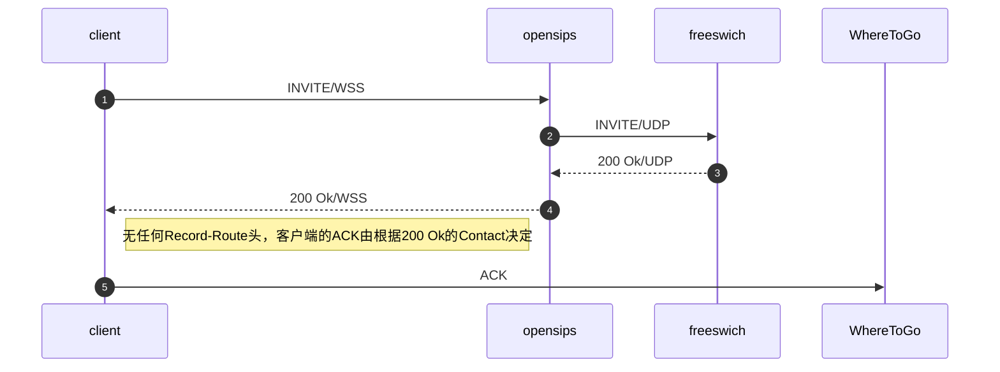
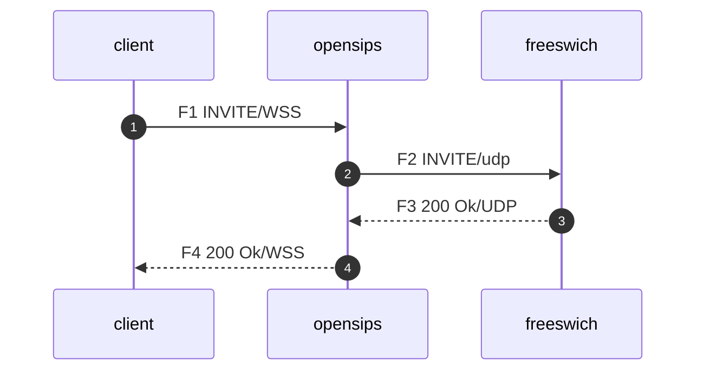

网络结构图如下：


节点   | 内网IP | 公网IP | 监听端口wss | 监听端口udp
---   | ---   | --- | --- | ---
opensips  | 192.168.0.10 | 1.2.3.4 | 4443 | 5060
freeswich  | 192.168.0.11 | 无 |  | 5060


# 场景1：  OpenSIPS不增加Record-Route



client收到200OK, 由于无Record-Route头，client的ACK由根据200 Ok的Contact决定。

WhereToGo 那么有以下几种可能：

1. 200 OK Contact 是 opensips的内网地址 192.168.0.10， ACK发往192.168.0.10， 这个肯定是不通的。 
2. 200 OK Contact 是 freeswich的内网地址 192.168.0.11， ACK发往192.168.0.11， 这个也肯定不通。
2. 200 Ok Contact 是 opensips的公网地址 1.2.3.4， ACK发往opensips的公网地址 1.2.3.4， 这个请求opensips可以收到

结论：如果200 Ok 没有Record-Route， 那么OpenSIPS再发出200 OK的时候，Contact必须设置成自己的OpenSIPS的公网地址。

# 场景2： OpenSIPS 增加Record-Route头



再F2步骤：添加Record-Route头。

```sh
Record-Route: <sip:192.168.0.10:5060;transport=udp;r2=on;lr>
Record-Route: <sip:192.168.0.10:4443;transport=wss;r2=on;lr>
```

一般被叫侧不会改写Record-Route头，在响应消息中，Record-Route会原封不动的回复给client。

在F4: 当client在 200 ok里发现Record-Route头后

```sh
Record-Route: <sip:192.168.0.10:5060;transport=udp;r2=on;lr>
Record-Route: <sip:192.168.0.10:4443;transport=wss;r2=on;lr>
```

ACK将会根据record-route进行路由。


这里发现了 client将会把ACK发送给 opensips的内网地址，这个显然是不通的。

# 解决问题

既然知道问题的原因，那么解决这个问题就非常简单了，只需在Record-Route设置正确的ip地址就可以了。

在opensips里，可以使用

```c
socket = wss:192.168.0.10:4443 as 1.2.3.4:4443
socket = udp:192.168.0.10:5060
```

也可以使用
```c
advertised_address="1.2.3.4"
```

也可以使用
```c
route [some_route] {

    set_advertised_address("1.2.3.4");
}
```

# 延伸方案
除了用record-route来路由，我们还可以使用拓扑隐藏。
拓扑隐藏模块将会删除的record-route, 并修改200 Ok的Contact, ack路由将会根据200 ok的Contact地址来路由，