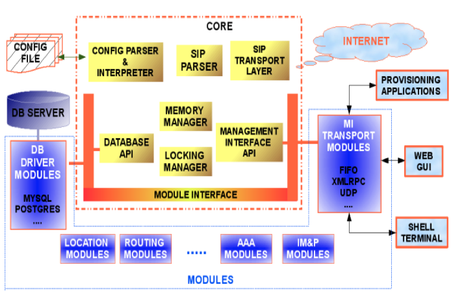
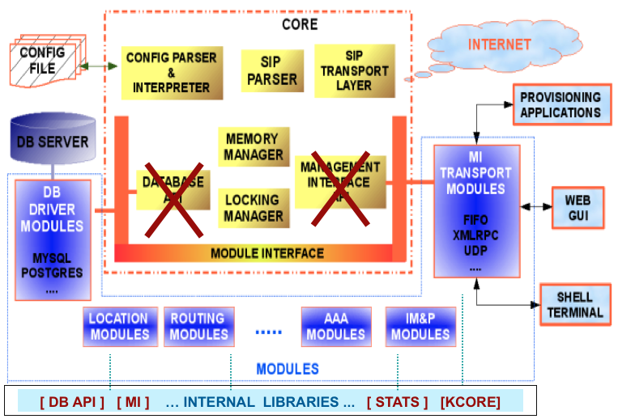
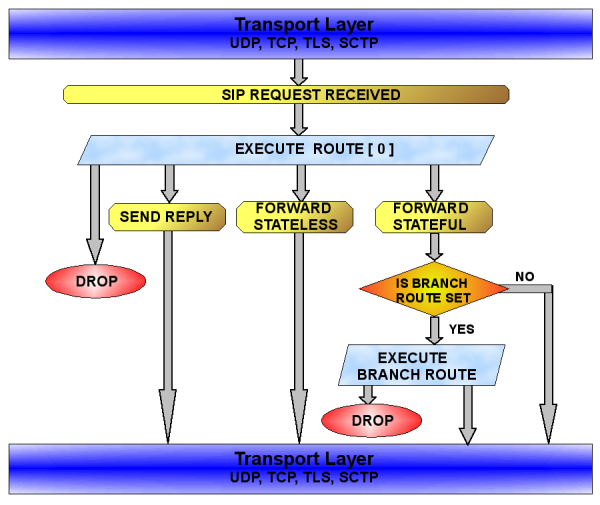
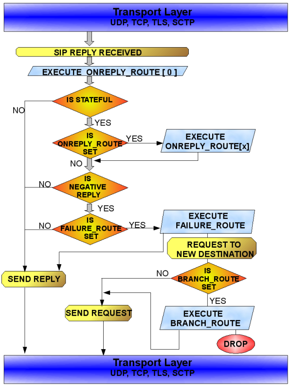

# 架构图

kamailio 1.x版本


kamailio 3.x版本。相比于1.x版本，两个核心模块移动到外部模块。


核心模块
The core includes:
- memory manager
- SIP message parser
- locking system
- DNS and transport layer management (UDP, TCP, TLS, SCTP)
- configuration file parser and interpreter
- stateless forwarding
- pseudo-variables and transformations engines
- RPC control interface API
- timer API

The internal libraries include:
- some components from old Kamailio v1.5.x core
- database abstraction layers (DB API v1 and v2)
- management interface (MI) API
- statistics engine

# SIP消息处理

请求处理


响应处理。 这里可以看到，是先执行响应路由，再执行失败路由。


# 锁系统
略

# 内存管理
略

# 数据结构

## str （字符串）

str.h
```c
struct _str{
	char* s; /* pointer to the beginning of string (char array) */
	int len; /* string length */
};

typedef struct _str str;
```

用法

```c
#include "str.h"
...
str s;
s.s = "kamailio";
s.len = strlen(s.s);
LM_DBG("the string is [%.*s]\n", s.len, s.s);
```

## struct sip_uri （SIP URI）

parser/msg_parser.h

想不到一个sip url居然也有将近20个参数。

```c
struct sip_uri {
	str user;     /* Username */
	str passwd;   /* Password */
	str host;     /* Host name */
	str port;     /* Port number */
	str params;   /* URI Parameters */
	str headers;  /* URI Headers */
	unsigned short port_no; /* Port number r*/
	unsigned short proto; /* Transport protocol */
	uri_type type; /* URI scheme */
	/* parameters */
	str transport;   /* transport parameter */
	str ttl;         /* ttl parameter */
	str user_param;  /* user parameter */
	str maddr;       /* maddr parameter */
	str method;      /* method parameter */
	str lr;          /* lr parameter */
	str r2;          /* specific rr parameter */
	/* values */
	str transport_val;  /* value of transport parameter */
	str ttl_val;        /* value of ttl parameter */
	str user_param_val; /* value of user parameter */
	str maddr_val;      /* value of maddr parameter */
	str method_val;     /* value of method parameter */
	str lr_val;         /* value of lr parameter */
	str r2_val;         /* value of r2 parameter */
};
```

## struct sip_msg （SIP消息）

parser/msg_parser.h

```c
struct sip_msg {
	unsigned int id;               /* message id, unique/process*/
	struct msg_start first_line;   /* Message first line */
	struct via_body* via1;         /* The first via */
	struct via_body* via2;         /* The second via */
	struct hdr_field* headers;     /* All the parsed headers*/
	struct hdr_field* last_header; /* Pointer to the last parsed header*/
	hdr_flags_t parsed_flag;       /* Already parsed header field types */

	/* Via, To, CSeq, Call-Id, From, end of header*/
	/* pointers to the first occurrences of these headers;
	 * everything is also saved in 'headers' (see above)
	 */

	/* shorcuts to known headers */
	struct hdr_field* h_via1;
	struct hdr_field* h_via2;
	struct hdr_field* callid;
	struct hdr_field* to;
	struct hdr_field* cseq;
	struct hdr_field* from;
	struct hdr_field* contact;
	struct hdr_field* maxforwards;
	struct hdr_field* route;
	struct hdr_field* record_route;
	struct hdr_field* path;
	struct hdr_field* content_type;
	struct hdr_field* content_length;
	struct hdr_field* authorization;
	struct hdr_field* expires;
	struct hdr_field* proxy_auth;
	struct hdr_field* supported;
	struct hdr_field* proxy_require;
	struct hdr_field* unsupported;
	struct hdr_field* allow;
	struct hdr_field* event;
	struct hdr_field* accept;
	struct hdr_field* accept_language;
	struct hdr_field* organization;
	struct hdr_field* priority;
	struct hdr_field* subject;
	struct hdr_field* user_agent;
	struct hdr_field* content_disposition;
	struct hdr_field* accept_disposition;
	struct hdr_field* diversion;
	struct hdr_field* rpid;
	struct hdr_field* refer_to;
	struct hdr_field* session_expires;
	struct hdr_field* min_se;
	struct hdr_field* ppi;
	struct hdr_field* pai;
	struct hdr_field* privacy;

	struct sdp_info* sdp; /* parsed SDP body */

	char* eoh;        /* pointer to the end of header (if found) or null */
	char* unparsed;   /* here we stopped parsing*/
	
	struct receive_info rcv; /* source and dest ip, ports, proto a.s.o*/

	char* buf;        /* scratch pad, holds a unmodified message,
                           *  via, etc. point into it */
	unsigned int len; /* message len (orig) */

	/* modifications */
    // 可写的伪变量

    // $ru
	str new_uri; /* changed first line uri, when you change this
                  * don't forget to set parsed_uri_ok to 0 */
    // $du
	str dst_uri; /* Destination URI, must be forwarded to this URI if len!=0 */
	
	/* current uri */
	int parsed_uri_ok; /* 1 if parsed_uri is valid, 0 if not, set it to 0
	                      if you modify the uri (e.g change new_uri)*/
	struct sip_uri parsed_uri; /* speed-up > keep here the parsed uri*/

	/* the same for original uri */
	int parsed_orig_ruri_ok;
	struct sip_uri parsed_orig_ruri;

	struct lump* add_rm;       /* used for all the forwarded requests/replies */
	struct lump* body_lumps;     /* Lumps that update Content-Length */
	struct lump_rpl *reply_lump; /* only for localy generated replies !!!*/

	/* whatever whoever want to append to branch comes here */
	char add_to_branch_s[MAX_BRANCH_PARAM_LEN];
	int add_to_branch_len;
	
	/* index to TM hash table; stored in core to avoid 
	 * unnecessary calculations */
	unsigned int  hash_index;

	/* flags used from script */
	flag_t flags;

	/* flags used by core - allows to set various flags on the message; may 
	 * be used for simple inter-module communication or remembering 
	 * processing state reached */
	unsigned int msg_flags;

    // 对外宣称地址和端口，可以通过as设置，也可以通过
    // set_advertised_address() set_advertised_port()
    // 这个地址会影响Via头和Record-Route头
	str set_global_address;
	str set_global_port;

	/* force sending on this socket */
	struct socket_info* force_send_socket;

	/* create a route HF out of this path vector */
	str path_vec;
};
```

kamailio处理SIP信令高效的原因
1. 懒解析，只解析需要的头
2. 解析之后缓存起来，避免重复解析
3. 解析后的值是一个指向原始SIP消息的指针，避免开辟内存
3. 避免在路由过程中修改SIP消息，二是把所有的修改操作在发送消息前，一次性批量执行

```c
REGISTER sip:sip.test.com SIP/2.0
Via: SIP/2.0/UDP 192.168.1.3:5061;branch=z9hG4bK-d663b80b
Max-Forwards: 70
From: user <sip:u123@sip.test.com>;tag=ea8cef4b108a99bco1
To: user <sip:u123@sip.test.com>
Call-ID: b96fead3-f03493d4@xyz
CSeq: 3720 REGISTER
Contact: user <sip:u123@192.168.1.3:5061>;expires=3600
User-Agent: Linksys/RT31P2-2.0.10(LIc)
Content-Length: 0
Allow: ACK, BYE, CANCEL, INFO, INVITE, NOTIFY, OPTIONS, REFER
Supported: x-sipura
```

# struct msg_start (消息首行)

消息首行是一个包含union类型的结构，因为首行可能是SIP请求，也可能是SIP响应。

parser/parse_fline.h.
To parse a buffer containing the first line of a SIP message you have to use the function parse_fline(...).


```c
struct msg_start {
	int type;                 /* Type of the Message - Request or Response (Reply) */
	int len;                  /* length including delimiter */
	union {
		struct {
			str method;       /* Method string */
			str uri;          /* Request URI as raw string */
			str version;      /* SIP version */
			int method_value; /* Internal integer representation of SIP method */
		} request;
		struct {
			str version;      /* SIP version */
			str status;       /* Reply status */
			str reason;       /* Reply reason phrase */
			unsigned int statuscode; /* Integer representation of reply status */
		} reply;
	}u;
};
```

# struct hdr_field (SIP头)

parser/hf.h.

SIP头这里主要是包含一个链表结构

```c
struct hdr_field {
	hdr_types_t type;          /* Header field type */
	str name;                  /* Header field name */
	str body;                  /* Header field body (may not include CRLF) */
	int len;                   /* length from hdr start until EoHF (incl.CRLF) */
	void* parsed;              /* Parsed data structures */
	struct hdr_field* next;    /* Next header field in the list */
	struct hdr_field* sibling; /* Next header of same type */
};
```
parsed字段指向头的body部分。


例如解析From和To头

```c
parse_headers(msg, HDR_FROM_F|HDR_TO_F, 0);
```

为了优化解析，给每个头都设置了一个枚举值。

```c
enum _hdr_types_t {
	HDR_ERROR_T        = -1   /* Error while parsing */,
	HDR_OTHER_T        =  0   /* Some other header field */,
	HDR_VIA_T          =  1   /* Via header field */,
	HDR_VIA1_T         =  1   /* First Via header field */,
	HDR_VIA2_T         =  2   /* only used as flag */,
	HDR_TO_T                  /* To header field */,
	HDR_FROM_T                /* From header field */,
	HDR_CSEQ_T                /* CSeq header field */,
	HDR_CALLID_T              /* Call-Id header field */,
	HDR_CONTACT_T             /* Contact header field */,
	HDR_MAXFORWARDS_T         /* MaxForwards header field */,
	HDR_ROUTE_T               /* Route header field */,
	HDR_RECORDROUTE_T         /* Record-Route header field */,
	HDR_PATH_T                /* Path header fiels */,
	HDR_CONTENTTYPE_T         /* Content-Type header field */,
	HDR_CONTENTLENGTH_T       /* Content-Length header field */,
	HDR_AUTHORIZATION_T       /* Authorization header field */,
	HDR_EXPIRES_T             /* Expires header field */,
	HDR_PROXYAUTH_T           /* Proxy-Authorization hdr field */,
	HDR_SUPPORTED_T           /* Supported  header field */,
	HDR_PROXYREQUIRE_T        /* Proxy-Require header field */,
	HDR_UNSUPPORTED_T         /* Unsupported header field */,
	HDR_ALLOW_T               /* Allow header field */,
	HDR_EVENT_T               /* Event header field */,
	HDR_ACCEPT_T              /* Accept header field */,
	HDR_ACCEPTLANGUAGE_T      /* Accept-Language header field */,
	HDR_ORGANIZATION_T        /* Organization header field */,
	HDR_PRIORITY_T            /* Priority header field */,
	HDR_SUBJECT_T             /* Subject header field */,
	HDR_USERAGENT_T           /* User-Agent header field */,
	HDR_ACCEPTDISPOSITION_T   /* Accept-Disposition hdr field */,
	HDR_CONTENTDISPOSITION_T  /* Content-Disposition hdr field */,
	HDR_DIVERSION_T           /* Diversion header field */,
	HDR_RPID_T                /* Remote-Party-ID header field */,
	HDR_REFER_TO_T            /* Refer-To header fiels */,
	HDR_SESSION_EXPIRES_T     /* Session-Expires header field */,
	HDR_MIN_SE_T              /* Min-SE header field */,
	HDR_PPI_T                 /* P-Preferred-Identity header field */,
	HDR_PAI_T                 /* P-Asserted-Identity header field */,
	HDR_PRIVACY_T             /* Privacy header field */,
	HDR_RETRY_AFTER_T         /* Retry-After header field */,
	HDR_EOH_T                 /* Some other header field */
};
```

# 参考
- https://www.asipto.com/pub/kamailio-devel-guide/
