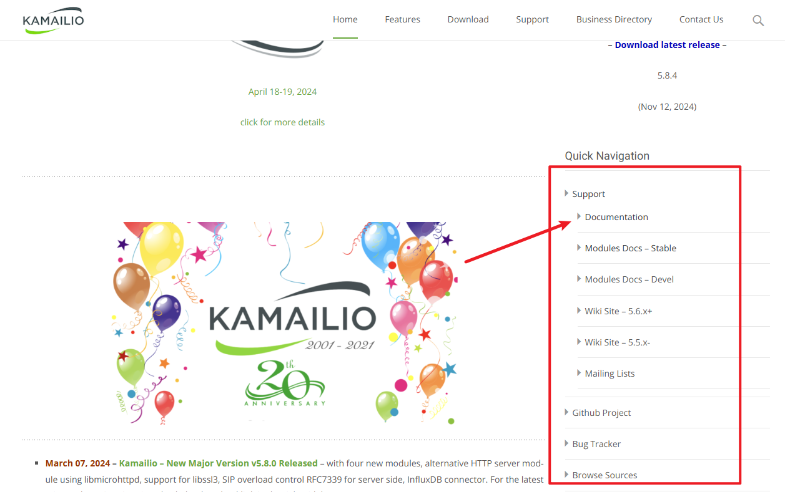
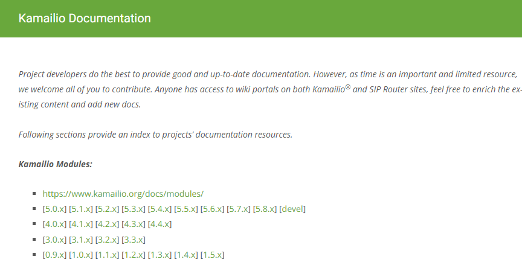
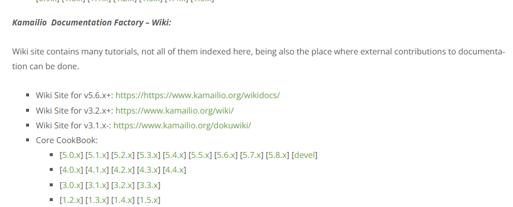
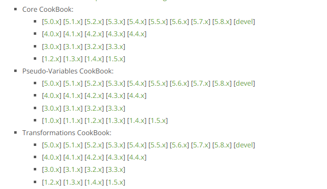
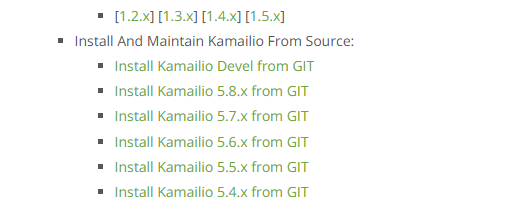
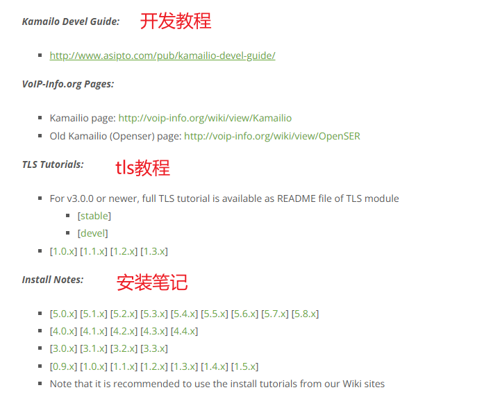
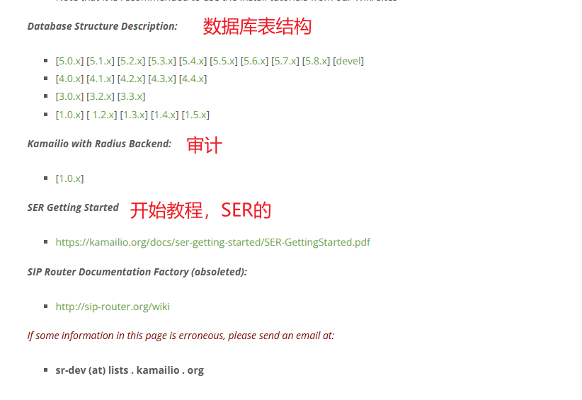

对于熟悉OpenSIPS的文档结构来说的人，看了Kamailio的文档，往往觉得无从下手。

当我们打开Km的官网(kamailio.org)后， 会重定向到https://www.kamailio.org/w/,  在页面的右侧，

接着，我们会导航到 https://www.kamailio.org/w/documentation/

这个页面的结构需要烂熟于心

# 1. 模块文档

如果你知道km的版本号和对应的模块，可以点击这里进入对应版本，然后再选择对应模块

# 2. wiki部分

## 2.1 必学部分
wiki部分主要是一些教程，非常值得看。

其中有三个重点部分
1. **core cookbook**： 主要讲解km的脚本的结构、全局参数、模块参数、路由类型、预处理、脚本操作等等，是编写km脚本的必学之处，各种参数都可以看看
2. **Pseudo-Variables CookBook**：主要讲解各种伪变量，用来读写SIP消息
3. **Transformations CookBook**： 主要讲解各种操作变换，例如把字符串型转为int型数据

## 源码安装

这部分讲解如何通过GIT进行源码安装。

## FAQ
https://www.kamailio.org/wikidocs/tutorials/faq/main/

## 外部资源

这里涉及了如何用km和常见的媒体服务器如何集成

# 总结

总体来说，km的文档算是非常完整了，但是相比于OpenSIPS, 还是缺少一个全局的函数指引，例如我知道函数名，但是不知道是在哪一个模块里，想找到这个模块，就只能靠搜索引擎的支持了。