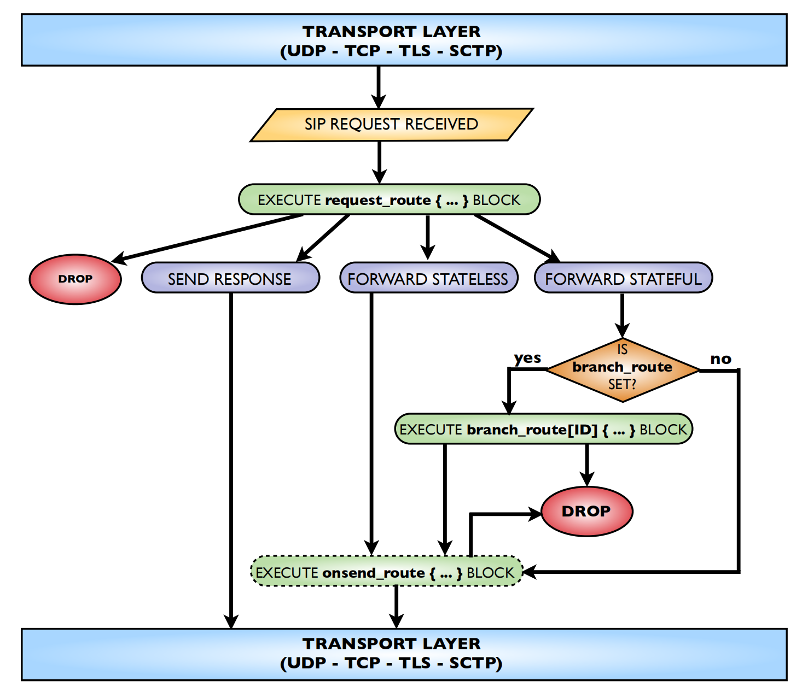
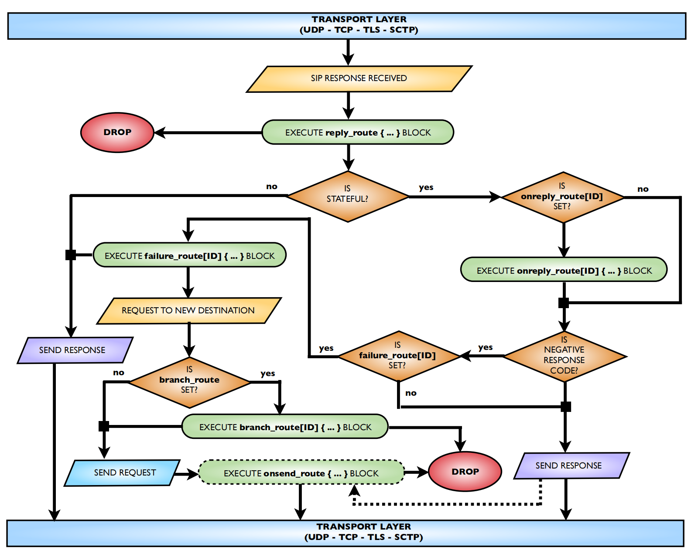
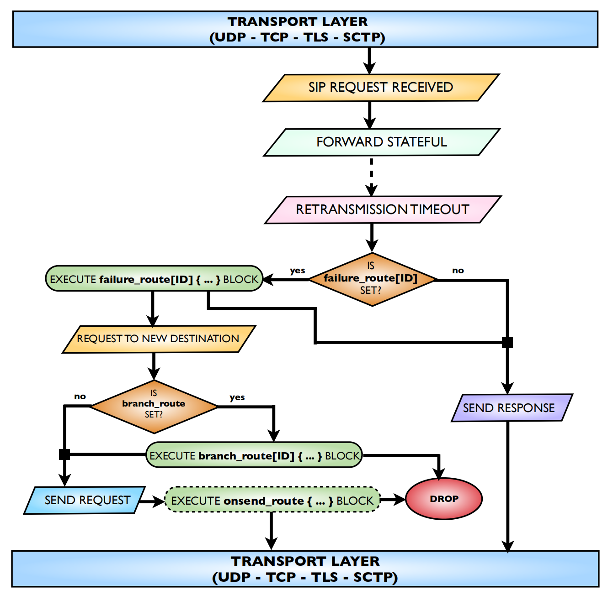

# 1. 请求消息处理过程

请求可以

- 直接丢弃，不返回任何响应。对于恶意请求，SIP Flood攻击，最好不要返回任何响应。
- 直接返回状态码，不做转发，例如直接返回301重定向
- 无状态转发
- 有状态转发
    - 执行分支路由，分支路由也可以将消息丢弃
- 无论有无状态，请求发出去前都会执行onsend_route路由，在onsend_route内部，已经不能对SIP消息再做拦截

# 2. 响应消息处理过程

- 首先执行reply_route{}, 在这个路由里可以将消息丢弃
- 然后判断消息是否有状态的
    - 有状态，这执行onreply_route[ID]路由
        - 如果响应是失败的，还可以执行failure_route[ID], 当前前提是在请求路由里是否设置了钩子
        - 在失败路由可以，可以再次设置新的目标地址，进行转发； 设置了新的目标地址后，还可以设置分支路由


这里要注意的是，响应路由在失败路由之前执行。


# 3. 重传处理

