图片来自 [https://microchipdeveloper.com/](https://microchipdeveloper.com/) 只不过这个网站访问速度很慢，但是里面的图片非常有意思，能够简洁明了的说明一个概念。

上学的时候，数学老师喜欢在讲课前先讲一些概念，然后再做题。但是我觉得概念并没有那么重要，我更喜欢做题。

但是，当你理解了概念后，再去实战，就有事半功倍的效果。

# 1. 路由器

> 路由器（英语：Router，又称路径器）是一种电讯网络设备，提供路由与转送两种重要机制，可以决定数据包从来源端到目的端所经过的路由路径（host到host之间的传输路径），这个过程称为路由；将路由器输入端的数据包移送至适当的路由器输出端（在路由器内部进行），这称为转送。路由工作在OSI模型的第三层——即网络层，例如网际协议（IP）。

路由器用来做网络之间的链接，所以路由器一般至少会链接到两个网络上。常见的就是一边连接外网，一边连接内网。

# 2. IP地址

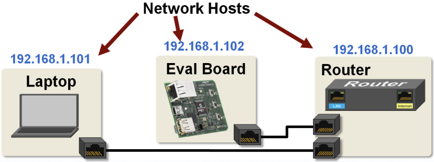

# 3. 交换机

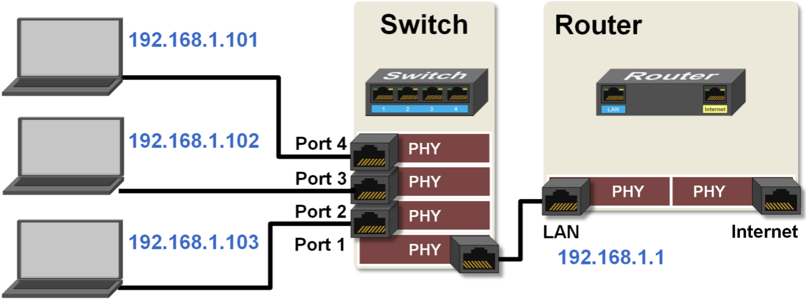

# 4. 五层网络模型

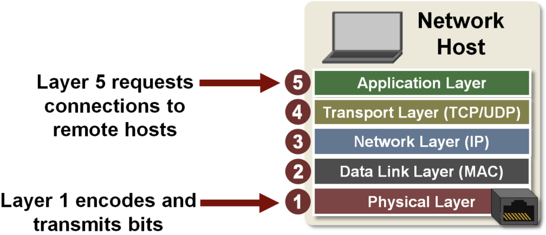

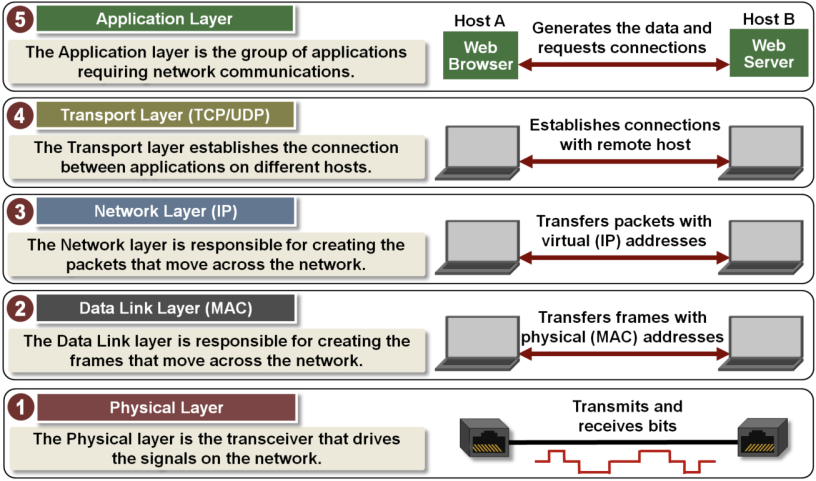

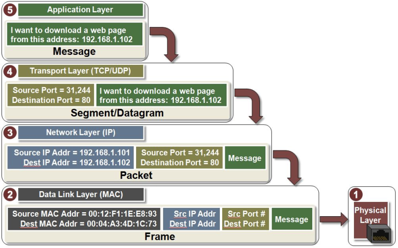

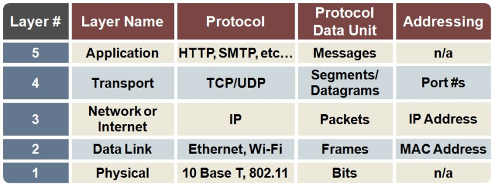

# 5. TCP vs UDP

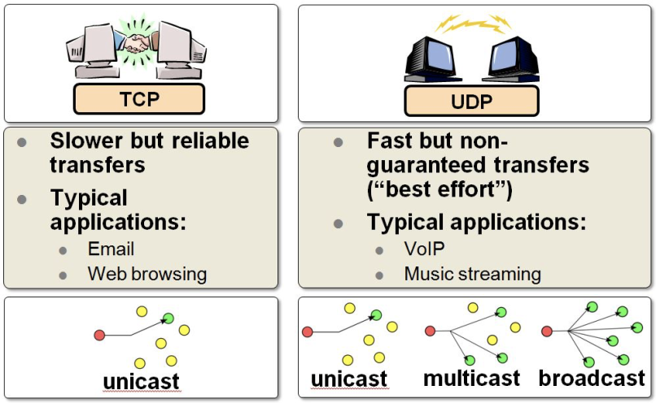

# 6. TCP 和 UDP 头

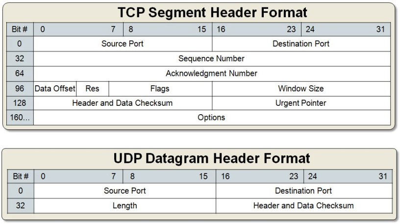

# 7. 常见的端口号

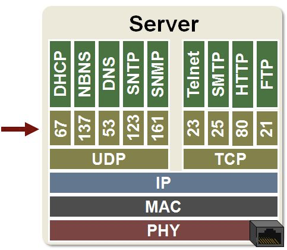

# 8. 客户端和服务端

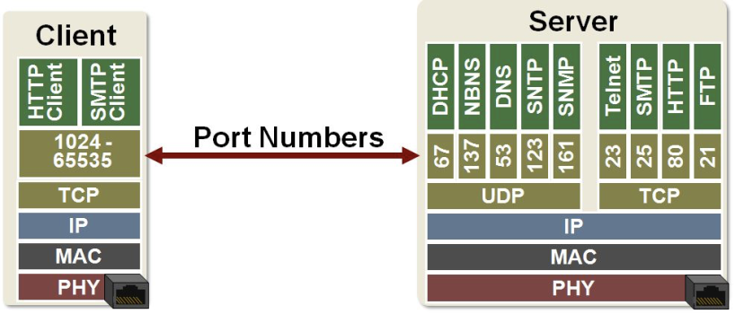

# 9. Socket

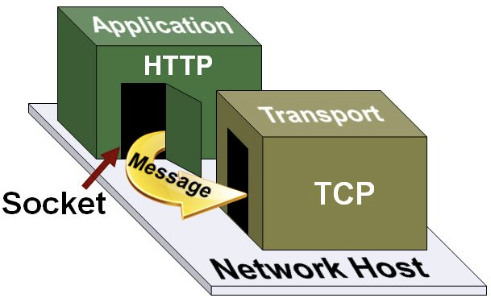

# 10. Socket建立

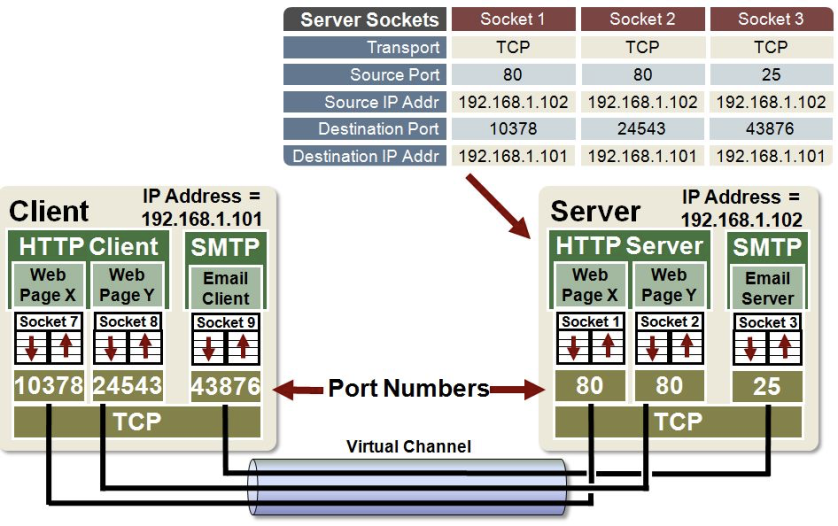

# 11. 一个Web服务器的工作过程s

## step1: 服务器在80端口监听消息

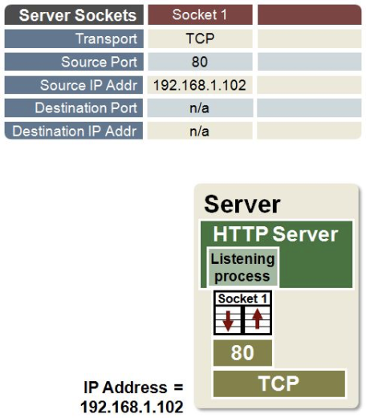

## step2: 客户端随机选择一个端口，向服务端发起连接请求

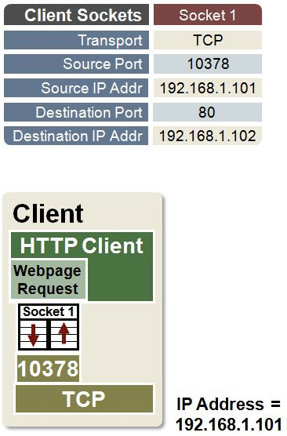

## step3: 传输层将消息传输给服务器

服务端建立一个Socket用来和客户端建立通道

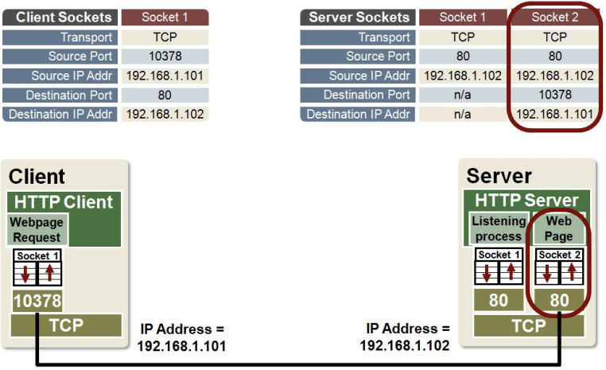

## step4: 服务器通过socket将html发给客户端

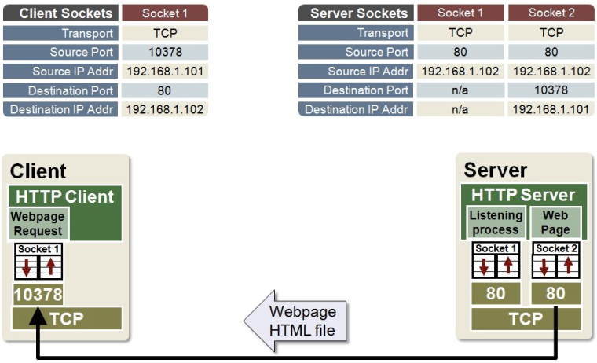

## step5: 消息接受完毕，Socket关闭

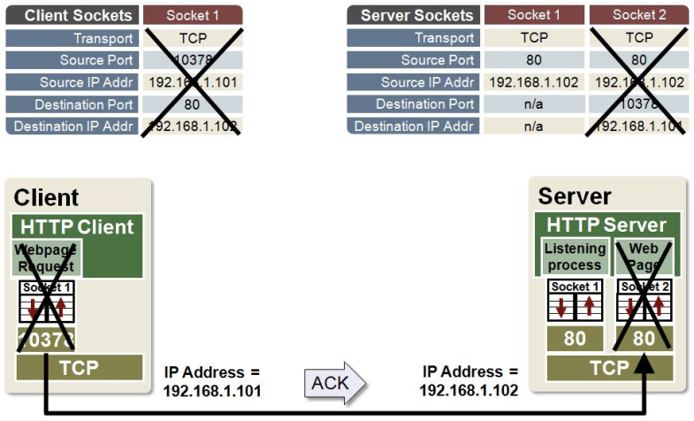

# 12 NAT
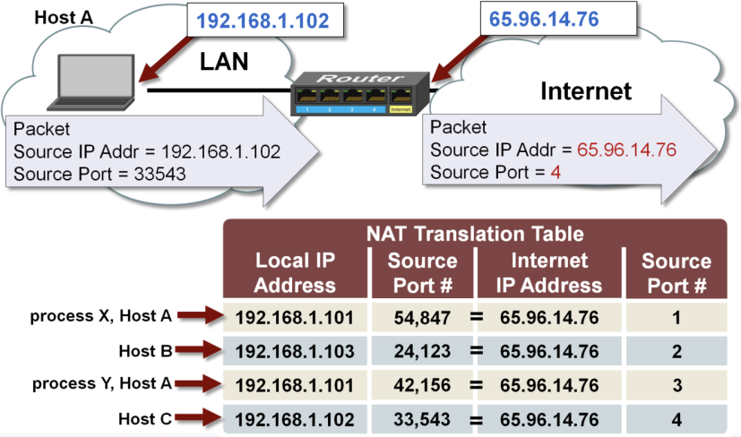

# 参考

- [https://zh.wikipedia.org/wiki/%E8%B7%AF%E7%94%B1%E5%99%A8](https://zh.wikipedia.org/wiki/%E8%B7%AF%E7%94%B1%E5%99%A8)

