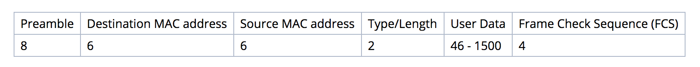
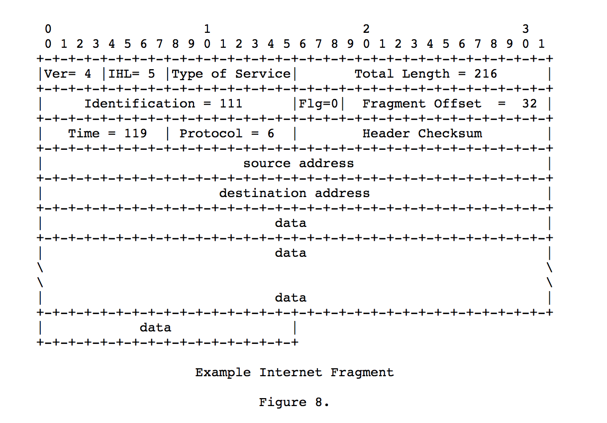
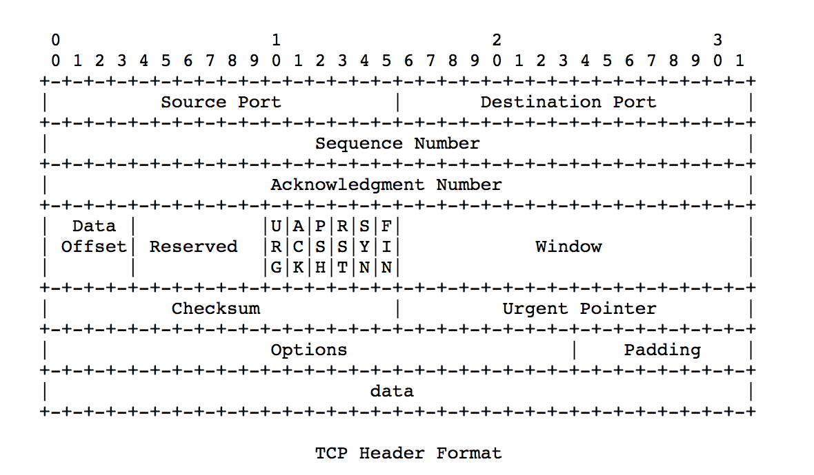
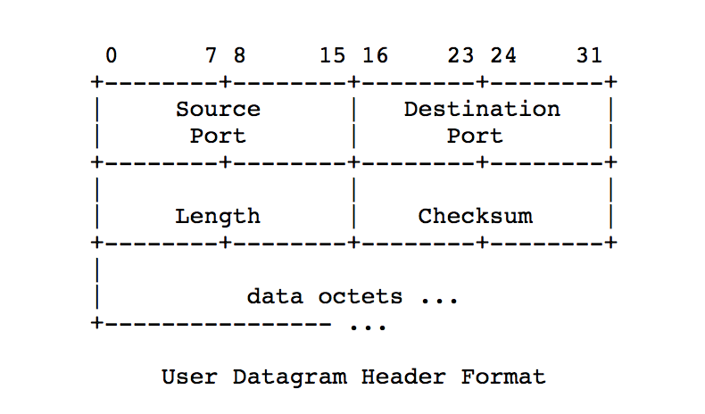
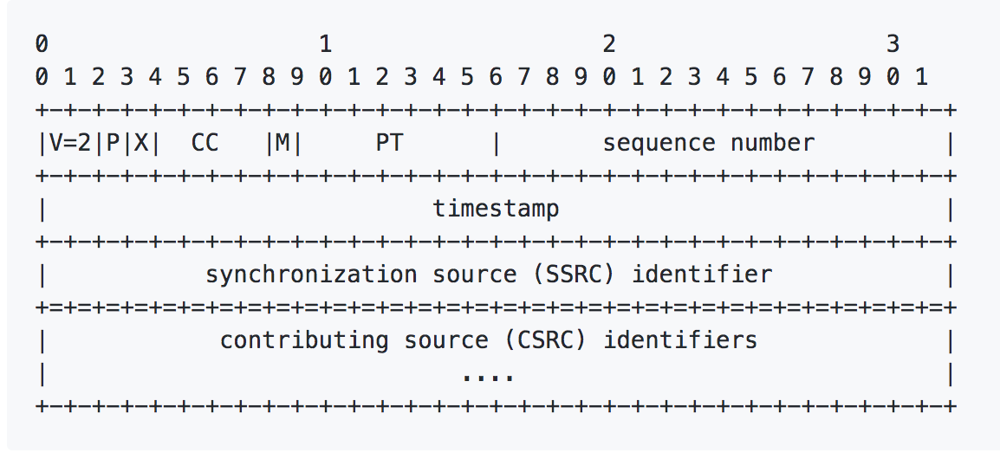

# 介绍
之所以要写这篇文章，是因为我要从pcap格式的抓包文件中抽取出语音文件。之间虽然对tcp协议有不错的理解，但并没有写代码去真正的解包分析。

最近用Node.js尝试去pacp文件中成功提取出了语音文件。再次做个总结。


# 预备知识
- 字节序： 关于字节序，可以参考 [https://www.ruanyifeng.com/blog/2016/11/byte-order.html](https://www.ruanyifeng.com/blog/2016/11/byte-order.html)。读取的时候，如果字节序设置错了，就会读出来一堆无法解析的内容


# PCAP格式
下面是paap文件的格式。

开局是一个全局的头文件。后续跟着一系列的包头和包体。<br />


## Global Header格式
全局头由六个字段组成，加起来一共24个字节。
```c
typedef struct pcap_hdr_s {
        guint32 magic_number;   /* magic number */
        guint16 version_major;  /* major version number */
        guint16 version_minor;  /* minor version number */
        gint32  thiszone;       /* GMT to local correction */
        guint32 sigfigs;        /* accuracy of timestamps */
        guint32 snaplen;        /* max length of captured packets, in octets */
        guint32 network;        /* data link type */
} pcap_hdr_t;
```

- magic_number 魔术字符，32位无符号整型，一般是0xa1b2c3d4或者0xd4c3b2a1，前者表示字段要按照大端字节序来读取，后者表示字段要按照小段字节序来读取。
- version_major 大版本号，16位无符号整形。一般是2
- version_minor 小版本号，16位无符号整形。一般是4
- thiszone 时区
- sigfigs 实际时间戳
- snaplen 捕获的最大的长度
- network 数据链路层的类型。参考[http://www.tcpdump.org/linktypes.html](http://www.tcpdump.org/linktypes.html)， 常见的1就是表示IEEE 802.3


## Packet Header
当读取了pcap文件的前24个字节之后，紧接着需要读取16个字节。这16个字节中，incl_len表示packet数据部分的长度。当拿到了Packet Data部分数据的长度。我们同时也就知道了下一个packet header要从哪个位置开始读取。

```c
typedef struct pcaprec_hdr_s {
        guint32 ts_sec;         /* timestamp seconds */
        guint32 ts_usec;        /* timestamp microseconds */
        guint32 incl_len;       /* number of octets of packet saved in file */
        guint32 orig_len;       /* actual length of packet */
} pcaprec_hdr_t;
```

## Packet Data
packet data部分是链路层的数据，由global header的network类型去决定，一般可能是802.3的比较多。


# IEEE 802.3

当拿到packet data部分的数据之后。参考frame的格式。一般Peramble字段部分是没有的。所以我们可以把包的总长度减去14字节之后，拿到User Data部分的数据。

其中Type/Length部分可以说明上层运载的是什么协议的包，比较常见的是0x0800表示上层是IPv4, 0x86dd表示上层是IPv6

- 0 - 1500 length field (IEEE 802.3 and/or 802.2)
- 0x0800 IP(v4), Internet Protocol version 4
- 0x0806 ARP, Address Resolution Protocol
- 0x8137 IPX, Internet Packet eXchange (Novell)
- 0x86dd IPv6, Internet Protocol version 6



<br />802.3的详情可以参考 [https://wiki.wireshark.org/Ethernet?action=show&redirect=Protocols%2Feth](https://wiki.wireshark.org/Ethernet?action=show&redirect=Protocols%2Feth)


# IP包的封装格式
如何计算IP数据部分的长度呢？需要知道两个字段的值。

1. Totol Length: IP数据报的总长度，单位是字节
2. IHL: IP数据报头部的总长度，单位是4字节。IHL比较常见的值是5，则说命名IP数据头部的长度是20字节。IHL占4位，最大是15，所以IP头的最大长度是60字节(15 * 4)

data部分的字节长度 = Total Length - IHL * 4<br />




# TCP包的封装格式




# UDP包的封装格式
UDP包的头部是定长的8个字节。数据部分的长度 = 总长度 - 8<br />




# RTP包的封装格式

RTP包的数据部分长度 = 总长度 - 12

PT部分表示编码格式，例如常见的PCMU是0，<br />



RTP详情 [https://www.ietf.org/rfc/rfc3550.txt](https://www.ietf.org/rfc/rfc3550.txt)<br />RTP数据体类型编码表参考 [https://www.ietf.org/rfc/rfc3551.txt](https://www.ietf.org/rfc/rfc3551.txt)


# 参考

- [http://www.tcpdump.org/linktypes.html](http://www.tcpdump.org/linktypes.html)
- [https://wiki.wireshark.org/Development/LibpcapFileFormat](https://wiki.wireshark.org/Development/LibpcapFileFormat)


