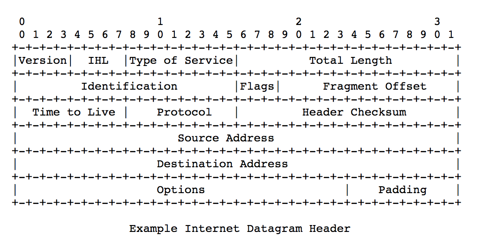
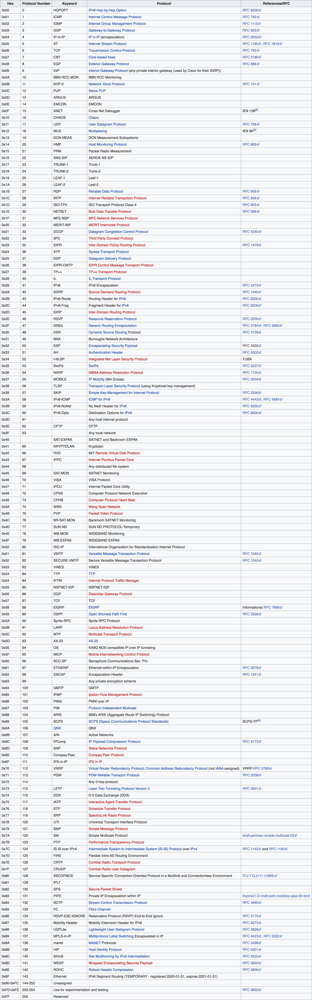
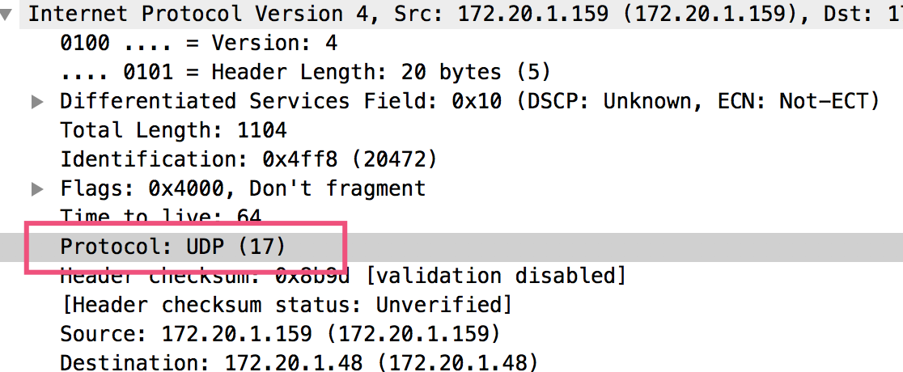

# IP协议格式

# 字段说明 

## Protocol
表示上层协议，也就是传输层是什么协议。

只需要看Decimal这列，常用的有**6表示TCP, 17表示UDP, 50表示ESP**。

 用wireshark抓包的时候，也可以看到Protocol: UDP(17)

# 参考

- [https://tools.ietf.org/html/rfc791](https://tools.ietf.org/html/rfc791)
- [https://tools.ietf.org/html/rfc790](https://tools.ietf.org/html/rfc790)
- [https://en.wikipedia.org/wiki/List_of_IP_protocol_numbers](https://en.wikipedia.org/wiki/List_of_IP_protocol_numbers)

