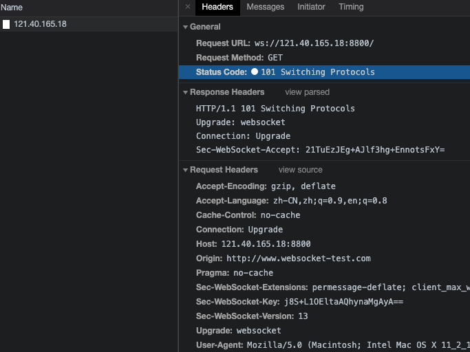
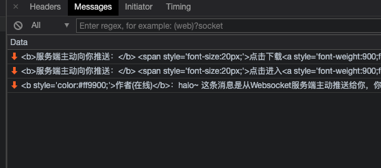
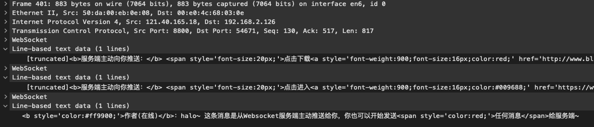
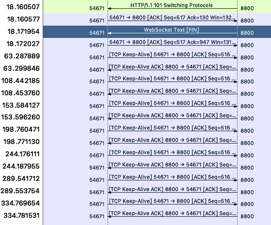

测试目标服务器 [http://www.websocket-test.com/](http://www.websocket-test.com/)， 该服务器使用的是未加密的ws协议。

打开这个页面，可以看到这个页面发起了连接到ws://121.40.165.18:8800/ 的websocket连接。

然后看下里面的消息，都是服务端向客户端发送的消息。

通过wireshark分析

单独的websocket也是能够看到服务端下发的消息的。

# keepalive 要点关注

- 每隔大约45秒，客户端会像服务端发送一个keep alive包。服务端也会非常快的回复一个心跳包

