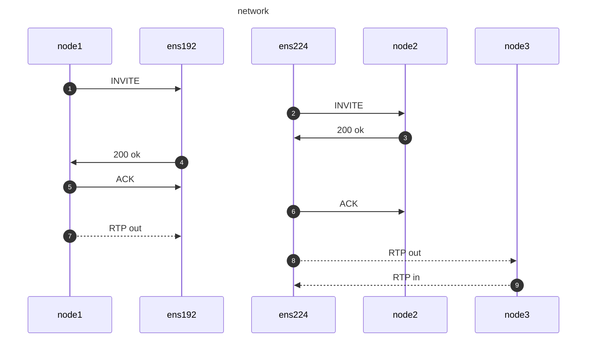

# 问题现象

主机上有两个网卡ens192和ens224。ens129网卡是对内网络的网卡，ens224是对网网络的网卡。

SIP信令阶段都是正常的，但是发现，对于来自node3的RTP流， 并没有从ens192网卡转发给node1上。




抓包程序抓到了node3发送到ens224上的包，但是排查应用服务器的日志发现，似乎应用服务器根本没有收到node3上过来的包, 所以也就无法转发。

因而怀疑是不是在内核上被拦截了。 后来通过将rp_filter设置为0, 然后语音流的转发就正常了。

# 事后复盘

node3的这个IP直接往应用服务器上发包，可能会被拦截。因为在信令建立的阶段，应用服务器并没有主动发


# 在kernel文档上 

```
rp_filter - INTEGER
	0 - No source validation.
	1 - Strict mode as defined in RFC3704 Strict Reverse Path
	    Each incoming packet is tested against the FIB and if the interface
	    is not the best reverse path the packet check will fail.
	    By default failed packets are discarded.
	2 - Loose mode as defined in RFC3704 Loose Reverse Path
	    Each incoming packet's source address is also tested against the FIB
	    and if the source address is not reachable via any interface
	    the packet check will fail.

	Current recommended practice in RFC3704 is to enable strict mode
	to prevent IP spoofing from DDos attacks. If using asymmetric routing
	or other complicated routing, then loose mode is recommended.

	The max value from conf/{all,interface}/rp_filter is used
	when doing source validation on the {interface}.

	Default value is 0. Note that some distributions enable it
	in startup scripts.
```


# 参考
- https://www.jianshu.com/p/717e6cd9d2bb
- https://www.jianshu.com/p/16d5c130670b
- https://www.kernel.org/doc/Documentation/networking/ip-sysctl.txt
