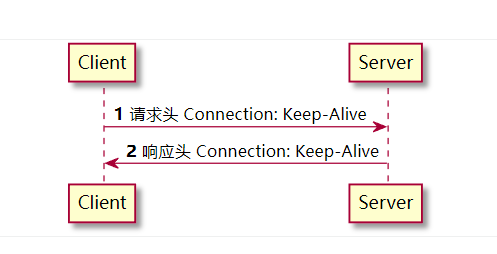
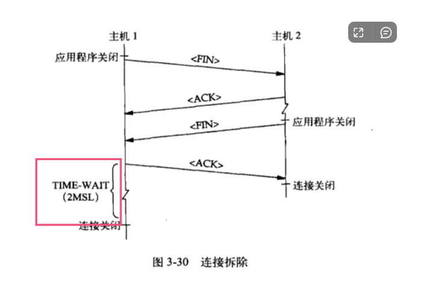

在事务结束之后，仍然保持在打开状态的链接称为持久连接。非持久的链接会在每个事务结束之后就会关闭。

# 持久连接的好处 

- 避免缓慢的链接建立阶段
- 避免慢启动的拥塞适应阶段

# Keep-Alive
客户端发起请求，带有Connection: Keep-Alive头。客户端在响应头中回应Connection: Keep-Alive。则说明客户端同意持久连接。

如果客户端不同意持久连接，就会在响应头中返回Connection: Close

注意事项

- 即使服务端同意了持久连接，服务端也可以随时关闭连接
- HTTP 1.0 协议，必须显式传递Connection: Keep-Alive，服务端才会激活持久连接
- HTTP 1.1 协议，默认就是持久连接

在通信双方中，主动关闭连接的一方会进入TIME_WIAT状态，而被动关闭的一方则不会进入该状态。

# TIME_WAIT连接太多
服务端太多的TIME_WAIT连接，则说明连接是服务端主动去关闭的。查看了响应头，内容也是Connection: Close。

我们知道，一般情况下TIME_WAIT状态的链接至少会持续60秒。也就是说该连接占用的内存至少在60秒内不会释放。

当连接太多时，就有可能产生out of memory的问题，而操作系统就会很有可能把这个进程给kill掉，进而导致服务不可用。

