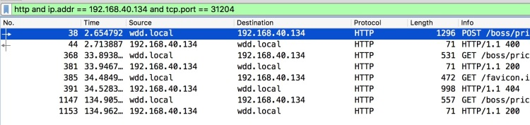
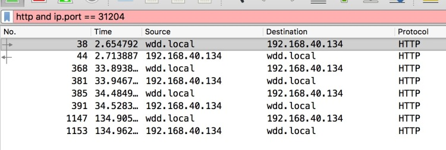
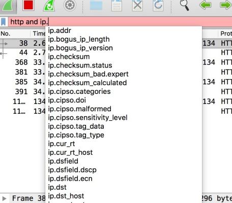
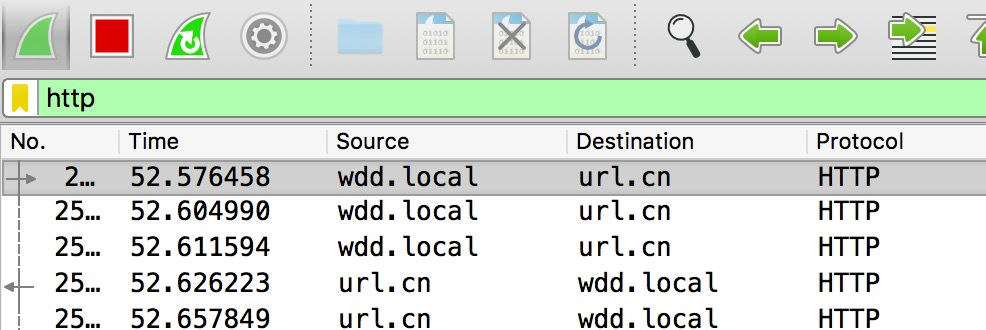
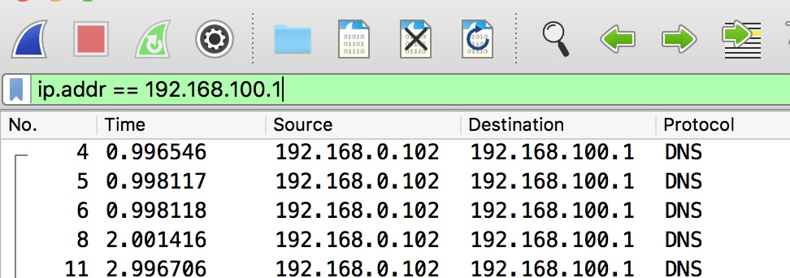
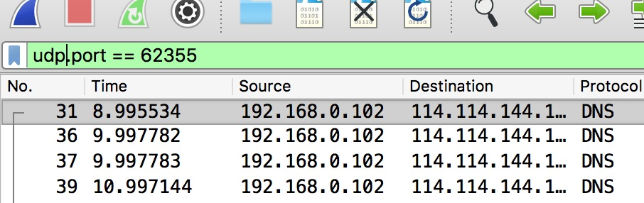
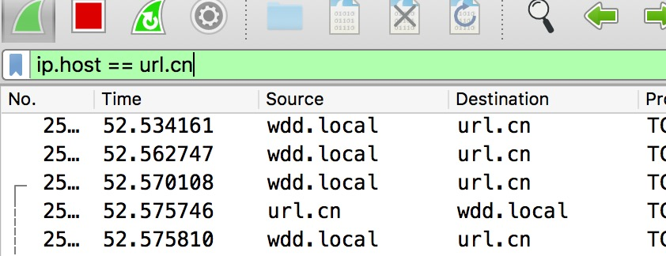
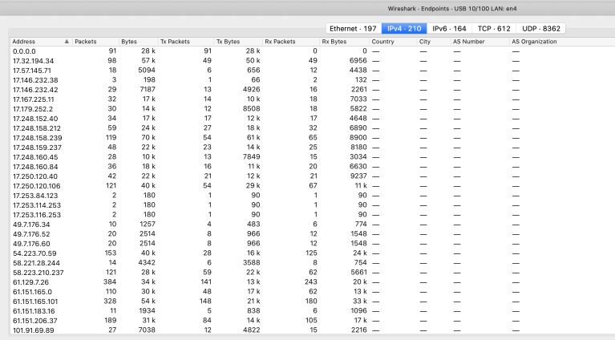
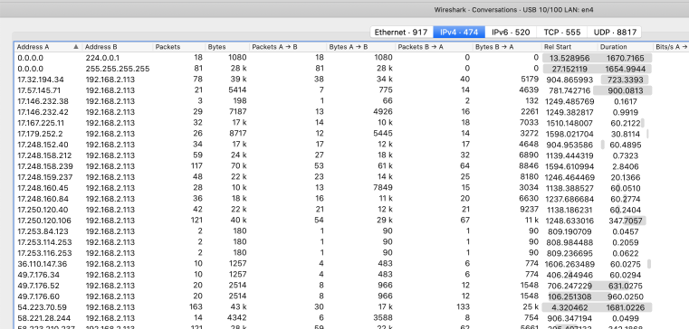

# 1. HTTP抓包例子

案例：本地向 http://192.168.40.134:31204/some-api，如何过滤？

```bash
http and ip.addr == 192.168.40.134 and tcp.port == 31204
```

语句分析：

- http 表示我只需要http的包
- ip.addr 表示只要源ip或者目标ip地址中包含192.168.40.134
- tcp.port 表示只要源端口或者目标端口中包含31204



# 2. 为什么我写的表达式总是不对呢？😂

很多时候，你写的表达式背景色变成红色，说明表达式错误了，例如下图：`http and ip.port == 31204`



写出**ip.port这个语句，往往是对传输协议理解不清晰。😅**

ip是网络层的协议，port是传输层tcp或者udp中使用的。例如你写tcp.port == 80，udp.port ==3000这样是没问题的。但是port不能跟在ip的后面，如果你不清楚怎么写，你可以选择wireshark的智能提示。

智能提示会提示所有可用的表达式。




# 3. 常用过滤表达式

一般我们的过滤都是基于协议，ip地址或者端口号进行过滤的，
## 3.1. 基于协议的过滤

直接输入协议名进行过滤



## 3.2. 基于IP地址的过滤




## 3.3. 基于端口的过滤
基于端口的过滤一般就两种

1. tcp.port == xxx
2. udp.port == xxx




## 3.4. 基于host的过滤



# 4. 比较运算符支持

```
== 等于
!= 不等于
> 大于
< 小于
>= 大于等于
<= 小于等于
```

```bash
ip.addr == 192.168.2.4
```

# 5. 逻辑运算符

- and 条件与
- or 条件或
- xor 仅能有一个条件为真
- not 所有条件都不能为真

```bash
ip.addr == 192.168.2.4 and tcp.port == 2145 and !tcp.port == 3389
```


# 6. 只关心某些特殊的tcp包
```bash
tcp.flags.fin==1  只过滤关闭连接的包
tcp.flags.syn==1	只过滤建立连接的包
tcp.flags.reset==1 只过滤出tcp连接重置的包
```

# 7. 统计模块
## 7.1. 查看有哪些IP
**Statistics -> endpoints**



## 7.2. 查看那些IP之间发生会话
**Statistics -> Conversations**



## 7.3. 按照协议划分


# 8. 最后
在会使用上述四个过滤方式之后，就可以自由的扩展了

🏄🏄🏄🏄🏄🏄
⛹️‍♀️⛹️‍♀️⛹️‍♀️⛹️‍♀️⛹️‍♀️⛹️‍♀️
🏋️🏋️🏋️🏋️🏋️🏋️

```bash
http.request.method == GET # 基于http请求方式的过滤
ip.src == 192.168.1.4
```
