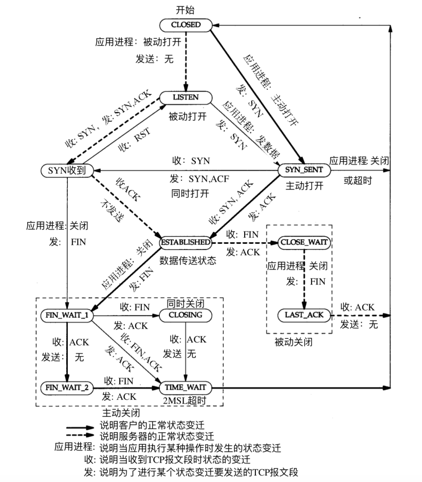
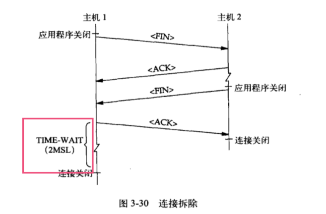

在《tcp/ip详解卷一》中，有幅图介绍了TCP的状态迁移，TCP的状态转移并不简单，我们本次重点关注TIME_WAIT状态。

# TIME-WAIT
主机1发起FIN关闭连接请求，主机2发送ACK确认，然后也发送FIN。主机1在收到FIN之后，想主机2发送了ACK。

在主机1发送ACK时，主机1就进入了TIME-WAIT状态。

- 主动发起关闭连接的一方会有TIME-WAIT状态
- 如果两方同时发起关闭连接请求，那么两方都会进入TIME-WAIT状态
- TIME-WAIT的时长在 `/proc/sys/net/ipv4/tcp_fin_timeout` 中配置，一般是60s

# 为什么要有TIME-WAIT状态？

# 太多TIME-WAIT链接是否意味有故障？

