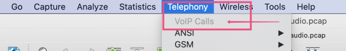
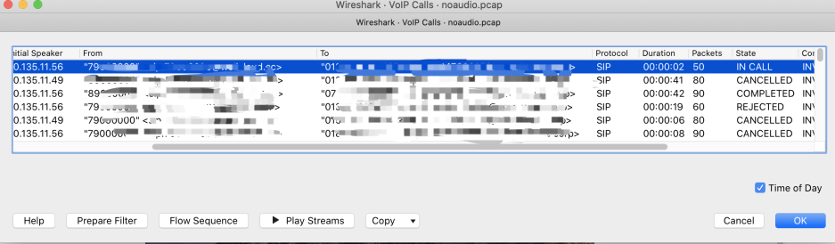
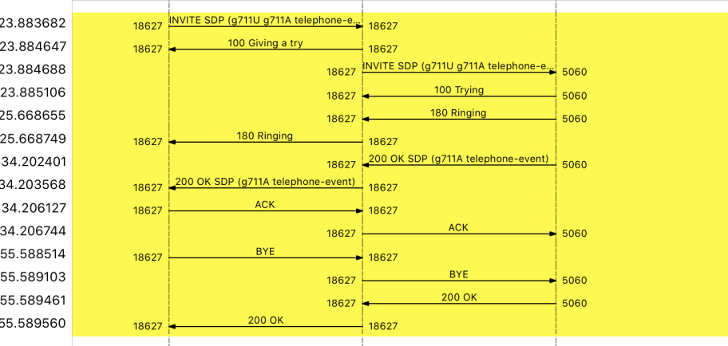
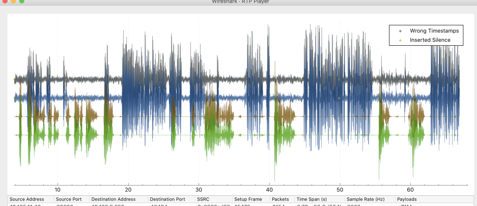

使用tcpdump在服务端抓包，将抓包后的文件在wireshark中打开。

然后选择：Telephony - VoIP Calls，wireshark可以从抓包文件中提取出SIP呼叫列表。

# 呼叫列表页面

在呼叫列表页面，选择一条呼叫记录，点击Flow Sequence， 可以查看该呼叫的SIP时序图。点击Play Stream， 可以播放该条呼叫的声音。

RTPplay页面有播放按钮，点击播放可以听到通话声音。 

