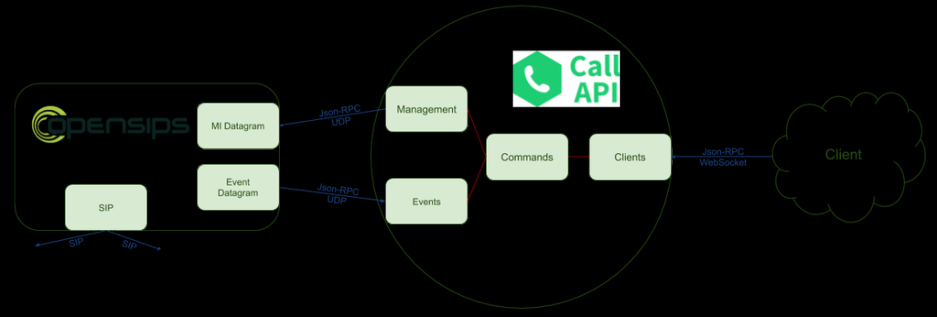

> 看来OpenSIPS的目标已经不仅仅局限于做代理了，而是想做呼叫控制。
> 

原文：[https://blog.opensips.org/2020/06/11/calls-management-using-the-new-call-api-tool/](https://blog.opensips.org/2020/06/11/calls-management-using-the-new-call-api-tool/)

The new [Call API](https://github.com/OpenSIPS/call-api) project consists of a standalone server able to serve a set of API commands that can be used to control SIP calls (such as start a new call, put a call on hold, transfer it to a different destination, etc.). In order to provide high performance throughput, the server has been developed in Go programming language, and provides a WebSocket interface that is able to handle [Json-RPC 2.0](https://www.jsonrpc.org/specification) requests and notifies. Although it runs as a standalone daemon able to control calls, it does not directly interact with SIP calls, but just communicates with a SIP proxy that actually provides the SIP stack and intermediates the calls. The first release of the Call API is using [OpenSIPS](https://opensips.org/) for this purposes, but this is a loose requirement – in the future other SIP stacks can be used, with the appropriate connectors.

#### Architecture
In terms of architecture, the new Call API tool consists of multiple units, the most important ones being:

- Clients interface – this unit is responsible for receiving Json-RPC requests over WebSocket from clients and pass them to the Commands unit
- Management interface – this is the unit that communicates with the SIP proxy in order to instruct what needs to be done
- Event interface – listens for event from the SIP proxy and passes them to the Commands unit
- Commands unit – this is the unit that implements the commands logic, ensuring the interaction between all the above interfaces.

Communication between these units is done asynchronous using go-routines. Below you can find a diagram that shows how all these units are interconnected

#### Demo
Below you can watch a video that shows how you can use some of the features the Call API tool provides, such as:

- Start a call between two participants
- Put the call on hold
- Resume the call from hold
- Transfer a call to a different destination
- Terminate an ongoing call

Enjoy watching!

