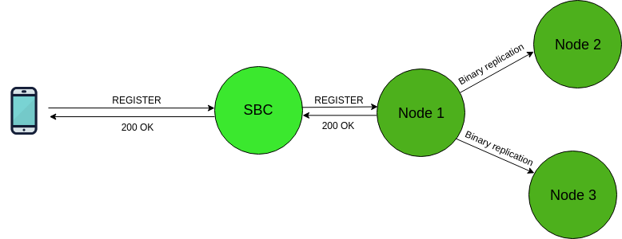
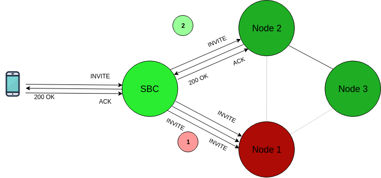
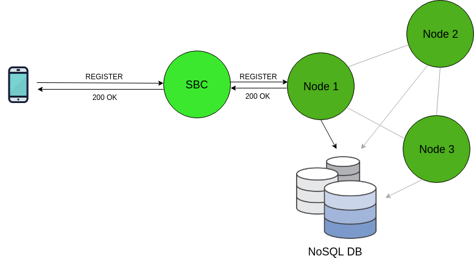

The distributed SIP user location support is one of the major features of the [latest stable OpenSIPS release](https://blog.opensips.org/2017/11/01/introducing-opensips-2-4/), namely 2.4.  The aim of this extension of the OpenSIPS _[usrloc](https://opensips.org/html/docs/modules/2.4.x/usrloc.html)_ module is to provide a horizontally scalable solution that is easy to set up and maintain, while remaining flexible enough to cope with varying needs of each specific deployment. Throughout this text, by “data” we refer to SIP Addresses-of-Record (subscribers) and their dynamic SIP Contact bindings (network coordinates of their SIP devices) — all of these must be replicated across cluster nodes.  From a data sharing point of view, we can break the distributed user location support down in two major modes of usage:

- _“federation”_, where each node holds a portion of the overall dataset.  You can read everything about this data sharing strategy [in this tutorial](http://www.opensips.org/Documentation/Tutorials-Distributed-User-Location-Federation).
- _“full sharing”_, where all cluster nodes are homogeneous and interchangeable.

In this article, we’re going to zoom in on the _“full sharing”_ support, which is actually further broken down into two submodes of usage, depending on the size of your deployment: one where the dataset fits into OpenSIPS memory, and the other one where it is fully managed by a specialized NoSQL database.

# Native “Full Sharing”
With native (OpenSIPS-only) data sharing, we make use of the clustering layer in order to replicate SIP AoRs and Contacts between nodes at runtime, as well as during the startup synchronization phase.  An example setup would look like the following:

Native “Full Sharing” Architecture Notice how the OpenSIPS cluster is _front-ended_ by an additional SIP entity: a _Session Border Controller_.  This is an essential requirement of this topology (and a common _gotcha!_).  The idea is that the nodes, along with the way they use the data must be identical.  This allows, for example, the ability to ramp up/down the number of instances when the platform is running at peak hour or is sitting idle. Let’s take a look at some common platform management concerns and see how they are dealt with using the native “full sharing” topology.

## Dealing with Node Failures
Node failures in “full sharing” topologies are handled smoothly.  Thanks to the SBC front-end that alleviates all IP restrictions, the service can withstand downtime from one or more cluster nodes without actually impacting the clients at all.

Successfully completing a call through Node 2 after Node 1 goes offline In this diagram, cluster Node 1 goes offline due to a hardware failure.  After the SIP INVITE transaction towards Node 1 times out, the SBC fails over to Node 2, successfully completing the call.

## Restart Persistency
By having restart persistency, we ensure that we are able to restart a node without losing the cached dataset.  The are two ways of achieving this, depending on whether you intend to use an SQL database or not.

### Cluster Sync
The clustering layer can also act as an [initialization tool](https://opensips.org/html/docs/modules/2.4.x/clusterer.html#capabilities), allowing a newly booted “joiner” node to discover a consistent “donor” node from which to request a full data sync.

### SQL-based
Users who prefer a more sturdy, disk-driven way of persisting data can easily configure an SQL database URL to which an OpenSIPS node will periodically flush its cached user location dataset. _Recommendation:_ if you plan on using this feature, we recommend deploying a local database server on each node.  Setting up multiple nodes to flush to a shared database using the old _[skip_replicated_db_ops](https://opensips.org/html/docs/modules/2.4.x/usrloc.html#param_skip_replicated_db_ops)_ feature may still work, but we no longer encourage or test such setups.

## Contact Pinging
Thanks to the clustering layer that makes nodes aware of the total number of online nodes, we are able to evenly spread the pinging workload across the current number of online cluster nodes at any given point in time. _Configuration_: You only have to configure the pinging-related module parameters of [nathelper](https://opensips.org/html/docs/modules/2.4.x/nathelper.html#param_sipping_bflag)(e.g. _sipping_bflag, sipping_from, natping_tcp, natping_interval_) and set these flags for the contacts which require pinging.  Nothing new, in short.   The newly added pinging workload distribution logic will work right out of the box.

# “Full Sharing” via NoSQL

NoSQL-based “Full Sharing” For deployments that are so large that the dataset outgrows the size of the OpenSIPS cache, or in case you simply don’t feel at ease with Gigabytes worth of cached SIP contacts in production, NoSQL may be a more pleasant alternative. With features such as data replication, data sharding and indexed columns, it may be a wise choice to leave the handling of large amounts of data to a specialized engine rather than doing it in-house.  Configuring such setups will be a topic for an in-depth future tutorial, where we will learn how to configure “full sharing” user location clusters with both of the currently supported NoSQL engines: Apache Cassandra and MongoDB.

# Summary
The “full sharing” data distribution strategy for the OpenSIPS user location is an intuitive solution which requires little to no additional OpenSIPS scripting (only a handful of module parameters).  The major hurdles of running a SIP deployment (data redundancy, node failover, restart persistency and NAT traversal) have been carefully solved and baked into the module, without imposing any special script handling to the user.  Moreover, depending on the sizing requirements of the target platform, users retain the flexibility of choosing between the native or NoSQL-based data management engines.

