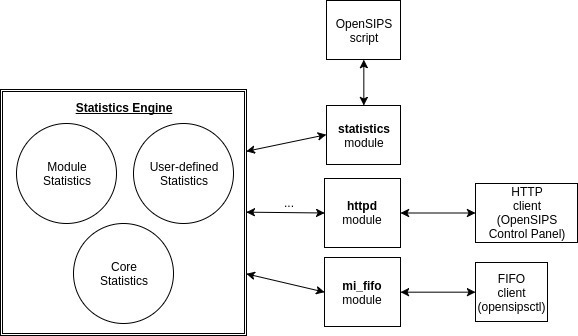
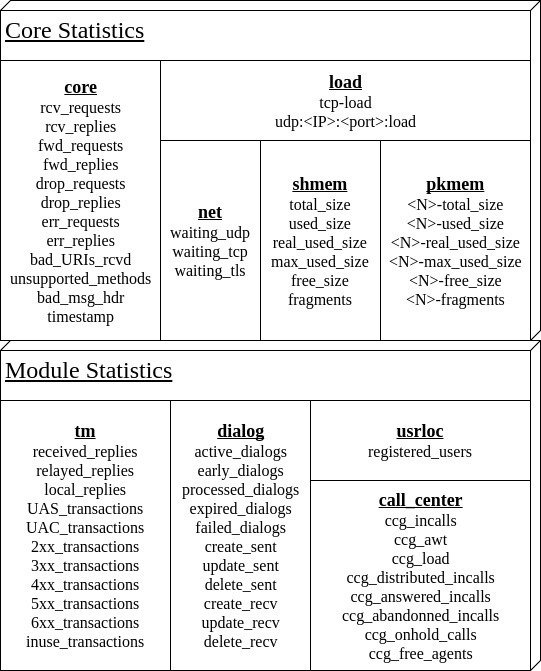

无论你是经验丰富的OpenSIPS管理员，或者你仅仅想找到为什么ACK消息在你的网络中循环发送，唯一可以确定的是：我们或早或晚会需要OpenSIPS提供数据来回答以下问题

- OpenSIPS运行了多久？
- 我们是否被恶意流量攻击了？
- 我们的平台处理了多少个来自运营商的无效SIP包
- 在流量峰值时，OpenSIPS是否拥有足够的内存来支撑运行
- ...

幸运的是，OpenSIPS提供内置的统计支持，来方便我们快速解决以上问题。详情可以查看[OpenSIPS统计接口](https://opensips.org/Documentation/Interface-Statistics-2-4)。在本篇文章中，我们将会了解统计引擎，但是，什么是引擎？


# 统计引擎

总的来说，下图就是OpenSIPS引擎的样子。



统计引擎内置于OpenSIPS。它管理所有的统计数据，并且暴露一个标准的CRUD操作接口给所有的模块，让模块可以推送或者管理他们自己的统计数据。

一下有三种方式来和统计引擎进行交互

- 直接通过脚本访问。如通过$script(my-stat)变量
- 使用HTTP请求来访问
- 使用opensipsctl fifo命令

统计引擎是非常灵活并且可以通过不同方式与其交互，那么它怎么能让我们的使用变得方便呢？下面的一些建议，能够让你全面的发挥静态统计引擎的能力，来增强某些重要的层面。


# 系统开发维护

当你处理OpenSIPS的DevOps时，你经常需要监控OpenSIPS的一些运行参数。你的关注点不同，那么你就需要监控不同的方面，例如SIP事务、对话、内存使用、系统负载等等

下面是OpenSIPS统计分组的一个概要，以及组内的每一个统计值，详情可以参考[wiki](https://opensips.org/Documentation/Interface-CoreStatistics-2-4)。




# 统计简介

假如我们想通过sipp对我们的平台进行流量测试，我们想压测期间观测当前的事务、对话、共享内存的值变化。或者我们我们有了一个新的SIP提供商，他们每天早上9点会开始向我们平台推送数据，我们需要监控他们的推送会对我们系统产生的影响。

你可以在OpenSIPS实例中输入以下指令：

```bash
watch -n0.2 'opensipsctl fifo get_statistics inuse_transactions dialog: shmem:'
```

注意 get_statistics命令即可以接受一个统计值项，也可以接受一个统计组的项。统计组都是以冒号(:)结尾。


# 与递增的统计指标进行交互
统计指标看起来相同，实际上分为两类

- **累计值**。累计是一般是随着时间增长，例如`rcv_requests`, `processed_dialogs`，表示从某个时间点开始累计收到或者处理了多少个任务
- **计算值**。计算值一般和系统运行负载有关，和时间无关。例如`active_dialogs`, `real_used_size`, 这些值都是由内部函数计算出来的计算值

一般来说，脚本中定义的统计值都是递增的，OpenSIPS无法重新计算它，只能我们自己来计算或者维护它的值。

以下方式可以快速查看计算值类的统计项

```bash
opensipsctl fifo list_statistics
```

某些场景，你可能需要周期性的重置累计值类的统计项。例如你可以只需要统计当天的`processed_dialogs`，`daily_routed_minutes`，那么你只需要设置一个定时任务，每天0点，重置这些统计值。

```bash
opensipsctl fifo reset_statistics processed_dialogs
```


# 在脚本中自定义统计项
在脚本中自定义统计项是非常简单的，只需要做两步

1. 加载`statistics.so`模块
2. 在某些位置调用函数, `update_stat("daily_routed_minutes", "+1")`


# 实战：脚本中有许多的自定义统计项

- 统计每天收到的SIP消息的请求方式, 以及处理的消息长度
- 每隔24小时，以JSON的形式，将消息写到SIP服务器

```bash
# 设置统计组
modparam("statistics", "stat_groups", "method, packet")

# 请求路由
route {
    ...
    update_stat("method:$rm", "+1");
    update_stat("packet:count", "+1");
    update_stat("packet:total_size", "$ml") # message length
    ...
}

# 响应路由
onreply_route {
    update_stat("packet:count", "+1");
    update_stat("packet:total_size", "$ml")
}

# 定时器路由，定时通过HTTP发请求
timer_route [daily_stat_push, 86400] {
    $json(all_stats) := "{\"method\": {}, \"packet\": {}}";
    # pack and clear all method-related statistics
    stat_iter_init("method", "iter");
    while (stat_iter_next("$var(key)", "$var(val)", "iter")) {
        $json(all_stats/method/$var(key)) = $var(val);
        reset_stat("$var(key)");
    }
    # pack and clear all packet-related statistics
    stat_iter_init("packet", "iter");
    while (stat_iter_next("$var(key)", "$var(val)", "iter")) {
        $json(all_stats/packet/$var(key)) = $var(val);
        reset_stat("$var(key)");
    }
    # push the data to our web server
    if (!rest_post("https://WEB_SERVER", "$json(all_stats)", , "$var(out_body)", , "$var(status)"))
        xlog("ERROR: during HTTP POST, $json(all_stats)\n");
    
    if ($var(status) != 200)
        xlog("ERROR: web server returned $var(status), $json(all_stats)\n");
}
```


