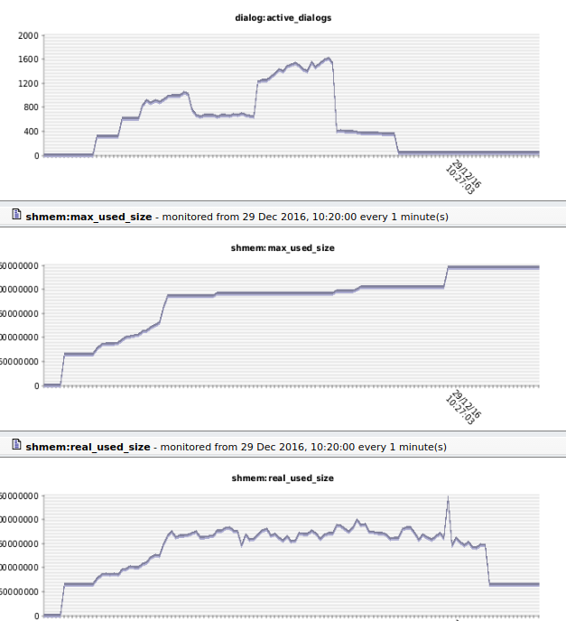

原文：[https://blog.opensips.org/2016/12/29/understanding-and-dimensioning-memory-in-opensips/](https://blog.opensips.org/2016/12/29/understanding-and-dimensioning-memory-in-opensips/)

Running OpenSIPS with the right memory configuration is a very important task when developing and maintaining your VoIP service, because it has a direct effect over the scale of your platform, the customers you support, as well as the services you offer. Setting the limit to a low value might make OpenSIPS run out of memory during high volume of traffic, or during complex scenarios, while setting a big value might lead to wasted resources.

> 内存太小会导致OOM, 内存大大有会浪费


Unfortunately picking this limit is not something that can be easily determined by a magic formula. The reason is that memory consumption is often influenced by a lot of external factors, like calling scenarios, traffic patterns, provisioned data, interactions with other external components (like AAA or DB servers), etc. Therefore, the only way to properly dimension the memory OpenSIPS is allowed to use is by monitoring memory usage, understanding the memory footprint and tuning this value accordingly. This article provides a few tips to achieve this goal.

> 首先监控opensips的内存使用，然后根据监控的值调整合适的内存大小


# OpenSIPS内部的内存使用
> opensips是个多进程程序并使用两种内存模型
> 1. 私有内存: 进程独占的内存，往往比较小
> 2. 共享内存: opensips模块使用的内存，往往比较大


To understand the way [OpenSIPS](http://www.opensips.org/) uses the available memory, we have to point out that [OpenSIPS](http://www.opensips.org/) is a [multi-process](https://en.wikipedia.org/wiki/Multiprocessing) application that uses two types of memory: private and shared. Each process has its own private memory space and uses it to store local data, that does not need to be shared with other processes (i.e. parsing data). Most of the time the amount of **private memory used is small, and usually fits into the default value of 2MB per process.** Nevertheless understanding the way private memory is used is also necessary in order to properly dimension your platform’s memory.<br />On the other hand, **shared memory is a big memory pool that is shared among all processes.** This is the memory used by [OpenSIPS](http://www.opensips.org/) modules to store data used at run-time, and in most of the cases, the **default value of 16MB is not enough**. As I stated earlier, it is impossible to pick a “magic” value for this limit, mostly because there are a lot of considerations that affect it. The data stored in the shared memory can be classified in two categories:

> 流量数据：1. 注册相关的数据；2. 呼叫相关的数据，tm和daillog
> 临时数据：数据库缓存数据


- Traffic data – data generated by your customers
   - registration data, managed by the [usrloc](http://www.opensips.org/html/docs/modules/2.2.x/usrloc.html) module, is directly linked to the number of customers registered into the platform;
   - call data, managed by the [tm](http://www.opensips.org/html/docs/modules/2.2.x/tm.html) and [dialog](http://www.opensips.org/html/docs/modules/2.2.x/dialog.html) modules, is related to the number of simultaneous calls done through the platform.
- Provisioning data – data cached from the database, used to implement the platform’s logic.

The amount of memory used by each of this data may vary according to the services you offer, your customer base and their traffic.

# 监控内存使用
> 有两种方式监控内存
> 1. Opensips CP，这个工具比较方便，但是安装比较负载，一般不使用
> 2. 通过opensips的fifo指令去获取内存。这个比较方便，可以做成crontab, 然后周期性的写入到influxdb。


There are two ways to monitor [OpenSIPS](http://www.opensips.org/) memory statistics:

- from [OpenSIPS CP](http://controlpanel.opensips.org/) Web GUI, using the statistics interface (Image 1)

<br /> 

- from cli using the **opensipsctl** tool:

```
opensipsctl fifo get_statistics shmem:
shmem:total_size:: 268435456
shmem:used_size:: 124220488
shmem:real_used_size:: 170203488
shmem:max_used_size:: 196065104
shmem:free_size:: 98231968
shmem:fragments:: 474863
```

From both you can observe 6 values:

- **total_size**: the total amount of memory provisioned
- **used_size**: the amount of memory required to store the data
- **real_used_size**: the total amount of memory required to store data and metadata
- **max_used_size**: the maximum amount of memory used since [OpenSIPS](http://www.opensips.org/) started
- **free_size**: the amount of free memory
- **fragments**: the number of fragments

When monitoring memory usage, the most important statistics are the **max_used_size** , because it indicates the minimum value [OpenSIPS](http://www.opensips.org/) needs to support the traffic that has been so far and the **real_used_size**, because it indicates the memory used at a specific moment. We will use these metrics further on.


# 理解内存使用

In order to have a better understanding about the memory used, we will take as an example a very specific platform: an outbound PSTN gateway, that is designed to support 500 CPS (calls per second) from customers and dispatch them to approximately 100K prefixes, cached by the [drouting](http://www.opensips.org/html/docs/modules/2.2.x/drouting.html) module. You can see the platform’s topology in this picture:


To figure out what happens in the scenario Image 1 presents, we will extract the **real_used_size**, **max_used_size** and **actve_dialogs** statistics:



<br />

<br />As you can observe, at the beginning of the chart, the memory usage was low, close to 0. That is most likely OpenSIPS startup. Then, it grows quickly until around 60MB. That is [OpenSIPS](http://www.opensips.org/) loading the 100K of prefixes into the [drouting](http://www.opensips.org/html/docs/modules/2.2.x/drouting.html) module cache. Next, as we can see in the **active_dialogs **statistic, traffic comes in in batches. Therefore [OpenSIPS](http://www.opensips.org/) memory usage increases gradually, until around 170MB and stabilizes with the call-flow. After a while, the dialog numbers start to decrease, and the memory is again gradually released, until it ends to the idle memory of 60MB used by the [drouting](http://www.opensips.org/html/docs/modules/2.2.x/drouting.html) cache.<br />Taking a closer look at the charts, you will notice two awkward things in the second half of the period:

> dialog占用的内存并不是呼叫结束后立即释放，而是由计时器去延时周期性的按批次去释放
> SIP事务也不是会麻烦释放，而是会等待去耗尽网络中所有的重传消息


> opensips的很多模块往往需要一次性的把数据库中的数据加载到内存中。而在模块reload的时候，内存中会同时存在两份数据。直到新的数据完全加载完毕后，老的数据占用的内存才会释放，而在此之前，老的数据仍旧驻留在内存中，用来处理呼叫。所以在模块reload的时候，也是往往内存出现峰值的时候。
> 老的数据被释放之后，峰值会很快回落。


1. Even though dialogs become significantly less, shared memory usage is still high. That is because dialogs are not immediately deleted from [OpenSIPS](http://www.opensips.org/) memory, but on a timer job that deletes them in bulk batches from the database(increased DB performance). Also, SIP transactions are not deleted immediately after they complete, but stored for a while to absorb re-transmissions (according to RFC 3261 requirements).
2. Even if there are no high amounts of dialogs coming in, there is a big spike of memory usage, which also changes the **max_used_size** statistic. The reason for this spike is a [drouting](http://www.opensips.org/html/docs/modules/2.2.x/drouting.html) module cache reload, over the MI (Management Interface):

```
opensipsctl fifo dr_reload
```

The reason for this spike is that during cache reload, [OpenSIPS](http://www.opensips.org/) stores in memory two sets of data: the old one and the new one. The old set is used to route calls until the new set is fully loaded. After that, the memory for the old set is released, and the new set is used further on. Although this algorithm is used to increase the routing performance, it requires a large amount of memory during reload, usually doubling the memory used for provisioning.<br />Following the article till now, you would say that looking at the memory statistics and correlating traffic with memory usage can be fairly easy to understand how [OpenSIPS](http://www.opensips.org/)** **uses memory and what are the components that use more. Unfortunately that is not always true, because sometime you might not have the entire history of the events, or the events happen simultaneously, and you can not figure out why. Therefore you might end up in a situation where you are using large amount of memory, but can point out why. This makes scaling rather impossible (for both customers and provisioning rules), because you will not be able to estimate how components spread the memory among them. That is why in [OpenSIPS 2.2](http://www.opensips.org/About/Version-2-2-x) we added a more granular memory support, that allows you to view the memory used by each module (or group of modules).<br /> 

# Memory usage in OpenSIPS 2.2
In order to enable granular memory support, you need to follow these steps:

1. generate statistics files by running:

```
# make generate-mem-stats 2> /dev/null
```

1. compile [OpenSIPS](http://www.opensips.org/) with extra shared memory support, by running:

```
# make menuconfig -> Configure compile options -> <br /> Configure compile flags -> SHM_EXTRA_STATS<br /># make all
```

1. configure the groups in [OpenSIPS](http://www.opensips.org/) configuration file:

```
mem-group = "traffic": "tm" "dialog"
mem-group = "provision": "drouting"
```

1. restart [OpenSIPS](http://www.opensips.org/) and follow the steps from the previous sections.

Checking the statistics during peak time you will get something like this:

```
# opensipsctl fifo get_statistics shmem_group_traffic: shmem_group_provision:
shmem_group_traffic:fragments:: 153618
shmem_group_traffic:memory_used:: 85448608
shmem_group_traffic:real_used:: 86677612
shmem_group_provision:fragments:: 245614
shmem_group_provision:memory_used:: 53217232
shmem_group_provision:real_used:: 55182144
```
Checking the **traffic** statistics will show you exactly how much memory [OpenSIPS](http://www.opensips.org/) uses for calls, while checking the **provision** statistics will show you the memory used by the [drouting](http://www.opensips.org/html/docs/modules/2.2.x/drouting.html) module. The rest of memory is used by other other modules or by the core. If you want to track those down too, group them in a new **mem-group.**<br />**


# Dimensioning OpenSIPS memory
As you have noticed throughout this article, dimensioning [OpenSIPS](http://www.opensips.org/) for a specific number of clients or provisioning data is not an easy task and requires a deep understanding of both customer traffic patterns and provisioning data, as well as [OpenSIPS](http://www.opensips.org/) internals. We hope that using the tips provided in this article will help you have a better understanding of your platform, how memory resources are used by [OpenSIPS](http://www.opensips.org/), and how to dimension your VoIP platform to the desired scale.


