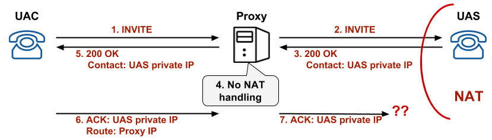
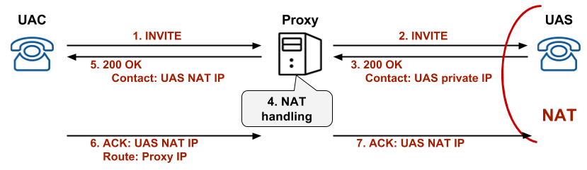
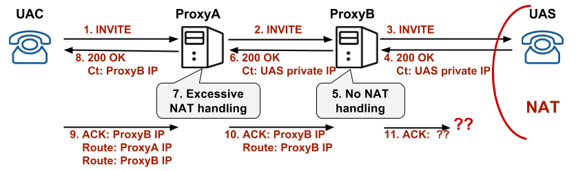

We all experienced calls getting self disconnected after 5-10 seconds – usually disconnected by the callee side via a _**BYE**_ request – but a _**BYE**_ which was not triggered by the party behind the phone, but by the SIP stack/layer itself. This is one of the most common issues we get in SIP and one of the most annoying in the same time. But why it happens ?

## Getting to the missing ACK
Such a decision to auto-terminate the call (beyond the end-user will and control) indicates an error in the SIP call setup. And because the call was somehow partially established (as both end-points were able to exchange media), we need to focus on the signalling that takes place after the _**200 OK**_ reply (when the call is accepted by the callee). So, what do we have between the _**200 OK**_ reply and the full call setup ? Well, it is the _**ACK**_ requests – the caller acknowledgement for the received _**200 OK**_. And according to the [RFC3261](https://www.ietf.org/rfc/rfc3261.txt), any SIP device not receiving the _**ACK**_ to its final _**2xx**_ reply has to disconnect the call by issuing a standard _**BYE**_ request. So, whenever you experience such 10 seconds disconnected calls, first thing to do is to do a SIP capture/trace and  to check if the callee end-device is actually getting an _**ACK**_. It is very, very import to check for _**ACK**_ at the level of the callee end-device, and not at the level of caller of intermediary SIP proxies – the _**ACK**_ may get lost anywhere on the path from caller to callee.

## Tracing the lost ACK
In order to understand how and where the _**ACK**_ gets lost, we need first to understand how the _**ACK**_ is routed from caller to the callee’s end-device. Without getting into all the details, the _**ACK**_ is routed back to callee based on the _**Record-Route**_ and _**Contact**_ headers received into the _**200 OK**_ reply. So, if the _**ACK**_ is mis-routed, it is mainly because of wrong information in the _**2oo OK**_. The _**Record-Route**_ headers (in the _**200 OK**_) are less to blame, as they are inserted by the visited proxies and not changed by anyone else. Assuming that you do not have some really special scenarios with SIP proxies behind NATs, we can simply discard the possibility of having faulty _**Record-Routes**_. So, the primary suspect is the _**Contact**_ header in the _**200 OK**_ – this header is inserted by the callee’s end-device and it can be altered by any proxy in the middle – so there are any many opportunities to get corrupted. And this mainly happens due to wrong handling of NAT presence on end-user side  – yes, that’s it, a NATed callee device.

## Common scenarios

### No NAT handling
If the proxy does not properly handle NATed callee device, it will propagate into the _**200 OK**_reply the private IP of the callee. And of course, this IP will be unusable when comes to routing back the _**ACK**_ to the callee – the proxy will have the “impossible” mission to route to a private IP :). So, the _**ACK**_ will get lost and call will get disconnected.

If the case, with [OpenSIPS](http://www.opensips.org/), you will have to review your logic in the **[onreply](http://www.opensips.org/Documentation/Script-Routes-2-2#toc4)** route and perform **[fix_nated_contact()](http://www.opensips.org/html/docs/modules/2.2.x/nathelper.html#id293994)** for the _**200 OK**_, if callee is known as NATed.

The correct handling and flow has to be like this:

### Excessive NAT handling

While handling NATed end-points is good, you have to be careful not to over do it. If you see a private IP in the _**Contact**_ header you should not automatically replace it with the source IP of the SIP packet. Or you should not do it for any incoming reply (like “let’s do it all the time, just to be sure”).

In a more complex scenarios where a call may visit multiple SIP proxies, the proxies may loose valuable routing information by doing excessive NAT traversal handling. Like in the scenario below, ProxyA is over doing it, by applying the NAT traversal logic also for calls coming from a proxy (ProxyB) and not only for replies coming from an end-point. By doing this, the IP coordinates of the callee will be lost from **_Contact_** header, as ProxyA has no direct visibility to callee (in terms of IP).

In such a case, with OpenSIPS, you will have to review your logic in the **[onreply](http://www.opensips.org/Documentation/Script-Routes-2-2#toc4)** route and to be sure you perform **[fix_nated_contact()](http://www.opensips.org/html/docs/modules/2.2.x/nathelper.html#id293994)** for the _**200 OK**_ only if the reply comes from an end-point and not from another proxy.

## Conclusions
SIP is complicated and you have to pay attention to all the details, if you want to get it to work. Focusing only on routing the _**INVITE**_ requests is not sufficient. If you come across disconnected calls:

1. get a SIP capture/trace and see if the _**ACK**_ gets to the callee end-point
2. if not, check the **Contact** header in the _**200 OK**_ – it must point all the time to the callee end-point (a public IP)
3. if not, check the NAT traversal logic you have in the **[onreply](http://www.opensips.org/Documentation/Script-Routes-2-2#toc4)** routes – be sure you do the _**Contact**_ fixing **only** when it is needed.

Shortly, be moderate, not too few and not too much …when comes to NAT handling 