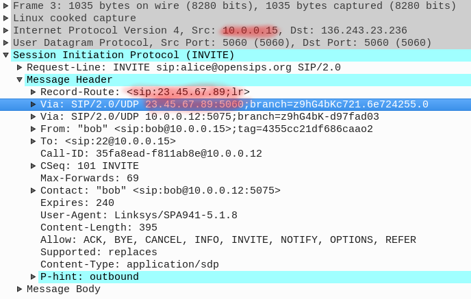

Cloud computing is a more and more viable option for running and providing SIP services. The question is how compatible are the SIP services with the Cloud environment ? So let’s have a look at this compatibility from the most sensitive (for SIP protocol) perspective – the IP network topology. A large number of existing clouds (like [EC2](https://aws.amazon.com/ec2/), [Google CP](https://cloud.google.com/), [Azure](https://azure.microsoft.com/)) have a particularity when comes to the topology of the IP network they provide – they do not provide public routable IPs directly on the virtual servers, rather they provide private IPs for the servers and a fronting public IP doing a [1-to-1 NAT](https://wiki.untangle.com/index.php/1:1_NAT) to the private one. Such a network topology forces you to run the SIP service behind a NAT. Why is this such a bad thing? Because, unlike other protocols (such as HTTP), SIP is very intimate with the IP addresses – the IPs are part of the SIP messages and used for routing. So, a SIP server running on a private IP advertises its listening IP address (the private one) in the SIP traffic – this will completely break the SIP routing, both at transaction and dialog level :

- **transaction level** – when sending a SIP request, the SIP server will construct the Via SIP header using its listening IP, so the private IP. But the information from the Via header is used by the receiver of the SIP request in order to route back the SIP replies. But routing to a private IP (from the public Internet) is mission impossible;
- **dialog level** – in a similar way, when sending an INVITE request, the SIP server will advertise in its Contact SIP header the private IP, so other SIP party will not be able to send any sequential request back to our server.

So, how can **OpenSIPS** help you to run SIP services in the Cloud ?

## Running OpenSIPS behind NAT
**OpenSIPS** implements a smart mechanism of separating the IPs used at network level (as listeners) and the IPs inside the SIP messages. The _**“advertise”**_ mechanism gives you full control of what IP is presented (or advertised) in the SIP messages, despite what IP is used for the networking communication. Shortly you can have **OpenSIPS** sending a SIP request from the _10.0.0.15_ private IP address, but using for inside the message (as Via, Contact or Route) a totally different IP. When advertising a different IP  (than the network layer), the following parts of the SIP message will be affected:

- the introduced **Via** header (if a SIP request)
- the introduced **Record-Route** header (if a SIP request)
- the introduced **Contact** header 

**OpenSIPS** has a a very flexible way to control the advertised IP, at different levels: global, per listening interface or per SIP transaction

### Global Advertising
Such advertising will affect the entire traffic handled by **OpenSIPS**, automatically, without any additional action in the actual routing script. This setting is achieved via the [advertised_address](http://www.opensips.org/Documentation/Script-CoreParameters-2-3#toc25)global parameter: advertised_address="12.34.56.78"

### Per Interface Advertising
For more complex scenarios when using multiple listening interfaces, you can opt for different advertised IP for each listener. Some listener may be bound to the NATed IP address, so you want to do advertising, some other listener may be bound to a private IP used only inside the private network, so you want no advertising. listen = udp:10.0.0.34:5060 as 99.88.44.33:5060 listen = udp:10.0.0.36:5060 All the SIP traffic routing through such an advertising interface will be automatically modified. The only thing you have to do is to be sure you properly control the usage of interfaces when you route your SIP traffic – usually switching to a different interface, by using the [force_send_socket()](http://www.opensips.org/Documentation/Script-CoreFunctions-2-3#toc16) script function.

### Per Transaction Advertising
The finest granularity **OpenSIPS** offers for controlling the advertising IP is at SIP transaction level – that is, for each transaction (a SIP requests and all its replies) you can choose what should be the advertised IP. Such control is done at via the routing script – when routing the SIP requests, you can enforce a value to be advertise for its transaction set_advertised_address( 12.34.56.78 ); As a **small but important note** : advertising a different IP identity may act as a boomerang – your OpenSIPS may be required to recognize itself based on IP you previously advertised. Like the IP advertised in an INVITE request in the Record-Route header must be recognized by OpenSIPS as “its own IP” later, when receiving a sequential request like ACK or BYE and inspecting the Route header. If for the global and per-interface advertising OpenSIPS is automatically able to recognize its own advertised IP’s, for the per-transaction level it cannot not. So you have to explicitly take care of that and teach OpenSIPS about the IP’s you plan to advertise by using the [alias](http://www.opensips.org/Documentation/Script-CoreParameters-2-3#toc27) core parameter.

## Running RTPproxy behind NAT
So far we covered the OpenSIPS related part. But in many SIP scenarios you may be required to handle the media/RTP too, for cases like call recording, media pinning, DTMF sniffing or other. So, you may end up with the need of running RTPproxy behind an 1-to-1 NAT. Fortunately things are much more simple here. The nature of the 1-to-1 NAT takes care of the port mapping between the public NAT IP and the private IP. The only thing you have to do is to advertise the public IP in the SIP SDP, while keeping RTPproxy to operate on the private IP. To get this done, when using one of the RTPproxy related functions like **rtpproxy_engage()**, **rtpproxy_answer()** or **rtpproxy_offer()**, simply use the second parameter of these function to overwrite (in the SDP) the IP received from RTPproxy with the IP you want to advertise: rtpproxy_engage("co","23.45.67.89"); This will result in having the 23.45.67.89 IP advertised in the SDP, rather than the IP RTPproxy is running on. And no other change is required in the actual RTPproxy configuration.

## What’s next ?
What we covered so far here is a relatively simple scenario, still it is the mostly used one – an OpenSIPS behind NAT serving SIP client on the public Internet. But things are getting more complicated and interesting when you also want to offer media services (like voicemail) or you want to support SIP clients from both public and private networks – and these are the topics for some future posts on this matter.

