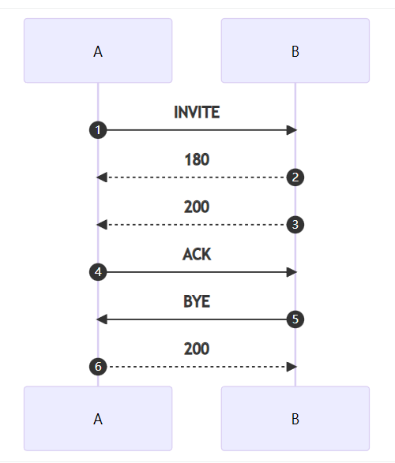

- from字段用来标记请求的发起者ID
- to字段用来标记请求接受者的ID
- to字段并不能用于路由，request-url可以用来路由
- 一般情况下，sip消息再传输过程中，from和to字段都不会改，而request-url很可能会因为路由而改变
- 对于最初的请求，除了注册请求之外，request-url和to字段中的url一致

**from字段：**<br />The From header field is a required header field that indicates the originator of the request. It is one of two addresses used to identify the dialog. The From header field contains a URI, but it may not contain the transport, maddr, or ttl URI parameters. A From header field may contain a tag used to identify a particular call. A From header field may contain a display name, in which case the URI is enclosed in < >. If there is both a URI parameter and a tag, then the URI including any parameters must be enclosed in < >. Examples are shown in Table 6.8. A From tag was optional in RFC 2543 but is mandatory to include in RFC 3261.

**to字段：**<br />**The To header field is a required header field in every SIP message used to indicate the recipient of the request. Any responses generated by a UA will contain this header field with the addition of a tag. (Note that an RFC 2543 client will typically only generate a tag if more than one Via header field is present in the request.) Any response generated by a proxy must have a tag added to the To header field. A tag added to the header field in a 200 OK response is used through- out the call and incorporated into the dialog. The To header field URI is never used for routing—the Request-URI is used for this purpose. An optional display name can be present in the header field, in which case the SIP URI is enclosed in < >. If the URI contains any parameters or username parameters, the URI must be enclosed in < > even if no display name is present. The compact form of the header field is t. Examples are shown in Table 6.12.



上面的信令图属于一个dialog, 并且包含三个事务

- invite 到 200 ok属于一个事务
- ack是单独的一个事务
- bye和200 ok属于一个事务

在同一个事务中，from和to中的sip url和tag都是相同的，但是对于不同的事务，from和to头的url和tag会相反。

```xml
# 事务1: INVITE 180 200
From: <sip:a@test.com>;tag=aaa
To: <sip:b@test.com>;tag=bbb
  
# 事务2: ACK
From: <sip:a@test.com>;tag=aaa
To: <sip:b@test.com>;tag=bbb

# 事务3: BYE 200 ok
# 由于事务3的发起方是B, 所以
From: <sip:b@test.com>;tag=bbb
To: <sip:a@test.com>;tag=aaa
```


所以在处理OpenSIPS脚本的时候，特别是关于from_tag和to_tag的处理的时候，我们不能先入为主的认为初始化和序列化的的所有请求里from_tag和to_tag都是不变的。  也不能先入为主的认为from_url和 to_url是一成不变的。

所以我们就必须深入的认识到，from和to实际上是标志着这个事务的方向。而不是dialog的方向。


[【重点】初始化请求和序列化请求](https://www.yuque.com/wangdd/opensips/init-seque?view=doc_embed)


# rfc 3261

## request url
The initial Request-URI of the message SHOULD be set to the value of<br />  the URI in the To field.  One notable exception is the REGISTER<br />  method; behavior for setting the Request-URI of REGISTER is given in<br />  Section 10.  It may also be undesirable for privacy reasons or<br />  convenience to set these fields to the same value (especially if the<br />  originating UA expects that the Request-URI will be changed during<br />  transit).<br />  In some special circumstances, the presence of a pre-existing route<br />  set can affect the Request-URI of the message.  A pre-existing route<br />  set is an ordered set of URIs that identify a chain of servers, to<br />  which a UAC will send outgoing requests that are outside of a dialog.<br />  Commonly, they are configured on the UA by a user or service provider<br />  manually, or through some other non-SIP mechanism.  When a provider<br />  wishes to configure a UA with an outbound proxy, it is RECOMMENDED<br />  that this be done by providing it with a pre-existing route set with<br />  a single URI, that of the outbound proxy.<br />  When a pre-existing route set is present, the procedures for<br />  populating the Request-URI and Route header field detailed in Section<br />  12.2.1.1 MUST be followed (even though there is no dialog), using the<br />  desired Request-URI as the remote target URI. 				 			 		 	

