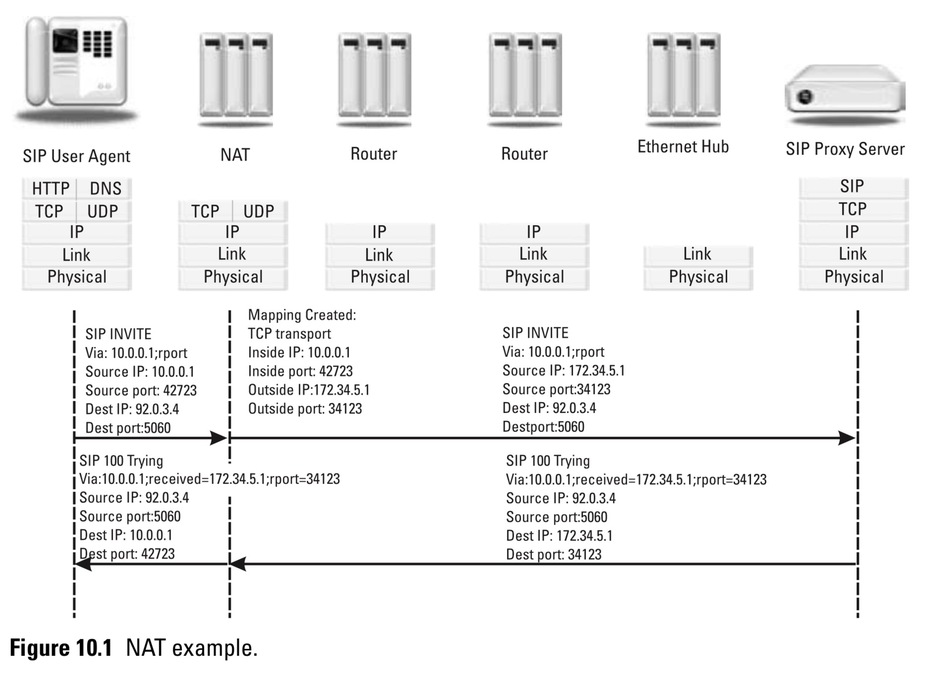
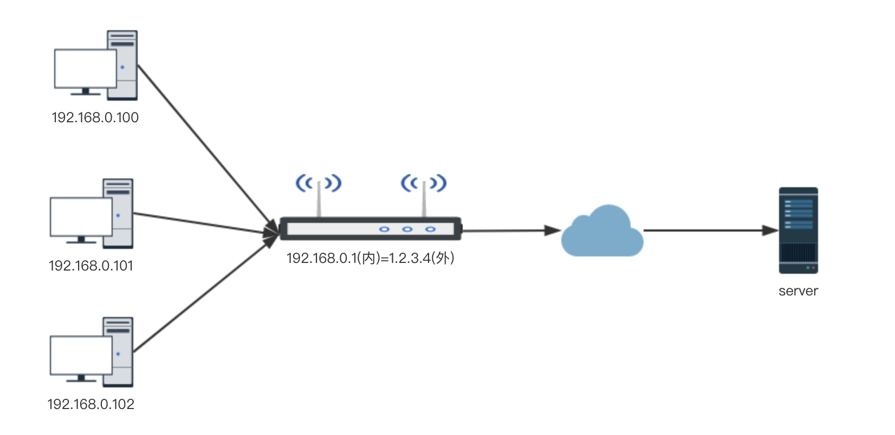
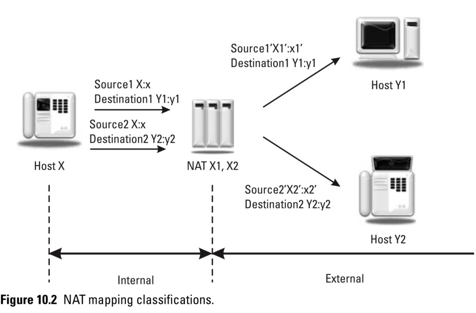
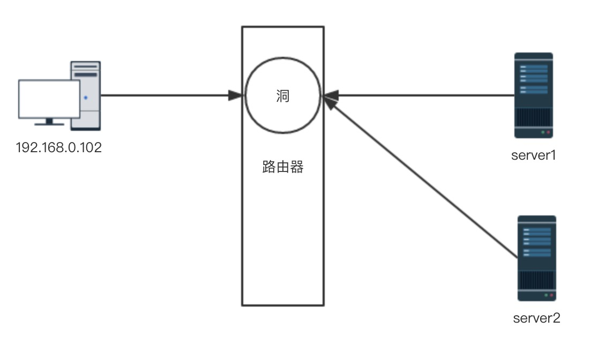
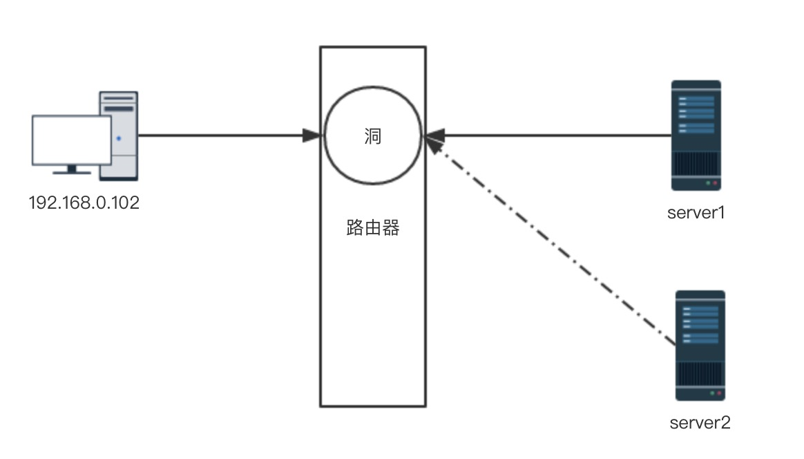
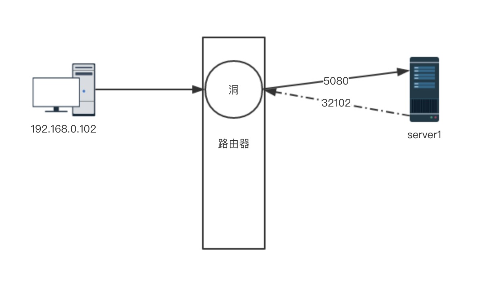

# 什么是NAT?



NAT(网络地址转换)， 具体可以参考百科 https://baike.baidu.com/item/nat/320024。

NAT是用来解决IPv4的地址不够的问题。



例如上图，内网的主机，在访问外网时，源192.168的网址，会被改写成1.2.3.4。所以在server端看来，请求是从1.2.3.4发送过来的。

NAT一般会改写请求的源IP包的源IP地址，也可能会改写tcp或者udp的源端口地址。

# NAT地址范围

互联网地址分配机构保留了三类网址只能由于私有地址，这些地址只能由于NAT内部，不能用于公网。

如果在sip消息中，Contact头中的地址是192.168开头，聪明的服务器应该知道，这个请求来自NAT内部。

```bash
10.0.0.0        -   10.255.255.255  (10/8 prefix)
172.16.0.0      -   172.31.255.255  (172.16/12 prefix)
192.168.0.0     -   192.168.255.255 (192.168/16 prefix)
```
# NAT 工作原理

NAT内部流量流出时，源IP和源端口都被改写，目标地址和端口不会改写。源ip和端口与被改写后的ip和端口存在一段时间的映射关系，当响应回来时，根据这个映射关系，NAT设备知道这个包应该发给内网的哪个设备。




# NAT分类

- 静态NAT: 每个内部主机都**永久映射**一个外部公网IP
- 动态NAT: 每个内部主机都**动态映射**一个外部公网IP
- 网络地址端口转换: 内部主机映射到外部**不同端口**上

由于静态NAT和动态NAT并不能节省公网IP,  常用的都是网络地址端口转换，即NAPT。

# NAPT 网络地址端口转换分类

- 全锥型NAT 
- 限制锥型NAT： 限制主机
- 端口限制NAT：限制主机和端口


## Full Cone NAT 全锥型NAT 

打洞过程

1. 来自nat内部ip1:port1地址在经过路由器时，路由器会打洞ip1':port1'
2. 任何服务器只要把包发到ip1':port1'，路由器都会把这个包发到ip1:port1。也就是说，即使刚开始打洞的包是发给server1的，如果server2知道这个洞的信息，那么server2也可以通过这洞，将消息发给ip1:port1




## Restricted Cone NAT 限制锥型NAT
限制锥型打洞过程和全锥型差不多，只不过增加了限制。

1. 如果内部主机是把包发到server1的，即使server2知道打洞的信息，它发的包也不会被转给内部主机。




## Port Restricted Cone NAT 端口限制NAT
端口限制NAT要比上述两种NAT的限制更为严格

1. 内部主机如果将消息发到server1的5080端口，那么这个端口只允许server1的5080端口发消息回来
2. server1的其他端口发消息到这个洞都会被拒绝



# SIP信令NAT穿越

NAT内部消息发到fs时，会携带如下信息。假如fs对NAT一无所知，如果后续有呼叫，fs是无法将消息发到192.168.0.102的，因为192.168.0.102是内网地址。

但是fs足够聪明，它会从分析包的源ip和源端口，从而正确的将sip消息送到NAT设备上。

```bash
Via: SIP/2.0/UDP 192.168.1.160:11266;branch=z9hG4bK-d8754z-1f2cd509;rport
Contact: <sip:flavio@192.168.1.160:11266>
c=IN IP4 192.168.1.160
m=audio 8616 RTP/AVP 0 8 3 101
```

sip消息头Via, Contact以及sdp中的c=和m=, 可能会带有内网的ip和端口，如果不加以翻译处理，sip服务器是无法将消息发到这些内网地址上的。

fs会将原始Contact头增加一些信息

```bash
Contact 1001@192.168.0.102:5060;fs_nat=yes;fs_path:sip:1001@1.2.3.4:23424
```


# RTP流NAT穿越

```bash
c=IN IP4 192.168.40.79
m=audio 31114 RTP/AVP 0 8 9 101
```

一般invite消息或者200ok的sdp下都会携带连接信息, c=， 但是这个连接信息因为是内网地址，所以fs并不会使用这个作为rtp的对端地址。

fs会等待NAT内部设备发来的第一个RTP包，fs会分析RTP包，提取出NAT设备上的RTP洞的信息，然后将另一方的语音流送到NAT设备上的洞里。

再由NAT设备将RTP流送到对应的内部主机。

# NAT与SIP的问题

NAT设备，例如路由器，一般工作在网络层和传输层。NAT会修改网络层的IP地址和传输层的端口，但是NAT不会修改包的内容。sip消息都是封装到包内容中的。

看一个INVITE消息，出现的内容都是内网中的，当sip服务器收到这个消息，那么它是无法向内网发送响应体的。

1. Via 头中的10.1.1.221:5060
2. c=IN IP4 10.1.1.221
3. m=audio 49170 RTP/AVP 0

当然，有问题就有解决方案
1. received 标记来源ip
2. rport 标记来源端口

使用这两个字段，就可以将数据正确的发送到NAT设备上


```
INVITE sip:UserB@there.com SIP/2.0
Via: SIP/2.0/UDP 10.1.1.221:5060;branch=z9hG4bKhjh From: TheBigGuy <sip:UserA@customer.com>;tag=343kdw2 To: TheLittleGuy <sip:UserB@there.com> Max-Forwards: 70
Call-ID: 123456349fijoewr
CSeq: 1 INVITE
Subject: Wow! It Works...
Contact: <sip:UserA@10.1.1.221>
Content-Type: application/sdp Content-Length: ...
v=0
o=UserA 2890844526 2890844526 IN IP4 UserA.customer.coms=- t=0 0
c=IN IP4 10.1.1.221
m=audio 49170 RTP/AVP 0
a=rtpmap:0 PCMU/8000
```


# 参考

- [https://tools.ietf.org/html/rfc1918](https://tools.ietf.org/html/rfc1918)