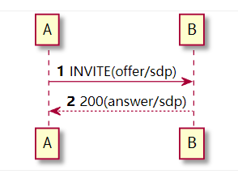
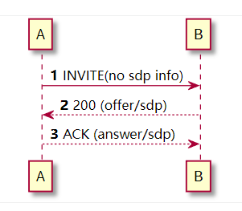
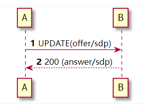
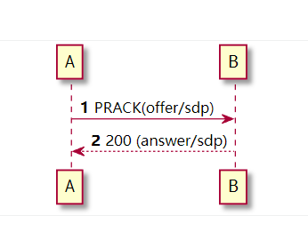

# 1. 简介

媒体协商用来交换呼叫双方的媒体能力。如

-   支持的编码类型有哪些
-   采样频率是多少
-   媒体端口，ip 信息
-   ...

媒体协商使用的是请求和应答模型。即一方向另一方发送含有 sdp 信息的消息，然后另一方更具对方提供的编码以及自己支持的编码，如果协商成功，则将协商后的消息 sdp 再次发送给对方。

# 2. 常见的几个协商方式

## 2.1 在 INVITE 中 offer



## 2.2 在 200 OK 中 offer



## 2.3 在 UPDATE 中 offer



## 2.4 在 PRACK 中 offer



# 3. 常见的几个问题

-   一般呼叫到中继测时，中继回的 183 信令是会携带 sdp 信息的
-   一般打到分机时，分机回的 180 信令是没有 sdp 信息的

不要先入为主的认为，某些请求一定带有 sdp，某些请求一定没有 sdp。而应当去测试请求或者响应消息上有没有携带 sdp 信息。

携带 sdp 信息的 sip 消息会出现下面的头

```bash
Content-Type: application/sdp
```
