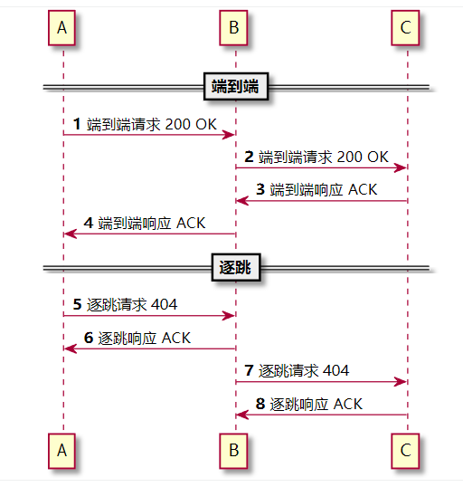

# ACK的特点
- ACK仅用于对INVITE消息的最终响应进行确认
- ACK的CSeq的号码必须和INVITE的CSeq号码相同，这是用来保证ACK对对哪一个INVITE进行确认的唯一标志。另外CSeq的方法会改为ACK
- ACK分为两种
   - 失败请求的确认；例如对4XX, 5XX请求的确认。在对失败的请求进行确认时，ACK是逐跳的。
   - 成功的请求的确认；对200的确认，此时ACK是端到端的。
- ACK一般不会带有SDP信息。如果INVITE消息没有带有SDP，那么ACK消息中一般会带有ACK

# ACK与事务的关系

- 如果请求成功，那么后续的ACK消息是单独的事物
- 如果请求失败，那么后续的ACK消息和之前的INVITE是属于相同的事务

# 逐跳ACK VS 端到端ACK

逐跳在英文中叫做: hop-by-hop 端到端在英文中叫做：end-to-end

# ACK如何路由
ack是序列化请求，所谓序列化请求，是指sip to 字段中已经有tag。有to tag是到达对端的唯一标志。

没有to tag请求称为初始化请求，有totag称为序列化请求。

初始化请求做路径发现，往往需要做一些数据库查询，DNS查询。而序列化请求不需要查询数据库，因为路径已经发现过了。

实战场景：分机A, SIP服务器S, 分机B, A呼叫B，详细介绍一下到ACK的过程。

1. 分机A向SIP服务器S发送请求：INVITE B
2. SIP服务器
   1. 首先在数据库中查找B的实际注册地址
   2. 修改Contact头为分机A的外网地址和端口。因为由于存在NAT, 分机A一般不知道自己的公网地址。
   3. record_route
   4. 将消息发送给B
3. 分机B:
   1. 收到来自SIP服务器的INVITE消息
   2. 从INVITE中取出Contact, 获取对端的，其实也就是分机A的实际地址
   3. 如果所有条件都满足，分机B会向SIP服务器发送180响应，然后发送200响应
   4. 由于180响应和200响应和INVITE都属于一个事务，响应会按照Via的地址，先发送给SIP服务器
4. SIP服务器：
   1. SIP服务器会首先修改180响应的Contac头，把分机B的内网地址改为外网地址
   2. SIP服务器根据Via头，将消息发送给分机A
   3. 对于200 OK的消息，和180的处理是相同的
5. 分机A:
   1. 分机收到180消息后，从Contact头中能够获取分机B的外网地址
   2. 分机A在发送ACK时，request url地址是分机B的地址，但是由于sip服务器的record_route动作首先会将消息发送给SIP服务器，SIP服务器会按照request url的地址，将ack发送给分机B。

**ACK的路由不需要做数据库查询，ACK的request url一般是对端UAC的地址。在存在route头时，ACK会按照route字段去路由。**

# ACK丢失了会怎样？
如果被叫在一定时间内没有收到ACK, 那么被叫会周期性的重发200OK。如果在超时的时候，还没有收到ACK, 就发发送BYE消息来挂断呼叫。很多呼叫在**30秒自动挂断**，往往就是因为丢失了ACK。

那么ACK为什么会丢失呢？ 可能有以下的原因，**大部分原因和NAT有关！**

- SIP服务器没有做fix_nat_contact, 导致主叫可能不知道实际被叫的外网地址

# ACK与媒体流的关系
并不是说被叫收到ACK后，媒体流才开始。往往在180或者183时，双方已经能够听到对方的声音了。

