# 1. sip协议由request-uri路由，而不是to字段
sip消息再经过ua发送出去时，request-uri可能会被重写，而to字段，一般是不变的

# 2. 主叫生成callId和from tag, 响应to tag由另一方生成
totag的作用可以用来区分初始化请求和序列化请求

# 3. sip消息有哪些头字段是必须的？
- Via
- Max-Forwards (请求消息必须有这个头，响应消息一般没有这个头) 感谢 @genmzy 提示。
- From
- To
- Call-ID
- CSeq

# 4. 被叫在向主叫发消息时，from和to字段为什么没变？
from和to字段用来表名sip 请求的方向，而不是sip消息的方向。主叫发起的请求，那么在这个dialog中，所有的sip消息，主叫和被叫字段都不会变。

# 5. 为什么所有via头中的branch都以z9hG4bK开头
这个头是rfc3261中规定的，表示她是经过严格规则生成的，可以用来标记事务。

# 6. sip有两种url, 是什么？有什么区别
- 用户uri: AOR address of record,  例如from和to字段中的url
- 设备uri: 例如 contact头
- 用户uri用来唯一认证用户，设备uri用来唯一认证设备。
- 用户uri往往需要查询数据库，而设备uri来自设备自己的网络地址，不需要查询数据库。
- 一个用户可能有多个设备

# 7. sip注册实际上绑定用户url和设备ip地址

我并不能直接联系你，我只能用我的手机拨打你的手机。

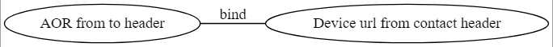

# 8. 呼叫结束了，为什么呼叫的状态信息还需要维持一段时间？
重传的invite消息，可能包含相同的callI和cseq, 为了影响到之后的呼叫，需要耗尽网络中重传的包。

# 9. sip 网关是干什么的？

网关的两侧通信协议是不同的，网关负责将协议翻译成彼此可以理解的协议。sip网关也是如此。电话网络的通信协议不仅仅只有sip， 还有其他的各种信令，如七号信令，ISDN, ISUP, CAS等。

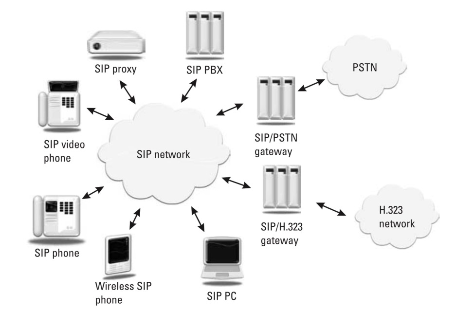

# 10. sip结构组件
- SIP User Agents
- Presence Agents
- B2B User Agents
- SIp Gateways
- SIP Server
- 代理服务器
- 注册服务器
- 重定向服务器

# 11. 代理服务器和UA与网关的区别？

- 代理服务器没有媒体处理能力
- 代理服务器不解析消息体，只解析消息头
- 代理服务器并不分发消息

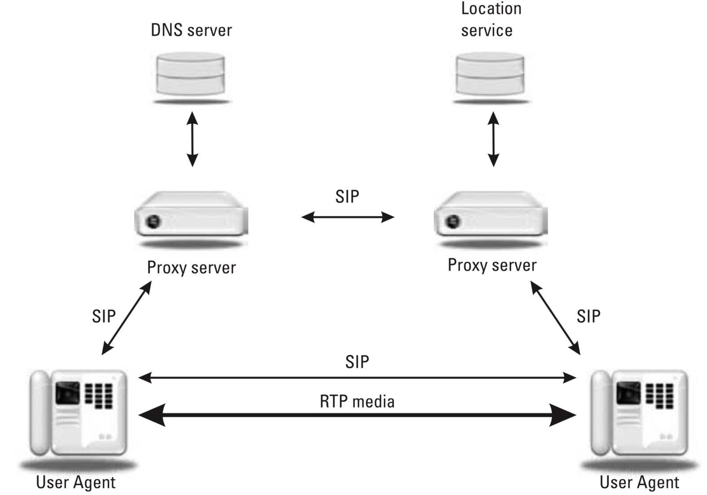

# 12. 什么是Forking Proxy?
Forking Proxy收到一个INVITE请求，却发出去多个INVITE来呼叫多个UA, 适用于多人会议。
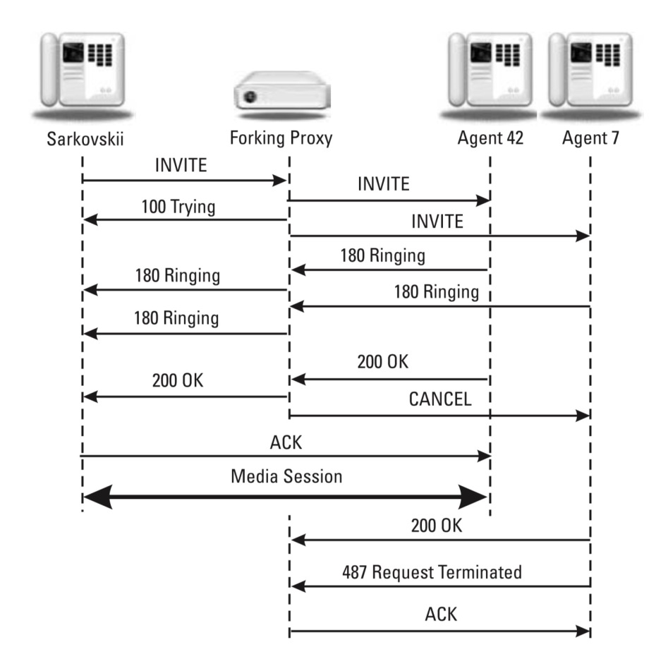

# 13. SIP url有哪些形式？

下图是 sip url 参数列表：
比较重要的有
- lr
- ob
- transport
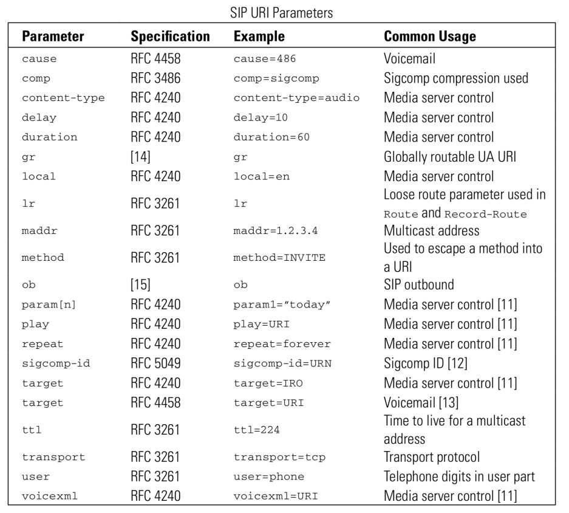

# 14. ACK请求的要点知识
- 只有INVITE需要ACK确认
- 2xx响应的ACK由主叫方产生
- 3xx, 4xx,5xx,6xx的ACK是逐跳的，并且一般是代理服务器产生

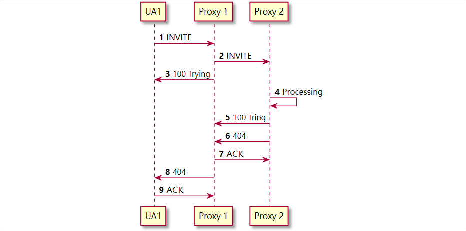

# 15. 可靠性的机制 重传 T1 T2
sip如果使用tcp， 那么tcp是自带重传的，不需要sip再做重传机制。如果使用udp, udp本身是没有可靠性的保证的。那么这就需要应用层去自己实现可靠性。

- 请求在发送出去时，会启动定时器
- 重传在达到64T1, 呼叫宣布失败

# 16. ACK 消息 Cseq method会怎样改变？

- Cseq不变 method变为ACK
- 主叫方发送ack, 其中ack的CSeq序号和invite保持一致

# 17. 端到端的ACK和逐跳的ACK有什么区别
- 对200响应的ACK是端到端的，对非200的ACK是逐跳的
- 端到端的ACK是一个新的事务，有新的branchId
- 逐跳的ACK和上一个INVITE请求的branchId一致
- 当你收到ACK请求时，你要判断这个ACK是应当立即传递到下一跳，还是自己处理

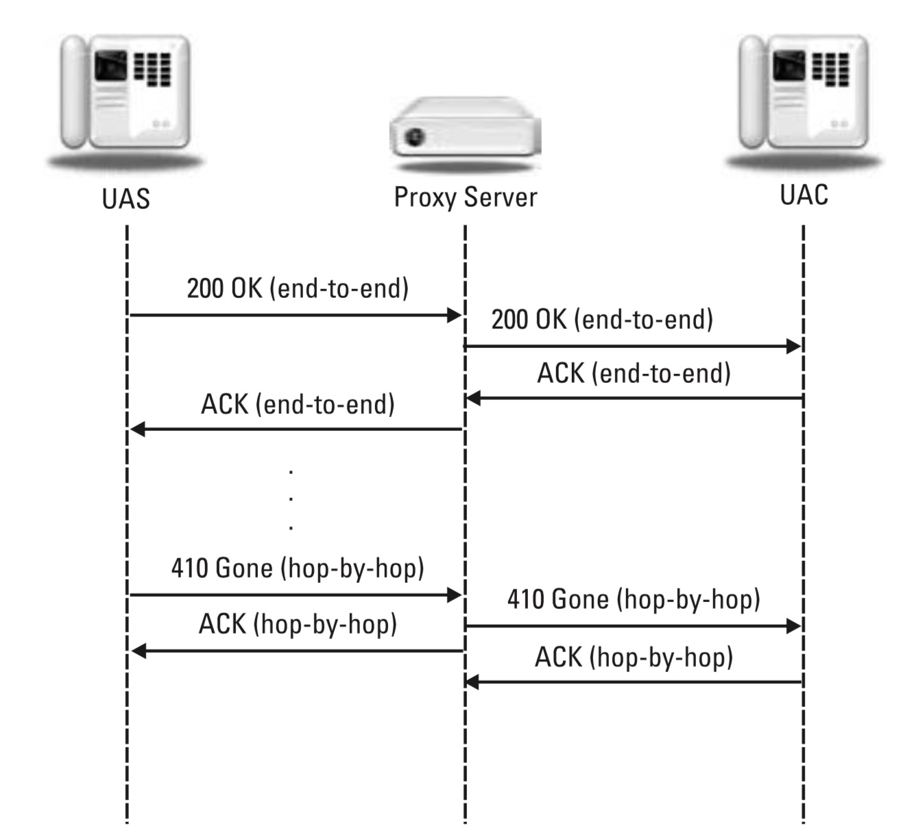

# 18. 非INVITE请求的重传
- 消息发送出去时，启动定时器，周期为T1
- 如果定时器过期，则再启动定时器，周期为2T1, 周期2倍递增，如果周期到达T2, 则以后的重传周期都是T2
- 如果中间收到了1xx的消息，则计时器立即将周期设置为T2, 并在T2过期时再次重发

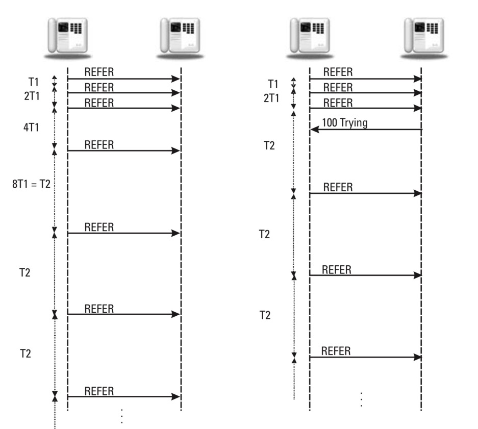

# 19. INVITE请求的重传
- 请求以2倍之前的周期执行重传
- 如果收到1xx的响应，则不会再重传

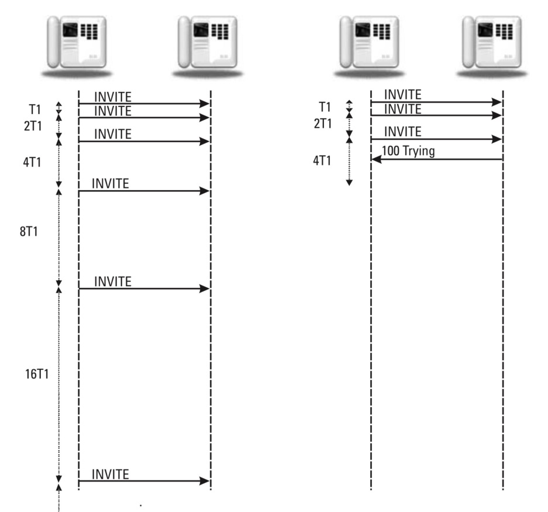

# 20. 端到端与逐跳的区别
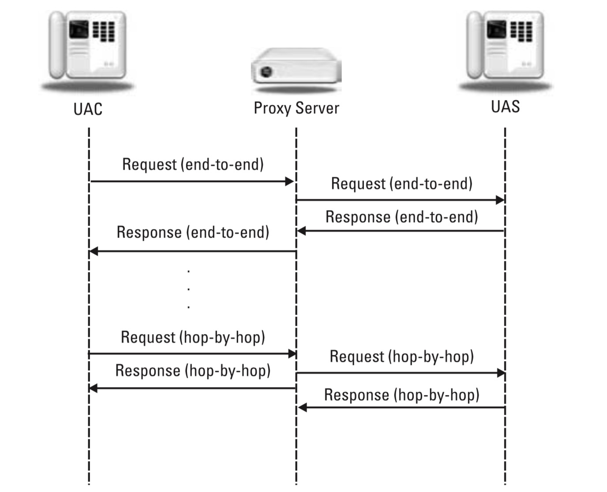

# 21. cancel消息的特点
- cancel是逐跳的
- cancel的CSeq和branchId和上一个invite一致
一般的cancel请求处理图

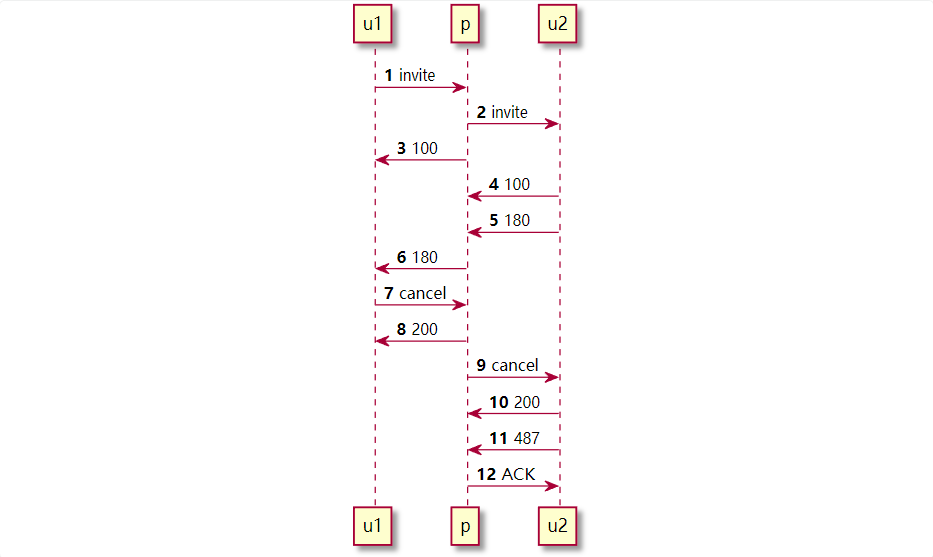

# 22. Via的特点
- 请求在传递给下一站时，UA会在在最上面加上自己的Via头。
- branch tag来自 from, to, callId, request-url的hash值
- 大多数sip头的顺序都是不重要的，但是Via的顺序决定了，响应应该送到哪里
- 如果请求不是来自Via头

# 23. 24 CSeq
- CSeq 会持续增长，有可能不会按1递增
- 同一个事务的CSeq是相同的
- ACK的CSeq会和invite一致

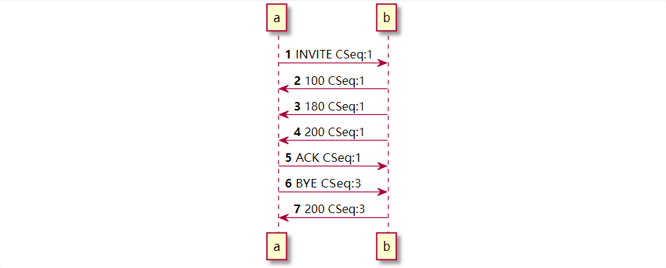