SIP是VoIP的基石，相当于HTTP协议在Web服务器里的角色。如果你熟悉HTTP协议，那么你可以在SIP协议中找到许多和HTTP中熟悉的东西，例如请求头，请求体，响应码之类概念，这是因为SIP协议的设计，很大程度上参考了HTTP协议。

如果想要学习VoIP，那么SIP协议是你务必掌握敲门砖。

# 1. SIP组件

- UAC: 例如sip终端，软电话，话机
- UAS: sip服务器
- UA: ua既可以当做uac也可以当做uas
- 代理服务器
- 重定向服务器
- 注册服务器
- 网关
- PSTN 公共交换电话网

# 2. SBC 边界会话控制器

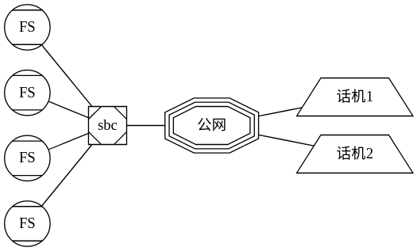

SBC是Session Border Controller的缩写，具有一下几个功能。

- 拓扑隐藏：隐藏所有内部网络的信息。
- 媒体流管理：设置语音流编码规则，转换等
- 增加能力：例如Refer, 3PCC
- 维护NAT映射：
- 访问控制
- 媒体加密：例如外部网络用SRTP, 内部网络用RTP

# 3. sip注册过程

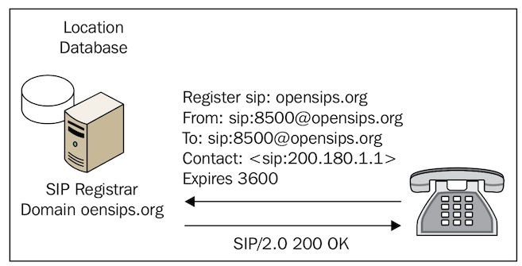

下面简化注册逻辑，省略了验证和过期等字段：

1. 对于分机来说，注册服务器的地址是需要设置的
2. 分机向注册服务器发请求，说：你好，注册服务器，我是8005，我的地址是200.180.1.1，以后你可以用这个地址联系我。
3. 注册服务器回复：好的，注册成功

# 4. sip服务器的类型

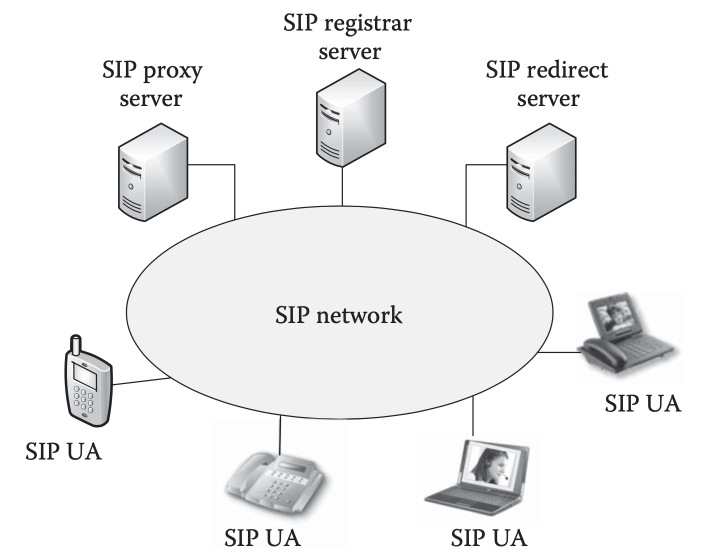

## 4.1. 代理服务器

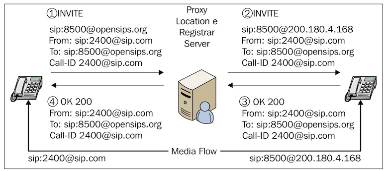

## 4.2. 重定向服务器

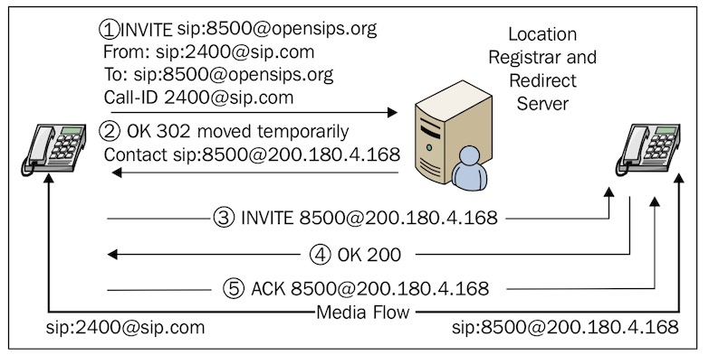

## 4.3. 背靠背UA服务器

背靠背UA服务器有两个作用
1. 隐藏网络拓扑结构
2. 有些时候，路由无法到达，只能用背靠背UA服务器

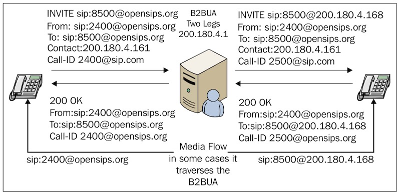

# 5. 常用sip请求方法
比较常用的是下面的

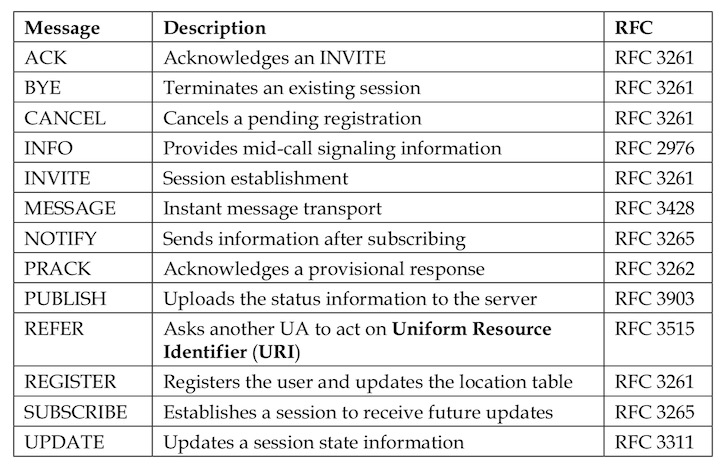

常用的几个是：register, invite, ack, bye, cancel。除了cancel和ack不需要认证外，其余的请求都需要认证。
register自不必说，invite和bye是需要认证的。

对于我们不信任的ua，我们不允许他们呼叫。对于未认证的bye，也需要禁止。后者可以防止恶意的bye请求，挂断正常的呼叫。

invite除了re-invite的情况，其余的都属于初始化请求，需要着重关心的。而对于bye这种序列化请求，只需要按照record-route去路由。

# 6. sip响应状态码

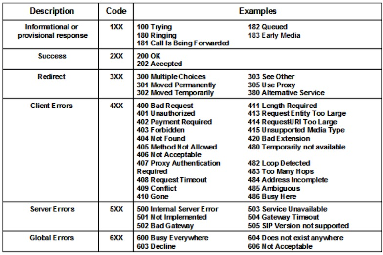

# 7. sip对话流程图

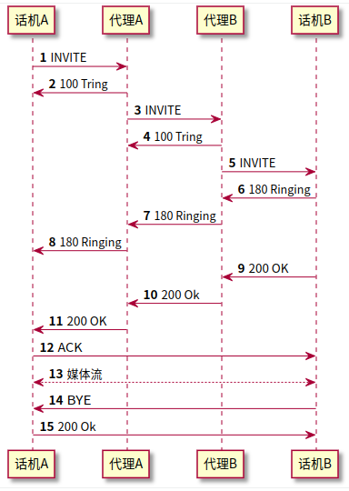

从上图可以看出，从invite请求到200ok之间的信令，都经过了代理服务器。但是200ok之后的ack，确没有经过代理服务器，如果想要所有信令都经过代理服务器，需要在sip消息头record-routing 指定代理服务器的地址

# 8. 请求与响应报文

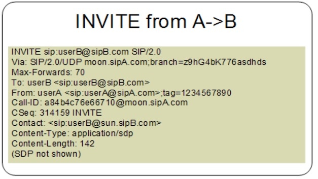
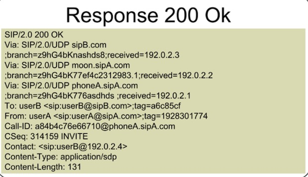
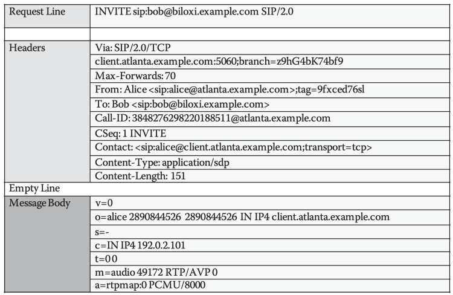
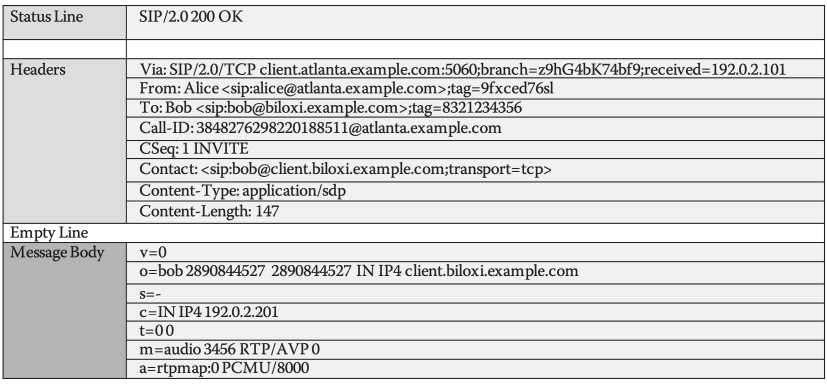

# 9. 事务与对话的区别

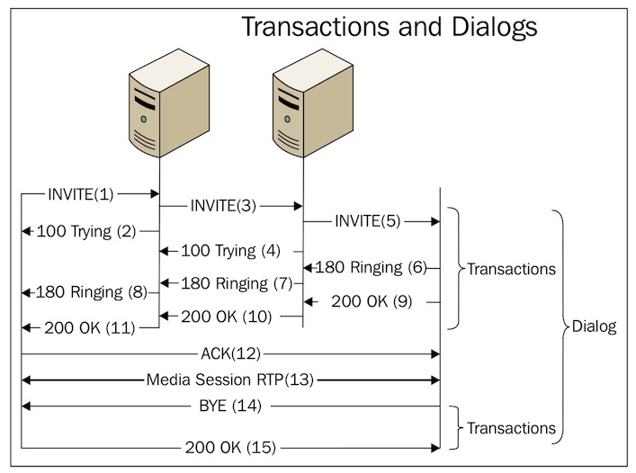

重点：
- 从INVITE请求到最终的响应（注意1xx不是最终响应，非1xx的都是最终响应）之间，称为事务。一个事务可以带有多个消息组成，并经过多个ua。
- ack请求比较特殊，但是ack不是事务。如果被叫接通后，超时未收到主叫方的ack, 会怎样？是否会再次发送200OK
- tcp三次握手建立连接，sip：invite->200ok->ack，可以理解为三次握手建立对话。
- bye请求和200ok算作一个事务
- dialog建立的前提是呼叫接通，如果呼叫没有接通，则没有dialog。
- dialog可以由三个元素唯一确定。callId, from字段中的tag, to字段中的tag。

# 10. sip底层协议

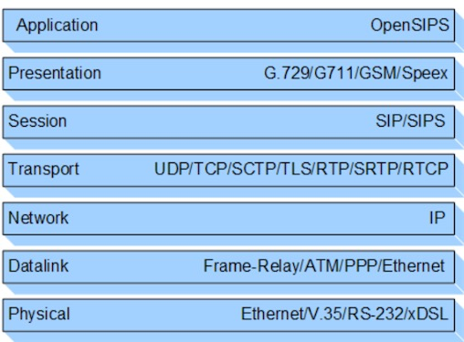
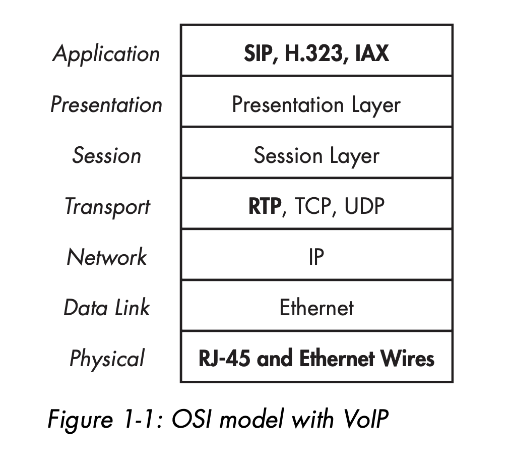

# SIP协议的结构

SIP协议是一个分层的协议，意味着各层之间是相互独立的

- 最底层：SIP编码的语法 BNF语法
- 第二层：传输层 传输层定义如何接收和发送消息，SIP常用的传输层可以是udp, tcp, websocket等等
- 第三层：事务层 事务是一个请求和最终的响应称为一个事务，例如invite, 200ok是一个事务
- 第四层：事务用户层 所有的SIP实体，除了无状态的代理，都称为事务用户层。常见的uac， uas都是事务用户层

# 11. voip总体架构

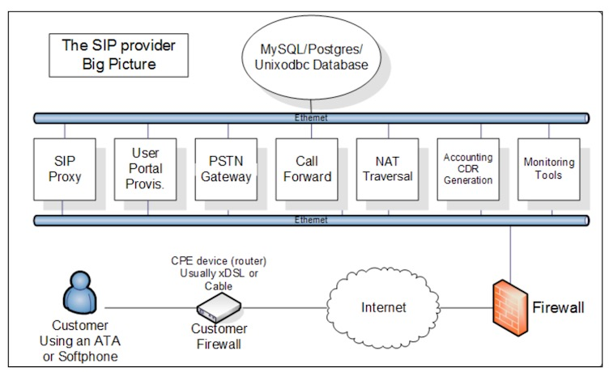

# 12. 参考