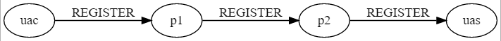
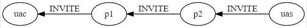

RFC3261并没有介绍关于Path头的定义，因为这个头是在RFC3327中定义的，Path头作为一个SIP的扩展头。

RFC3327的标题是：Session Initiation Protocol (SIP) Extension Header Field for Registering Non-Adjacent Contacts。

从这个标题可以看出，Path头是作为Register请求的一个消息头，一般这个头只在注册消息上才有。

这个头的格式如下。

```
Path: <sip:P1.EXAMPLEVISITED.COM;lr>
```

从功能上说，Path头和record-route头的功能非常相似，但是也不同。


看下面的一个场景，uac通过p1和p2, 将注册请求发送到uas, 在某一时刻，uac作为被叫，INVITE请求要从uas发送到uac, 这时候，INVITE请求应该怎么走？



假如我们希望INVITE请求要经过p2,p2,然后再发送到uac, Path头的作用就是这个。




1. 注册请求经过P1时，P1在注册消息上加上p1地址的path头
2. 注册请求经过P2时，P2在注册消息上加上p2地址的path头
3. 注册请求到达uas时，uas从Contact头上获取到uac的地址信息，然后从两个Path头上获取到如下信息：如果要打电话给uac, Path头会转变为route头，用来定义INVITE请求的路径。

简单定义：Path头用来一般在注册消息里，Path头定义了uac作为被叫时，INVITE请求的发送路径。

# 参考