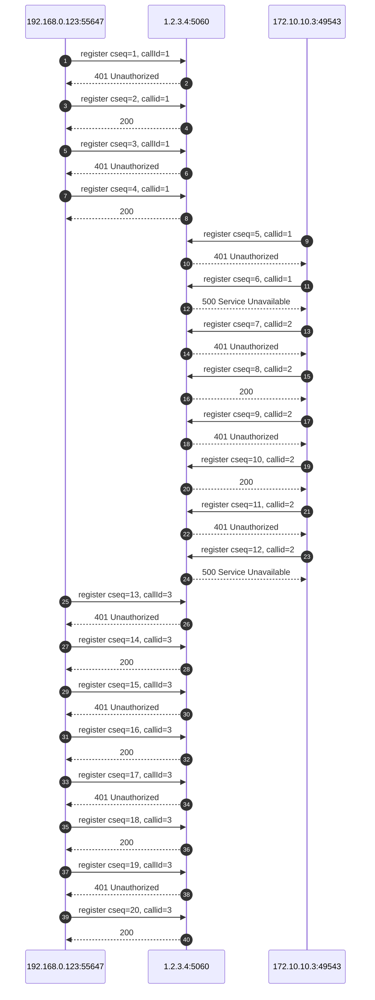
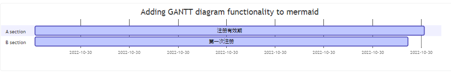

- 服务端设置的过期时间是120s
- 客户端每隔115s注册一次, callid和之前的保持不变
- 当网络变了之后，由于ip地址改变，客户端的在115秒注册，此时服务端还未超时，所以给客户端响应报错500
- 客户端在等了8秒之后，等待服务端超时，然后再次注册，再次注册时，callid改变
- 因为服务端已经超时，所以能够注册成功

需要注意的是，在一个注册周期内，客户端的注册信息包括IP、端口、协议、CallID都不能变，一旦改变了。如果服务端的记录还没有失效，新的注册就会失败。

有的客户会经常反馈，他们的分机总是无辜掉线。经过抓包分析，发现分机每隔1.5分钟注册一次，使用tcp注册的，每次的端口号都会变成不同的值。

然后尝试让分机用udp注册，分机就不再异常掉线了。

一个tcp socket一旦关闭，新的tcp socket必然会被分配不同的端口。但是udp不一样，udp是无连接的。

