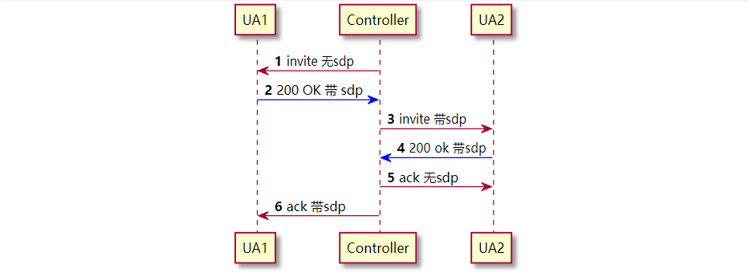
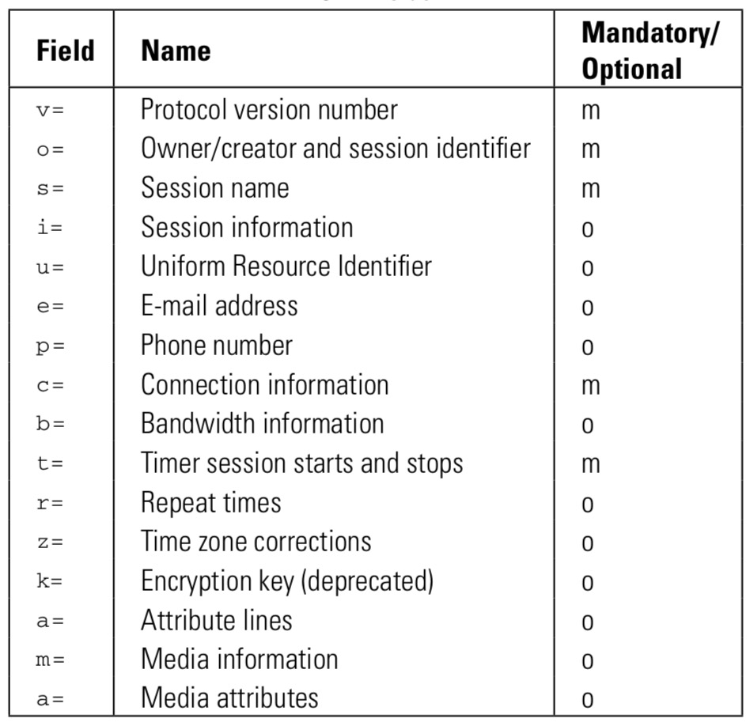
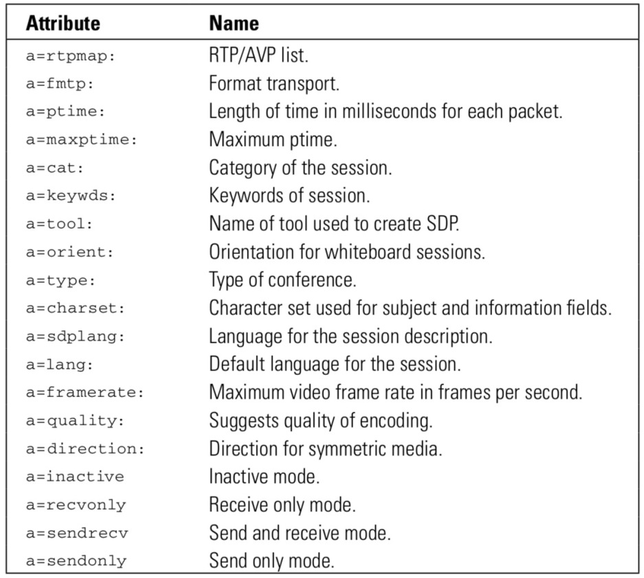
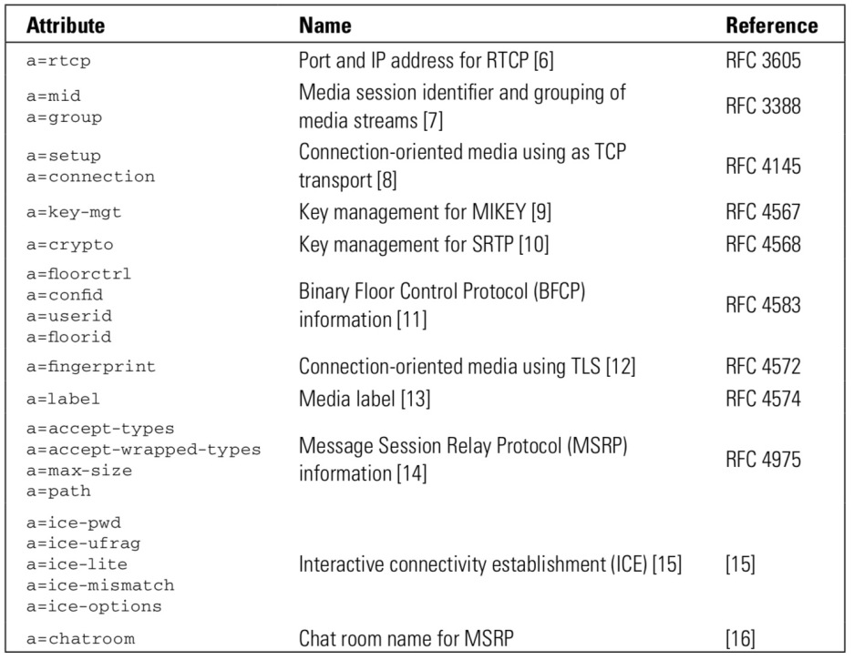

# 1. 什么是SDP?

SDP是Session Description Protocol的缩写，翻译过来就是会话描述协议，这个协议通常存储各种和媒体相关的信息，例如支持哪些媒体编码, 媒体端口是多少？媒体IP地址是多少之类的。

SDP一般作为SIP消息的body部分。如下所示

```
INVITE sip:bob@biloxi.example.com SIP/2.0
Via: SIP/2.0/TCP client.atlanta.example.com:5060;branch=z9hG4bK74bf9
Max-Forwards: 70
From: Alice <sip:alice@atlanta.example.com>;tag=9fxced76sl
To: Bob <sip:bob@biloxi.example.com>
Call-ID: 3848276298220188511@atlanta.example.com
CSeq: 1 INVITE
Contact: <sip:alice@client.atlanta.example.com;transport=tcp>
Content-Type: application/sdp
Content-Length: 151

v=0
o=alice 2890844526 2890844526 IN IP4 client.atlanta.example.com
s=-
c=IN IP4 192.0.2.101
t=0 0
m=audio 49172 RTP/AVP 0
a=rtpmap:0 PCMU/8000
```

刚开始我一直认为某些sip消息一定带有sdp，例如invite消息。某些sip请求一定没有携带sdp。

**实际上sip消息和sdp并没有硬性的附属关系**。sip是用来传输信令的，sdp是用来描述媒体流信息的。

如果信令不需要携带媒体流信息，就可以不用携带sdp。

一般情况下，invite请求都会带有sdp信息，但是某些时候也会没有。例如3PCC(third party call control), 第三方呼叫控制，是指由第三方负责协商媒体信息。

常见的一个场景



# 2. SDP字段介绍



## 2.1. v= 版本号
当前sdp的版本号是0，所以常见的都是v=0

## 2.2. o= 发起者id

o=的格式

```js
o=username session-id version network-type address-type address
```

- username： 登录的用户名或者主机host
- session-id: NTP时间戳
- version: NTP时间戳
- network-type： 一般是IN, 表示internet
- address-type: 表示地址类型，可以是IP4， IP6

## 2.3. c= 连接数据
c=的格式

```
c=network-type address-type connection-address
```

- network-type: 一般是IN, 表示internet
- address-type: 地址类型 IP4, IP6
- connection-address: 连接地址

## 2.4. m= 媒体信息
格式
```
m=media port transport format-list
```
- media 媒体类型
  - audio 语音
  - video 视频
  - image 传真
- port 端口号
- transport 传输协议
- format-list 格式

```
m=audio 49430 RTP/AVP 0 6 8 99
m=application 52341 udp wb
```

## 2.5. a= 扩展属性



## 2.6. 通用扩展




# 3. SDP中的RTP RTCP 信息
RTP的端口一般是偶数，例如下面的4002。RTCP是RTP端口下面的一个奇数，如4003。
RTP中传递的是媒体信息，RTCP是用于控制媒体信息传递的控制信令，流入丢包的数据。

```
m=audio 4002 RTP/AVP 104 3 0 8 96
a=rtcp:4003 IN IP4 192.168.1.5
```

# 4. WebRTC中的RTP和RTCP端口
在WebRTC中，RTP和RTCP的端口一般是公用一个。
在INIVTE消息的SDP中会带有:
```
a=rtcp-mux
```
如果服务端同意公用一个端口，并且INVITE请求成功，那么在200 OK的SDP中可以看到下面的内容。
可以看到RTP和RTCP公用20512端口。
```
m=audio 20512 RTP/SAVPF 0 8 101
a=rtcp:20512
a=rtcp-mux
```


# 5. 参考

- https://www.ietf.org/rfc/rfc2327.txt

