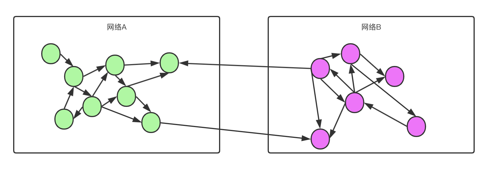

设想一下，如果国家规定，给孩子起名字的时候，不能和已经使用过的活着的人名字相同，会发生什么事情？

除非把名字起得越来越长，否则名字很快就不够用了。

在 1993 年的时候，有人就遇到类似的问题，因为 IP 地址快被用完了。

他们想出两个方案：

-   短期方案：CIDR(Classless InterDomain Routing)
-   长期方案：开发新的具有更大地址空间的互联网协议。可以认为是目前的 IPv6

当然了长期方案不是一蹴而就的，短期方案才是解决眼前问题的方案。

> a very small percentage of hosts in a stub domain are communicating outside of the domain at any given time

短期的方案基于一个逻辑事实：**在一个网络中，只有非常少的几个主机需要跟外部网络交流。也就是说，大部分的主机都在内部交流。那么内部交流的这些主机，实际上并不需要给设置公网 IP。（但是这个只是 1993 年的那个时期的事实）** \*\* 可以类比于，班级内部之间的学生交流很多。班级与班级之间的交流，估计只有班长之间交流。 

# 参考

-   [https://tools.ietf.org/html/rfc1631](https://tools.ietf.org/html/rfc1631)
-   [https://tools.ietf.org/html/rfc1996](https://tools.ietf.org/html/rfc1996)
-   [https://tools.ietf.org/html/rfc2663](https://tools.ietf.org/html/rfc2663)
-   [https://tools.ietf.org/html/rfc2993](https://tools.ietf.org/html/rfc2993)
