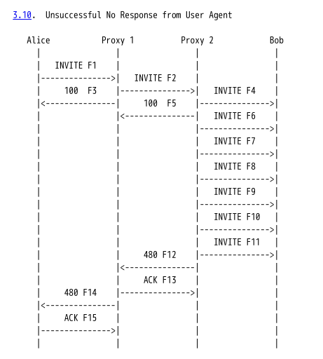

# 1. 概念理解
- 务必要能理解SIP的重要概念，特别是事务、Dialog。参考https://www.yuque.com/wangdd/opensips/fx5pyy
- 概念是非常重要的东西，不理解概念，越学就会越吃力

# 2. 时序图

时序图是非常重要的，培训时，一般我会要求学员务必能够手工绘制时序图。因为只有能够手工绘制时序图了，在排查问题时，才能够从抓包工具给出的时序图中分析出问题所在。

RFC3665 https://datatracker.ietf.org/doc/html/rfc3665 中提供了很多经典的时序图，建议可以去临摹。

