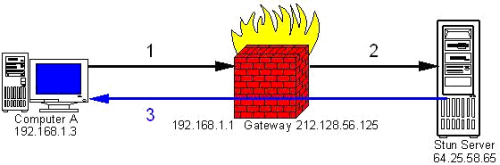
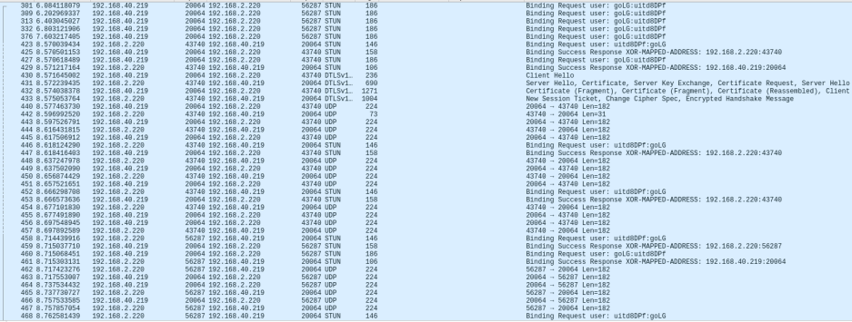
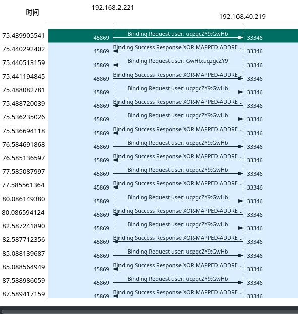

---
title: "STUN协议笔记"
date: "2022-01-06 17:54:10"
draft: false
---
- STUN是**S**imple **T**raversal of **U**ser Datagram Protocol (UDP) through **N**etwork Address Translators (NAT’s)的缩写
- 传输层底层用的是UDP
- 主要用来NAT穿透
- 主要用来解决voip领域的单方向通话(one-way)的问题
- 目的是让NAT后面的设备能发现自己的公网IP以及NAT的类型
- 让外部设备能够找到合适的端口和内部设备通信
- 刷新NAT绑定，类似keep-alive机制。否则端口映射可能因为超时被释放
- STUN是cs架构的协议

- 1. 客户端端192.168.1.3，使用5060端口，发送stun请求到 64.25.58.65， 经过了192.168.1.1的网关之后
- 2. 网关将源ip改为212.128.56.125， 端口改为15050
- 3. stun服务器将请求发送到 网关的外网端口15050，然后网关将请求转发给192.168.1.3:5060

- stun message type which typically is one of the below:
      - 0x0001 : Binding Request
      - 0x0101 : Binding Response
   - 0x0111 : Binding Error Response
   - 0x0002 : Shared Secret Request
   - 0x0102 : Shared Secret Response
   - 0x0112 : Shared Secret Error Response
- **0x0001: MAPPED-ADDRESS - **This attribute contains an IP address and port. It is always placed in the Binding Response, and it indicates the source IP address and port the server saw in the Binding Request sent from the client, i.e.; the STUN client’s public IP address and port where it can be reached from the internet.
- **0x0002: RESPONSE-ADDRESS** - This attribute contains an IP address and port and is an optional attribute, typically in the Binding Request (sent from the STUN client to the STUN server). It indicates where the Binding Response (sent from the STUN server to the STUN client) is to be sent. If this attribute is not present in the Binding Request, the Binding Response is sent to the source IP address and port of the Binding Request which is attribute 0x0001: MAPPED-ADDRESS.
- **0x0003: CHANGE-REQUEST** - This attribute, which is only allowed in the Binding Request and optional, contains two flags; to control the IP address and port used to send the response. These flags are called "change IP" and "change Port" flags. The "change IP" and "change Port" flags are useful for determining whether the client is behind a restricted cone NAT or restricted port cone NAT. They instruct the server to send the Binding Responses from a different source IP address and port.
- **0x0004: SOURCE-ADDRESS - **This attribute is usually present in Binding Responses; it indicates the source IP address and port where the response was sent from, i.e. the IP address of the machine the client is running on (typically an internal private IP address). It is very useful as from this attribute the STUN server can detect twice NAT configurations.
- **0x0005: CHANGED-ADDRESS - **This attribute is usually present in Binding Responses; it informs the client of the source IP address and port that would be used if the client requested the "change IP" and "change port" behaviour.
- **0x0006: USERNAME** - This attribute is optional and is present in a Shared Secret Response with the PASSWORD attribute. It serves as a means to identify the shared secret used in the message integrity check.
- **0x0007: PASSWORD** - This attribute is optional and only present in Shared Secret Response along with the USERNAME attribute. The value of the PASSWORD attribute is of variable length and used as a shared secret between the STUN server and the STUN client.
- **0x0008: MESSAGE-INTEGRITY** - This attribute must be the last attribute in a STUN message and can be present in both Binding Request and Binding Response. It contains HMAC-SHA1 of the STUN message.
- **0x0009: ERROR-CODE - **This attribute is present in the Binding Error Response and Shared Secret Error Response only. It indicates that an error has occurred and indicates also the type of error which has occurred. It contains a numerical value in the range of 100 to 699; which is the error code and also a textual reason phrase encoded in UTF-8 describing the error code, which is meant for the client.
- **0x000a: UNKNOWN-ATTRIBUTES** - This attribute is present in the Binding Error Response or Shared Secret Error response when the error code is 420; some attributes sent from the client in the Request are unknown and the server does not understand them.
- **0x000b: REFLECTED-FROM** - This attribute is present only in Binding Response and its use is to provide traceability so the STUN server cannot be used as part of a denial of service attack. It contains the IP address of the source from where the request came from, i.e. the IP address of the STUN client.

## **Common STUN Server error codes**
Like many other protocols, the STUN protocol has a list of error codes. STUN protocol error codes are similar to those of HTTP or SIP. Below is a list of most common error codes encountered when using the STUN protocol. For a complete list of STUN protocol error codes refer to the STUN RFC 3489.

- **Error Code 400** - Bad request; the request was malformed. Client must modify request and try sending it again.
- **Error Code 420** - Unknown attribute; the server did not understand an attribute in the request.
- **Error Code 430** - Stale credentials; the shared secret sent in the request is expired; the client should obtain a new shared secret.
- **Error Code 432** - Missing username; the username attribute is not present in the request.
- **Error Code 500** - Server error; temporary error and the client should try to send the request again.

下图是一个webrtc呼叫的抓包， 可以看到，在呼叫建立前的阶段。服务端和客户端都相互发送了Binding Request和响应了Bind Response。

并且在通话过程中，还会有持续的binding reqeust, 并且在某些时候，源端口可能会变。说明媒体发送的端口也已经发生了改变。

如果binding request 请求没有响应，那么语音很可以也会断，从而导致了呼叫挂断。

# 参考

- [https://www.3cx.com/blog/voip-howto/stun/](https://www.3cx.com/blog/voip-howto/stun/)
- [https://www.3cx.com/blog/voip-howto/stun-voip-1/](https://www.3cx.com/blog/voip-howto/stun-voip-1/)
- [https://www.3cx.com/blog/voip-howto/stun-protocol/](https://www.3cx.com/blog/voip-howto/stun-protocol/)
- [https://www.3cx.com/blog/voip-howto/stun-details/](https://www.3cx.com/blog/voip-howto/stun-details/)