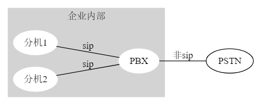
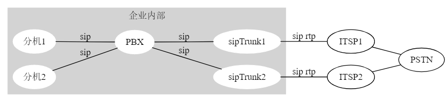

# 传统中继

# sip trunk中继

- **安全可靠**：SIP Trunk设备和ITSP之间只需建立唯一的、安全的、具有QoS保证的SIP Trunk链路。通过该链路来承载企业的多路并发呼叫，运营商只需对该链路进行鉴权，不再对承载于该链路上的每一路SIP呼叫进行鉴权。
- **节约硬件成本**：企业内部通信由企业IP-PBX负责。企业所有外出通信都通过SIP Trunk交由ITSP，再由ITSP中的设备发送到PSTN网络，企业不再需要维护原有的传统PSTN中继链路，节省了硬件和维护成本。
- **节约话费成本**：企业可以通过设置目的地址任意选择并连接到多个ITSP，充分利用遍布全球各地的ITSP，节省通话费用。
- **功能强大**：部署SIP Trunk设备后，全网可以使用SIP协议，可以更好的支持语音、会议、即时消息等IP通信业务。
- **处理信令和媒体**：SIP Trunk设备不同于SIP代理服务器。SIP Trunk设备接收到用户的呼叫请求后，会代表用户向ITSP发起新呼叫请求。在转发过程中，SIP Trunk设备不但要对信令消息进行中继转发，对RTP媒体消息也需要进行中继转发。在整个过程中，SIP Trunk设备两端的设备（企业内部和企业外部设备）均认为和其交互的是SIP Trunk设备本身。

# 参考

- http://www.h3c.com/cn/d_201009/688762_30003_0.htm
- https://getvoip.com/blog/2013/01/24/differences-between-sip-trunking-and-hosted-pbx/
- https://www.onsip.com/blog/hosted-pbx-vs-sip-trunking
- https://baike.baidu.com/item/sip%20trunk/1499860

