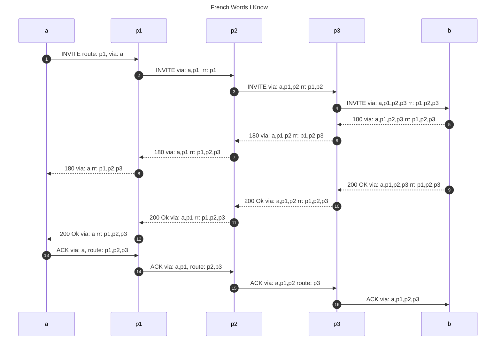

rr代表record-route头。


- **Via**
    - 何时添加: 除了目的地外，请求从ua发出去时 
    - 何时删除: 除了目的地外，请求从ua发出去时 
    - 作用: 除了目的地外，请求从ua发出去时 Via的作用是让sip消息能够按照原路返回
    - 比喻: 第一次离开家的人，只有每次经过一个地方，就记下地名。那么在回家的时候，他才能按照原来的路径返回。



- **route**
    - 何时添加: 当请求从uac发出去时
    - 何时删除: 请求离开ua时 
    - 作用: route的作用是指明下一站的目的地。虽然route请求是在请求发送出去时就添加，但是可以进添加一个。
    - 比喻: 第一次离开家的人，可能并不知道如何到达海南，但是他知道如何到达自己的省会。这个省会就是sip终端配置的外呼代理。每次经过一个站点时，就把这个站点记录到record-route中。record-route会在180或者183，或200ok时，发送给主叫的话机。



- **record-route**
    - 何时添加: 当请求从uas发出去时 
    - 何时删除: 为dialog中的后续请求，指明到达目的地的路径
    - 作用: 为dialog中的后续请求，指明到达目的地的路径
    - 比喻: 当一个uac收到180之后，这个180中带有了record-route，例如p1,p2,p3。那么后续的ACK请求，就可以理由record-route来生成route: p1, p2, p3。


> Address-of-Record: An address-of-record (AOR) is a SIP or SIPS URI that points to a domain with a location service that can map the URI to another URI where the user might be available. Typically, the location service is populated through registrations.  An AOR is frequently thought of as the "public address" of the user. -- rfc3261

> The difference between a contact address and an address-of-record is like **the difference between a device and its user**.  While there is no formal distinction in the syntax of these two forms of addresses, contact addresses are associated with a particular device, and may have a very device-specific form (like sip:10.0.0.1, or sip:edgar@ua21.example.com).  An address-of-record, however, represents an identity of the user, generally a long-term identity, and it does not have a dependency on any device; users can move between devices or even be associated with multiple devices at one time while retaining the same address-of-record.  A simple URI, generally of the form 'sip:egdar@example.com', is used for an address-of-record. --rfc3764

# 1. Record-route写法

u1 -> p1 -> p2 -> p3 -> p4,

最后经过的排在最上面或者最前面。

多行写法

```
INVITE sip:callee@u2.domain.com SIP/2.0
Contact: sip:caller@u1.example.com
Record-Route: <sip:p4.domain.com;lr>
Record-Route: <sip:p3.middle.com>
Record-Route: <sip:p2.example.com;lr>
Record-Route: <sip:p1.example.com;lr>
```

Record-Route记录的是从主叫到被叫的过程，其中Record-Route的顺序非常重要。因为这个顺序会影响Route字段的顺序。

因为loose_route是从最上面的route字段来决定下一条的地址。

所以，对于主叫来说，route的顺序和Record-Router相反。对于被叫来说，route字段和Record-Route字段相同。

对于某些使用不同协议对接的不同代理的时候，会一次性的增加两次Record-Route。

例如下面的，AB直接是tcp的，BC之间是udp的。那么INVITE从A到C之后，会在最上面增加两个。
A --tcp-- B --udp-- C

```
Record-Route: <sip:B_ip;transport=udp>
Record-Route: <sip:B_ip;transport=tcp>
```

单行写法

```
INVITE sip:callee@u2.domain.com SIP/2.0
Contact: sip:caller@u1.example.com
Record-Route: <sip:p4.domain.com;lr>,<sip:p3.middle.com>,<sip:p2.example.com;lr>,<sip:p1.example.com;lr>
```

# 2. Via 写法
- 最新的排在最上面
