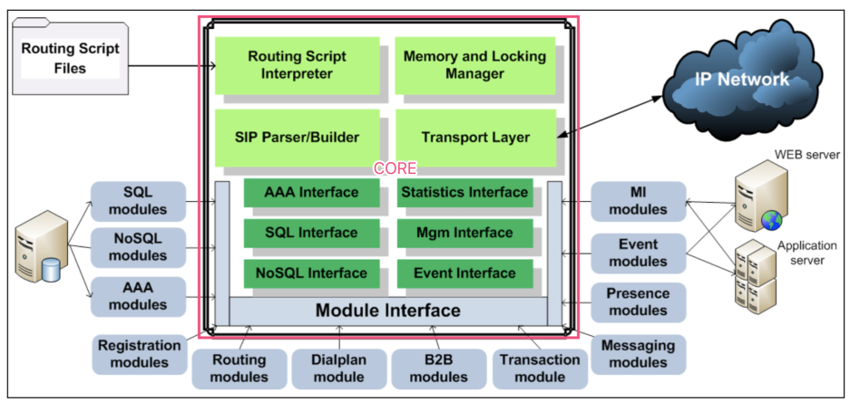

# 1. OpenSIPS架构
OpenSIPS主要有两部分构成，

1. core: 提供底层工具、接口、资源
2. module：模块是一些共享的库，在启动时按需加载。有些模块是用于在opensips脚本中提供功能，而有些模块是作为底层，为其他模块提供功能。

# 2. OpenSIP 核心

## 2.1. 传输层
传输层提供了对于各种协议的支持，如TCP、UDP、TLS、WebSocket

## 2.2. SIP工厂层
SIP工厂层提供了对SIP协议的解析和构建。OpenSIPS实现了一种懒解析功能，懒解析的效率非常高。

**懒解析**：懒解析就是只去解析SIP头，并不解析SIP头的字段内容。而是在需要读取头字段内容时，才去解析。所以可以理解为按需解析。有点类似于一些文件系统的写时复制功能。

**惰性应用：**有一点非常重要，当你通过脚本提供的函数去改变SIP消息时，所作出的改变并不是实时作用到SIP消息上，而是在先存起来，而是当所有的SIP消息处理完成后才会去应用这些改变。举例来说，你首先通过函数给SIP消息添加了某个头，然后你通过函数去获取这个头的时，发现这个头并不存在，但是SIP消息再发送出去后，又携带了你添加的这个头。

## 2.3. 路由脚本解析与执行
OpenSIPS在启动后，会将opensips.cfg解析并加载到内存中。一旦OpenSIPS正常运行了，opensips.cfg文件即使删了也不会影响到OpenSIPS的运行了。

但是OpenSIPS并不支持热脚本更新，如果你改了脚本，让让运行的OpenSIPS具有添加的功能，那么必须将OpensSIPS重启。

OpenSIPS的脚本有点类似于C或者Shell语言，如果你Shell写的很溜，OpenSIPS的脚本理解起来也会非常容易。

## 2.4. 内存与锁管理
出于性能考虑，OpenSIPS自己内部实现了内存和锁的管理，这部分在内容在脚本中是不可见的。

## 2.5. 脚本变量和脚本函数
OpenSIPS核心提供的脚本变量和函数比较有限，外围的模块提供和很多的变量和函数。这些变量和函数的存在，都是为了让你易于获取SIP消息的某些字段，或者对SIP消息进行修改。

## 2.6. SQL接口类
OpenSIPS 核心实现了接口的定义，但是并没有实现接口。接口的实现由外部的模块提供，这样做的函数可以使用不同的数据库。

## 2.7. MI管理接口
mi接口用来管理OpenSIPS, 可以实现以下功能

- 向OpenSIPS 发送数据
- 从OpenSIPS 获取数据
- 触发OpenSIPS 的内部行为

